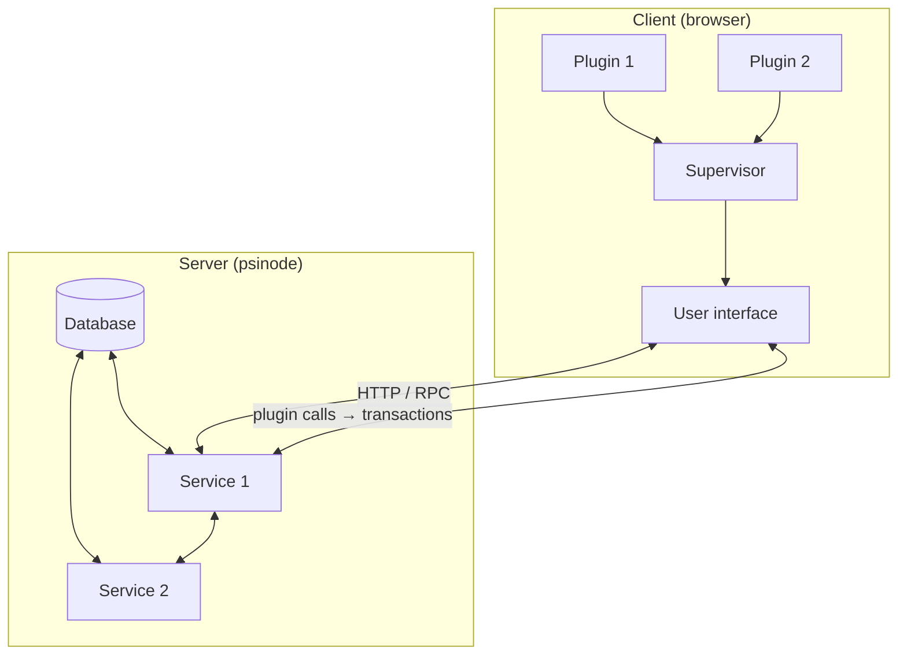

# Psibase Full-Stack Architecture

> AI-focused overview. Official spec: `doc/src/specifications/app-architecture/`.

## High-level picture

A psibase app is a **full-stack application** hosted on the chain: database, server-side logic, client-side plugin, and UI all live in the network. No separate web server is required; an account doubles as a domain (e.g. `alice.my-node.com`).

## Core components

| Component | Role | Where it runs |
|-----------|------|----------------|
| **Database** | Key/value store; replicated across nodes | Server |
| **Service** | WASM program: actions (write), HTTP/GraphQL (read) | Server (WASM VM) |
| **Plugin** | WASM component: client logic, transaction building, calls to Supervisor | Browser (via Supervisor) |
| **Supervisor** | Loads plugins, mediates UI↔plugin, submits transactions | Browser (hidden iframe) |
| **UI** | React/TypeScript app; stored in service DB, served from service domain | Browser |

## Data and request flow

1. **Authenticated writes (actions)**  
   UI → Supervisor → plugin → plugin adds actions to transaction → Supervisor submits transaction → psinode runs actions on service(s) → database updated.

2. **Reads (no auth)**  
   UI can call service HTTP/GraphQL directly (GET, or POST to `/graphql`). Plugin can also call back to its **own** service via host-provided interfaces (e.g. `host:common` `post-graphql-get-json`, `get-json`). Plugins cannot make arbitrary HTTP to the open web.

3. **Plugin-to-plugin**  
   Plugins can synchronously call other apps’ plugins (e.g. OAuth-like flows). The Supervisor manages the call stack and namespacing.

## Domains and hosting

- **Root domain** (e.g. `psibase.localhost`): network homepage, common endpoints.
- **Service domain** (e.g. `my-service.psibase.localhost`): that service’s UI, RPC, GraphQL, and plugin.

HTTP routing is documented in `doc/src/development/front-ends/reference/http-requests.md`.

## Key constraints for AI

- **Services**: Deterministic, no external HTTP, no system clock/random in a way that differs across nodes. All synced state goes through the database.
- **Plugins**: Capability-based; imports/exports are WIT-defined. They get host interfaces (e.g. `host:common`, `host:db`, `transact:plugin`) rather than raw browser APIs.
- **UI**: Stored in and served from the service; must use Supervisor (and optionally plugins) to submit transactions and call plugins.

## References

- App architecture: `doc/src/specifications/app-architecture/README.md`
- Services: `doc/src/specifications/app-architecture/services.md`
- Supervisor: `doc/src/specifications/app-architecture/supervisor.md`
- Plugins: `doc/src/specifications/app-architecture/plugins.md`
- Events: `doc/src/specifications/app-architecture/events.md`
