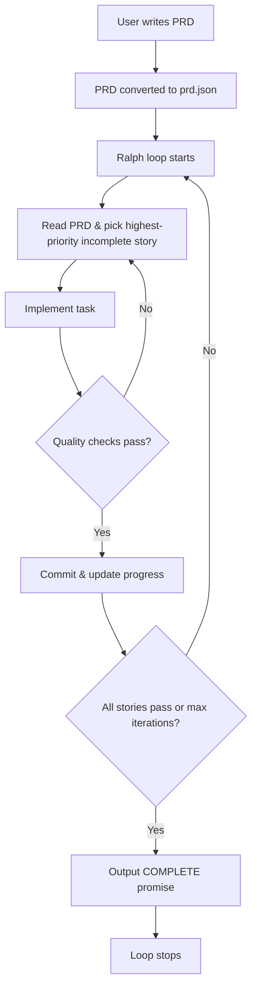

# Ralph: Research Overview

## What Ralph Is

- **Creator**: Geoff Huntley; went viral late 2025
- **Namesake**: Ralph Wiggum from The Simpsons — "clueless yet relentlessly persistent"
- **Core form**: A bash loop that runs an AI coding agent repeatedly
- **Original loop**: `while :; do cat PROMPT.md | claude-code ; done`
- **Core insight**: "Carve off small bits of work into independent context windows"
- **Not about**: "Run forever" — it's about **fresh context per iteration**

## Core Concepts

- **One item per loop**: Each iteration picks one task from a PRD, implements it, and commits
- **Fresh context**: Each iteration spawns a new AI instance with clean context. Memory persists via git history, `progress.txt`, and `prd.json`
- **Backpressure**: Quality checks (typecheck, lint, test) reject bad code generation
- **Specs over instructions**: Declarative specifications beat imperative instructions
- **Subagents**: Primary context window operates as scheduler; expensive work delegated to subagents
- **Self-improvement**: The agent updates `AGENTS.md` with learnings for future iterations
- **fix_plan.md / progress.txt**: Running todo list and progress log that persist across iterations

## The Workflow

1. User writes a PRD describing the project
2. PRD is converted to structured user stories (`prd.json`)
3. Ralph loop starts: bash script that spawns fresh AI instances
4. Each iteration: read PRD → pick highest-priority incomplete story → implement → quality checks → commit → update progress → exit
5. Next iteration picks up where previous left off
6. Loop stops when all stories pass or max iterations reached
7. Completion signaled by outputting `<promise>COMPLETE</promise>`

## Key References

| Resource | URL |
|----------|-----|
| Original blog post | https://ghuntley.com/ralph/ |
| Snarktank/ralph repo (12k stars) | https://github.com/snarktank/ralph |
| HumanLayer history | https://www.humanlayer.dev/blog/brief-history-of-ralph |
| AI Hero getting started guide | https://www.aihero.dev/getting-started-with-ralph |
| Medium overview | https://medium.com/@tentenco/what-is-ralph-loop-a-new-era-of-autonomous-coding-96a4bb3e2ac8 |
| Geoff Huntley on specs | https://ghuntley.com/specs/ |
| Geoff Huntley on subagents | https://ghuntley.com/subagents/ |
| Matt Pocock's YouTube overview | https://www.youtube.com/watch?v=_IK18goX4X8 |

## Related Tools

- **Ralph TUI**: Terminal UI for monitoring Ralph loops — [subsy/ralph-tui](https://github.com/subsy/ralph-tui)
- **Amp Code**: Alternative to Claude Code for running Ralph
- **Cubic**: AI code review tool for reviewing Ralph output

## Compatibility with Standards and Existing Tools

We treat compatibility with common Ralph conventions and tools as a **priority**:

- **PRD format**: We support both `userStories` (snarktank/ralph) and `stories` in `prd.json`, so the same file works with other tooling that expects snarktank-style PRDs.
- **Progress and state**: We use `progress.txt` (append-only) and a `state.json`-style loop state so tools that expect a progress file (e.g. Ralph TUI) can read status. Ralph TUI typically expects a task tracker (e.g. JSON or markdown); our `prd.json` + `progress.txt` + `state.json` provide the same information.
- **Completion signal**: We use the same completion sigil `<promise>COMPLETE</promise>` so parsers that look for it (e.g. in Ralph TUI or wrapper scripts) work unchanged.
- **AGENTS.md**: We direct the agent to read and update AGENTS.md with learnings (see [learnings-and-agents.md](learnings-and-agents.md)), matching the standard that many Ralph setups use for self-improvement.

Where we extend (e.g. `ralph.conf`, escalation reports, skill injection), we do so in addition to these conventions rather than replacing them. See [ralph-for-psibase.md](ralph-for-psibase.md) for our adaptations.
