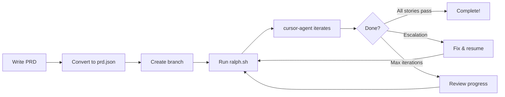

# Ralph: Autonomous AI Coding for Psibase

A Ralph-inspired system that uses **cursor-agent** to autonomously implement psibase app features from Product Requirements Documents (PRDs). Write a PRD, convert it to JSON, and let Ralph iterate until your user stories are complete—or escalate when it needs your help.

---

## Prerequisites

- **cursor-agent** installed and authenticated (`cursor-agent --version`)
- **jq** installed (for JSON parsing)
- **psibase repo** cloned and build environment set up (build directory exists)
- A running local psibase chain (if deploying/testing)

---

## Quick Start

### 1. Configure

Edit `ralph.conf` to set your preferences (model, max iterations, workspace path, etc.):

```bash
# Key settings
MAX_ITERATIONS=10
STORIES_PER_RUN=1
MODEL=auto
WORKSPACE=/path/to/your/psibase
```

### 2. Create a PRD

Copy `templates/prd-template.md` to `projects/my-feature.md` and fill it in with your project goals, user stories, and technical considerations.

### 3. Convert to prd.json

Either manually create `prd.json` following the template format, or use cursor-agent to convert:

```bash
cursor-agent "Convert projects/my-feature.md to prd.json following the template format"
```

Then move or copy the resulting `prd.json` into `ralph-work/`.

**Quick verification:** Copy `templates/prd.sample.json` to `prd.json` and run `./ralph.sh --dry-run` to test prompt building without calling cursor-agent. See [VERIFICATION.md](VERIFICATION.md).

### 4. Create a branch

Create and checkout the branch specified in your PRD's `branchName`:

```bash
git checkout -b ralph/my-feature
```

### 5. Run Ralph

```bash
./ralph.sh
```

Optional: run `./ralph.sh --dry-run` first to build the prompt and write it to `last_run/dry_run_prompt.md` without invoking cursor-agent (verifies config, branch, and skill injection).

### 6. Monitor

Watch stdout for iteration progress, model used, and task status. Check `iteration.log` for a history of model, story, and result per iteration. Ralph will stop when:
- All stories pass (agent outputs `<promise>COMPLETE</promise>` and script marks them complete)
- `STORIES_PER_RUN` stories are completed
- Max iterations reached
- An escalation occurs (agent outputs `<escalation>`, or 3 consecutive iterations without completion)

### 7. Handle escalations

If Ralph stops with an escalation report, check `reports/` for details, fix the issue in the codebase, and re-run `./ralph.sh`. The loop resumes from where it left off.

---

## How It Works

Ralph runs `cursor-agent` in a loop. Each iteration:

1. Injects your PRD, progress log, and relevant skills into a prompt
2. Targets the first story with `passes: false` (by priority order)
3. Agent breaks it into subtasks, implements them, and runs quality checks
4. On success (agent outputs `<promise>COMPLETE</promise>`): script marks that story `passes: true` in `prd.json`, appends to `iteration.log`, and continues
5. On agent escalation (agent outputs `<escalation>...</escalation>`): script writes an escalation report and exits
6. If 3 iterations in a row complete without COMPLETE or escalation: script writes an escalation report and exits (so you can fix blocking issues and re-run)



---

## Configuration Reference

| Option | Default | Description |
|--------|---------|-------------|
| `MAX_ITERATIONS` | 10 | Maximum loop iterations per run. Loop exits when reached even if stories remain. |
| `STORIES_PER_RUN` | 1 | How many user stories to complete before stopping. Useful for incremental runs. |
| `MODEL` | auto | Model to pass to cursor-agent. Examples: `auto`, `sonnet-4`, `opus-4.5`. |
| `MAX_TASK_ATTEMPTS` | 3 | Max retries per subtask before writing escalation report and exiting. |
| `WORKSPACE` | (repo path) | Psibase repo root. All paths are relative to this. |
| `BUILD_DIR` | build | Build directory relative to workspace. Used for build verification. |
| `SKILLS_DIR` | (empty = WORKSPACE/ai/skills) | Directory of skill subdirs (each with SKILL.md) to inject into the prompt. |

---

## File Structure

```
ai/
├── docs/
│   ├── ralph/          # Ralph research and adaptation docs
│   └── psibase/        # AI-focused psibase knowledge base
├── skills/             # Composable AI skills for psibase tasks
│   └── [skill-name]/   # One dir per skill with SKILL.md
├── ralph-work/         # ← You are here
│   ├── README.md       # This file
│   ├── VERIFICATION.md # Phase 5: verification checklist and dry-run guide
│   ├── ralph.conf      # Configuration
│   ├── ralph.sh        # Main loop script (supports --dry-run)
│   ├── prompt.md       # Template prompt for cursor-agent
│   ├── prd.json        # Active PRD (created per project)
│   ├── progress.txt    # Append-only progress log
│   ├── iteration.log   # Per-iteration log (model, story, result)
│   ├── state.json      # Loop state (auto-managed)
│   ├── templates/      # PRD and user story templates
│   │   └── prd.sample.json  # Sample PRD for dry-run verification
│   ├── projects/       # Your PRD markdown files
│   ├── reports/        # Escalation reports
│   ├── archive/        # Archived previous runs
│   └── missing-skills.log  # Log when no skill matched (for developing new skills)
└── lessons-learned/    # Self-learning from user interventions
```

---

## Writing Good PRDs for Psibase

- **Keep stories small** — Completable in one iteration. Break large features into multiple stories.
- **Order by dependency** — Schema → backend → plugin → UI. Stories that depend on others should have lower priority.
- **Include psibase-specific acceptance criteria** — Build passes, WASM compiles, table created, action callable, etc.
- **Include the component type** — Set `type` or `category` (service/plugin/UI) on each story so the script can map to a default skill when `skills` is absent.
- **List relevant skills** — Prefer a `skills` array with **area-based** names that match what’s needed (e.g. `["plugin-wasm"]`, `["service-tables", "service-actions"]`). See `ai/skills/README.md`.

---

## Handling Escalations

Ralph escalates in two cases: (1) the agent outputs an `<escalation>` block after 3 attempts at a subtask, or (2) the script sees 3 consecutive iterations without `<promise>COMPLETE</promise>` (no story completed).

1. **Read the escalation report** in `reports/` (e.g. `reports/escalation-2025-03-04-143022.md`)
2. **Fix the issue** in the codebase (or clarify the PRD if the agent was stuck)
3. **Re-run** `./ralph.sh` — the loop resumes from the current state; `prd.json` and `state.json` are preserved
4. **Add a lesson** — Consider adding a note to `ai/lessons-learned/` so future runs can avoid the same pitfall

---

## Tips

- **Start with `STORIES_PER_RUN=1`** — Review each story before continuing to the next.
- **Watch the first few iterations manually** — Build intuition for how the agent breaks down tasks.
- **If the PRD produces poor results** — The PRD is probably too vague. Add more detail, acceptance criteria, and implementation hints.
- **Use escalation reports** — They often reveal gaps in the skills documentation. Update `ai/skills/` accordingly.
- **Reset progress** — Delete `progress.txt` and `state.json` to start fresh (e.g. when switching to a different PRD or branch).

---

## Troubleshooting

| Issue | Solution |
|-------|----------|
| **Branch mismatch** | Checkout the branch from your PRD's `branchName` before running. |
| **jq not found** | Install jq: `apt install jq` (Debian/Ubuntu) or `brew install jq` (macOS). |
| **cursor-agent not found** | Ensure cursor-agent is on PATH. Run `cursor-agent --version` to verify. |
| **Escalation loops** | The AI is stuck. Either the agent reported `<escalation>` or the script hit 3 iterations without COMPLETE. Read the report and `iteration.log`, fix the root cause, then re-run. |
| **prd.json not found** | Create or convert your PRD to `prd.json` in `ralph-work/` before running. |

---

## Verification

See **[VERIFICATION.md](VERIFICATION.md)** for a Phase 5 checklist: prerequisites, dry-run steps (no cursor-agent), optional one-iteration run, and troubleshooting.

---

## Related Documentation

- **Ralph research:** `ai/docs/ralph/`
- **Psibase knowledge base:** `ai/docs/psibase/` (Phase 2)
- **AI skills:** `ai/skills/`
- **Official psibase docs:** `doc/src/`
