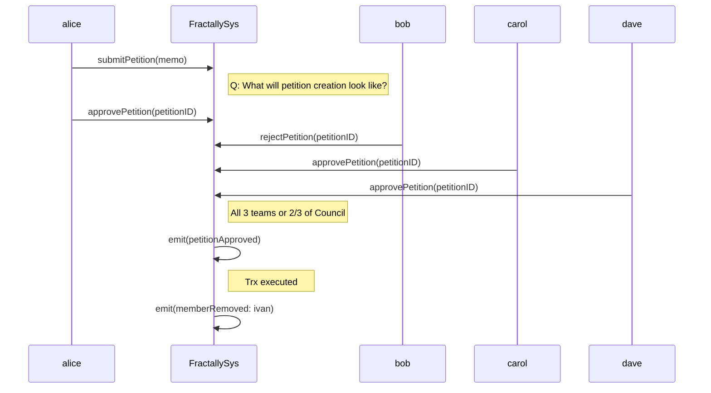

## Council Evicts someone

```mermaid
sequenceDiagram
alice->>FractallySys: submitPetition(memo)
note right of FractallySys: Q: What will petition creation look like?

alice->>FractallySys: approvePetition(petitionID)
bob->>FractallySys: rejectPetition(petitionID)
carol->>FractallySys: approvePetition(petitionID)
dave->>FractallySys: approvePetition(petitionID)
note right of FractallySys: All 3 teams or 2/3 of Council
FractallySys->>FractallySys: emit(petitionApproved)
note right of FractallySys: Trx executed
FractallySys->>FractallySys: emit(memberRemoved: ivan)
```