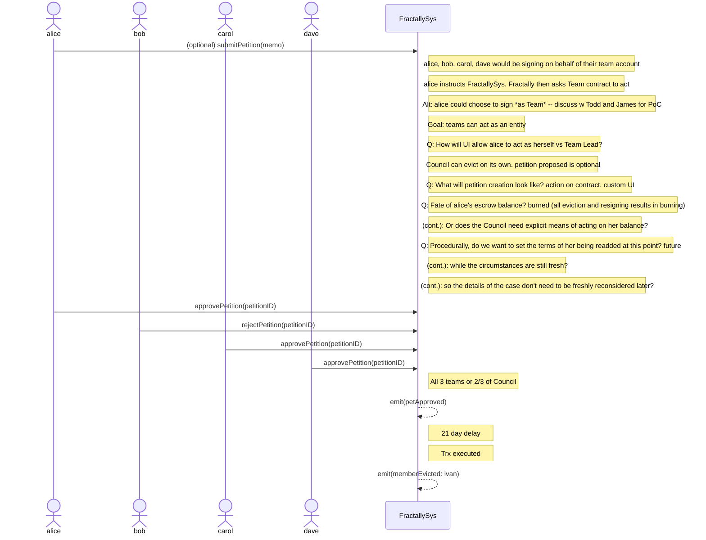

## Council votes on Petition to Evict

```mermaid
sequenceDiagram
Actor alice
Actor bob
Actor carol
Actor dave

alice->>FractallySys: (optional) submitPetition(memo)
note right of FractallySys: alice, bob, carol, dave would be signing on behalf of their team account
note right of FractallySys: alice instructs FractallySys. Fractally then asks Team contract to act
note right of FractallySys: Alt: alice could choose to sign *as Team* -- discuss w Todd and James for PoC
note right of FractallySys: Goal: teams can act as an entity
note right of FractallySys: Q: How will UI allow alice to act as herself vs Team Lead?
note right of FractallySys: Council can evict on its own. petition proposed is optional
note right of FractallySys: Q: What will petition creation look like? action on contract. custom UI
note right of FractallySys: Q: Fate of alice's escrow balance? burned (all eviction and resigning results in burning)
note right of FractallySys: (cont.): Or does the Council need explicit means of acting on her balance?
note right of FractallySys: Q: Procedurally, do we want to set the terms of her being readded at this point? future
note right of FractallySys: (cont.): while the circumstances are still fresh?
note right of FractallySys: (cont.): so the details of the case don't need to be freshly reconsidered later?

alice->>FractallySys: approvePetition(petitionID)
bob->>FractallySys: rejectPetition(petitionID)
carol->>FractallySys: approvePetition(petitionID)
dave->>FractallySys: approvePetition(petitionID)
note right of FractallySys: All 3 teams or 2/3 of Council
FractallySys-->>FractallySys: emit(petApproved)
note right of FractallySys: 21 day delay
note right of FractallySys: Trx executed
FractallySys-->>FractallySys: emit(memberEvicted: ivan)
```