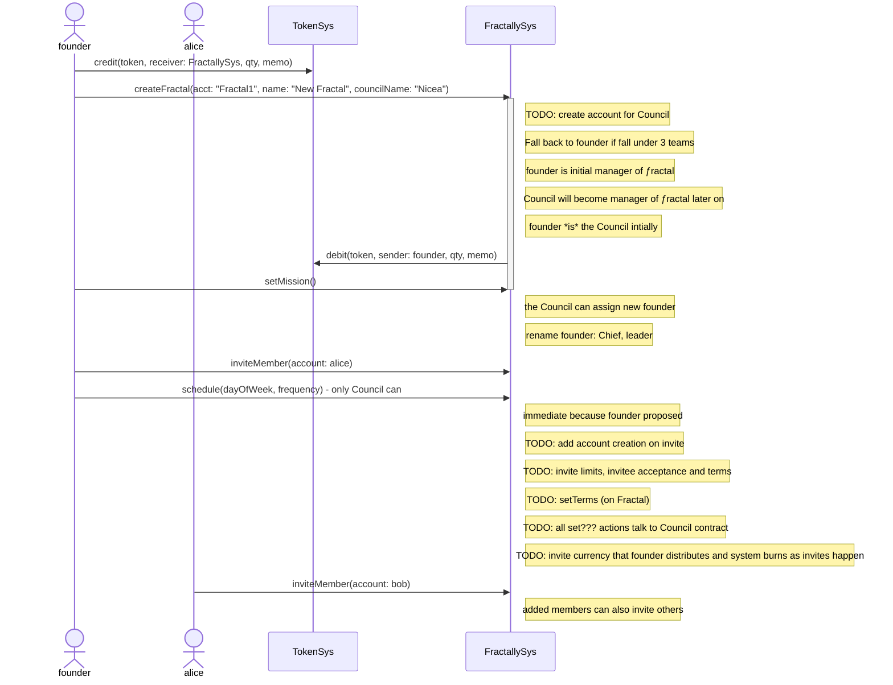
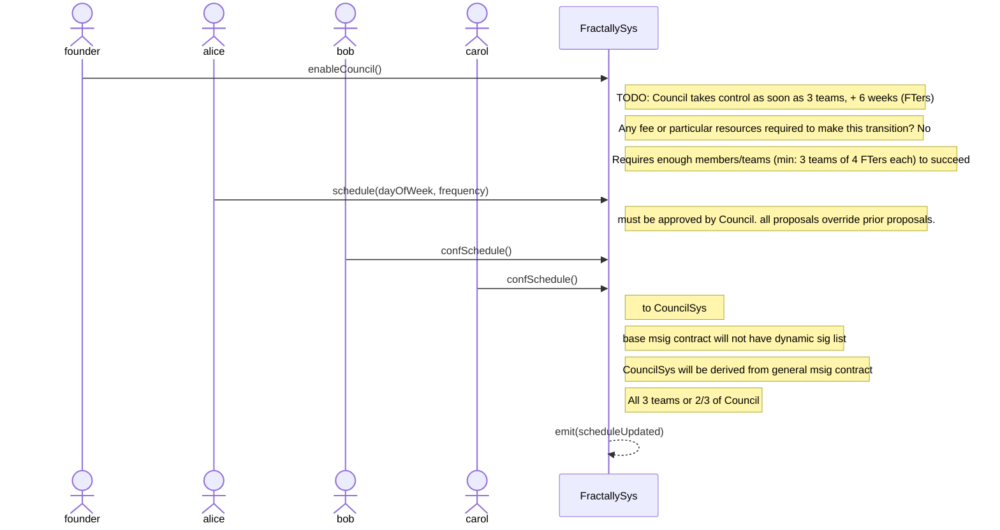

Notes:
- Resource management actions have been left out of these diagrams for simplicity
- These diagrams are in part intended to demonstrate user flows (in the userFlows subfolder)
- Where the details get technical and complex enough, certain flows have been broken out into separate diagrams (this folder).
 - In the technical diagrams, where technical details are uncertain, user-flow-level placeholders are present until these are reviewed

## Bootstrapping a Functioning Founder-Controlled ƒractal

## Founder Passes Control to Council and Council Changes Meeting Schedule

