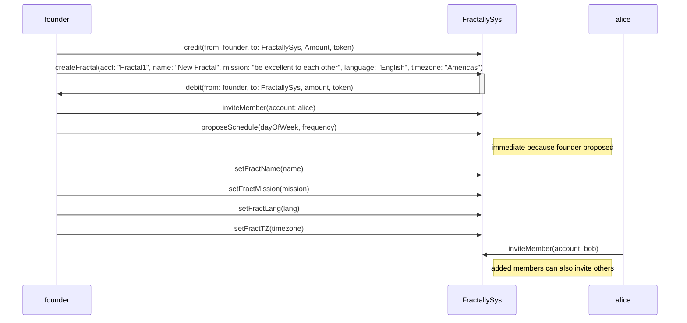
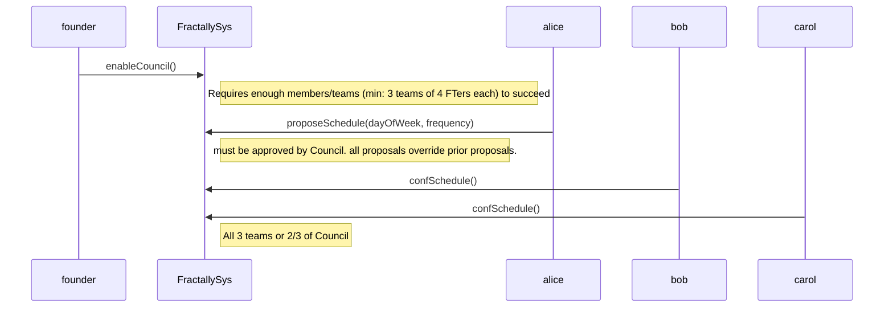

## Create a Fractal

```mermaid
sequenceDiagram
founder->>FractallySys: credit(from: founder, to: FractallySys, Amount, token)

founder->>FractallySys: createFractal(acct: "Fractal1", name: "New Fractal", mission: "be excellent to each other", language: "English", timezone: "Americas")
activate FractallySys
FractallySys->>founder: debit(from: founder, to: FractallySys, amount, token)
deactivate FractallySys

founder->>FractallySys: inviteMember(account: alice)
founder->>FractallySys: proposeSchedule(dayOfWeek, frequency)
note right of FractallySys: immediate because founder proposed

founder->>FractallySys: setFractName(name)
founder->>FractallySys: setFractMission(mission)
founder->>FractallySys: setFractLang(lang)
founder->>FractallySys: setFractTZ(timezone)

alice->>FractallySys: inviteMember(account: bob)
note right of FractallySys: added members can also invite others
```

## Founder Passes Control to Council and Council Changes Meeting Schedule

```mermaid
sequenceDiagram
founder->>FractallySys: enableCouncil()
note right of FractallySys: Requires enough members/teams (min: 3 teams of 4 FTers each) to succeed

alice->>FractallySys: proposeSchedule(dayOfWeek, frequency)
note right of FractallySys: must be approved by Council. all proposals override prior proposals.

bob->>FractallySys: confSchedule()
carol->>FractallySys: confSchedule()
note right of FractallySys: All 3 teams or 2/3 of Council
```

