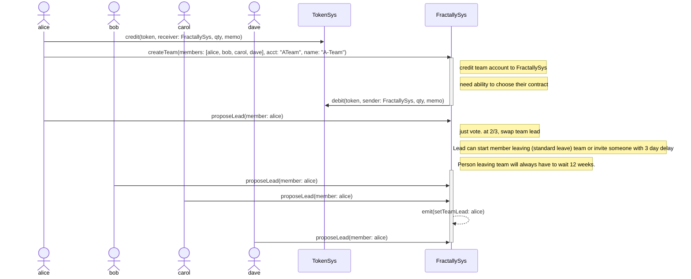
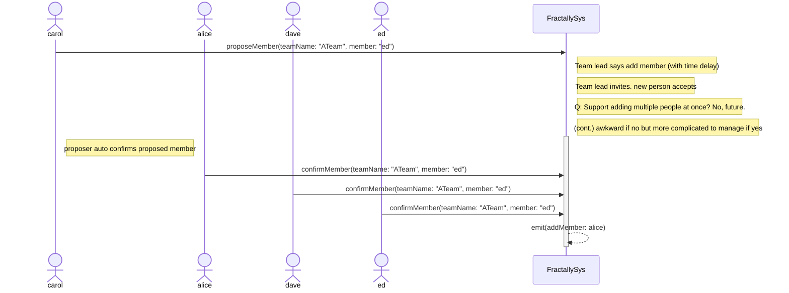
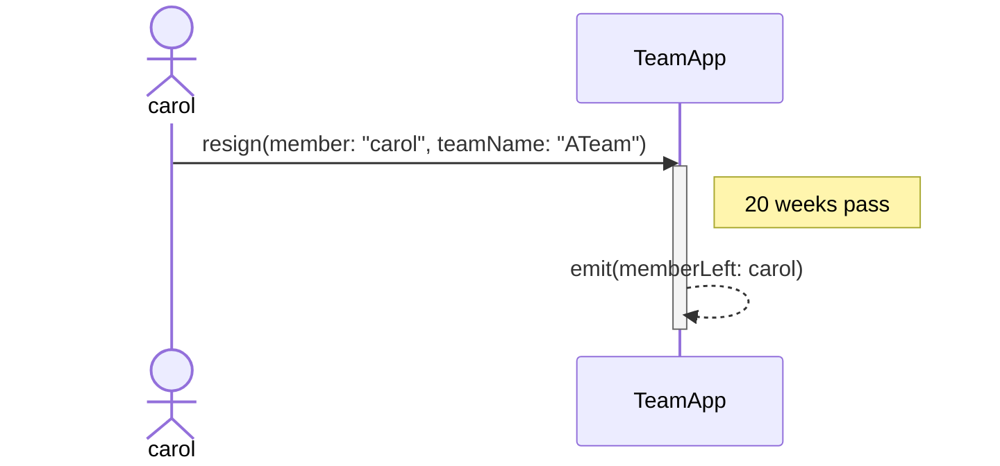
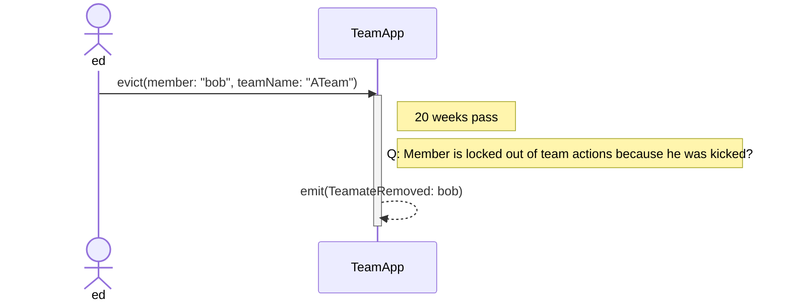
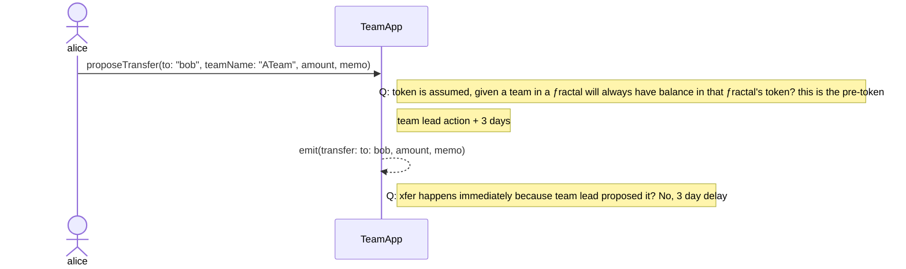
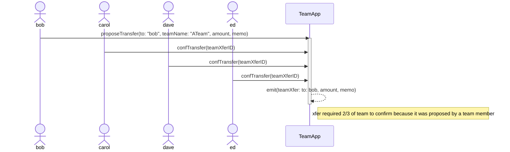
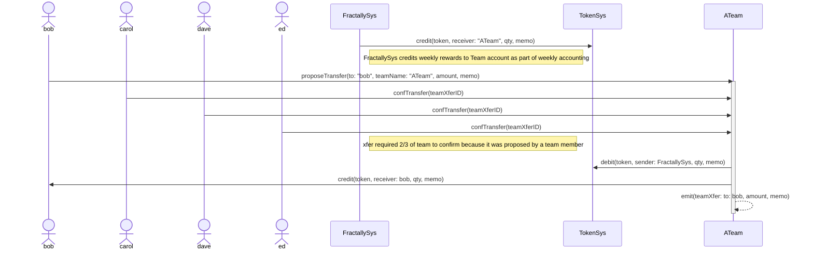

## Team Management: Create a Team and Choose a Team Lead

## Team Management: Add New Member

## Team Management: Member Elects to Leave Team

## Team Management: Team Kicks a Member Off the Team

## Team Management: Team Lead Proposes Team Respect Transfer

## Team Management: Team Member Proposes Team Respect Transfer

## EXPERIMENTAL Team Management: Team Member Proposes Team Respect Transfer
