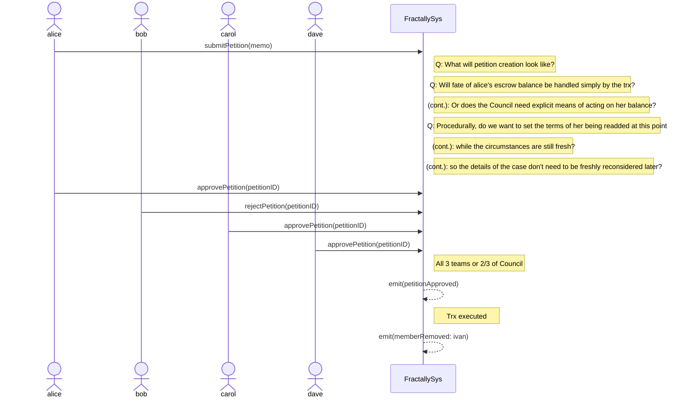

## Council Evicts someone

```mermaid
sequenceDiagram
Actor alice
Actor bob
Actor carol
Actor dave

alice->>FractallySys: submitPetition(memo)
note right of FractallySys: Q: What will petition creation look like?
note right of FractallySys: Q: Will fate of alice's escrow balance be handled simply by the trx?
note right of FractallySys: (cont.): Or does the Council need explicit means of acting on her balance?
note right of FractallySys: Q: Procedurally, do we want to set the terms of her being readded at this point
note right of FractallySys: (cont.): while the circumstances are still fresh?
note right of FractallySys: (cont.): so the details of the case don't need to be freshly reconsidered later?

alice->>FractallySys: approvePetition(petitionID)
bob->>FractallySys: rejectPetition(petitionID)
carol->>FractallySys: approvePetition(petitionID)
dave->>FractallySys: approvePetition(petitionID)
note right of FractallySys: All 3 teams or 2/3 of Council
FractallySys-->>FractallySys: emit(petitionApproved)
note right of FractallySys: Trx executed
FractallySys-->>FractallySys: emit(memberRemoved: ivan)
```