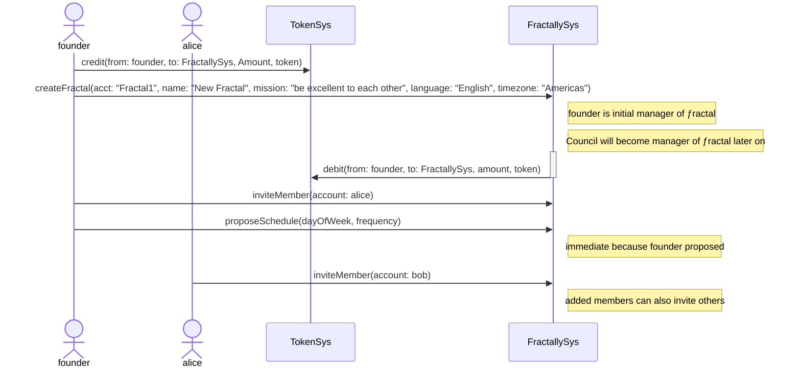
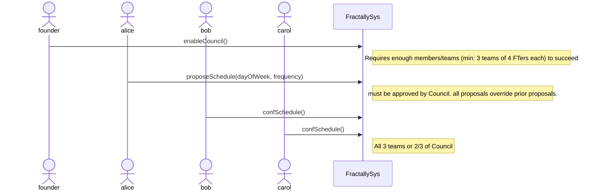

Notes:
- Resource managemen actions have been left out of these diagrams for simplicity
- These diagrams are in part intended to demonstrate user flows
- Where the details get technical and complex enough, certain flows have been broken out into separate diagrams.

## Bootstrapping a Functioning Founder-Controlled ƒractal

founder->>FractallySys: (optional) setFractName(name)
founder->>FractallySys: (optional) setFractMission(mission)
founder->>FractallySys: (optional) setFractLang(lang)
founder->>FractallySys: (optional) setFractTZ(timezone)

## Founder Passes Control to Council and Council Changes Meeting Schedule

