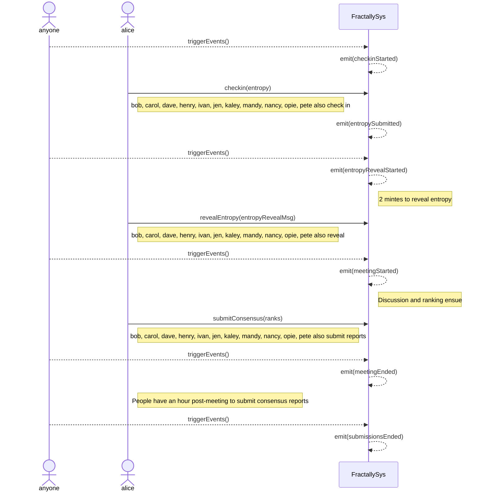
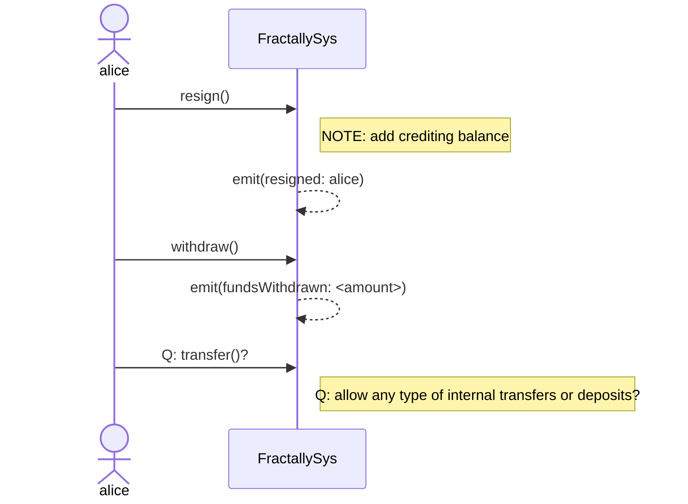
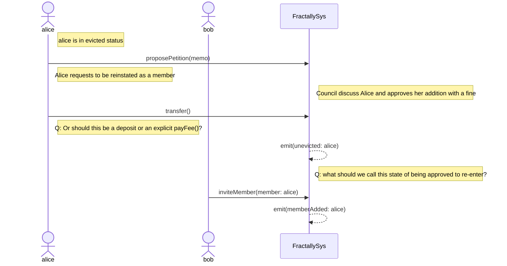

## Members Participating in Weekly Meeting

```mermaid
sequenceDiagram
Actor anyone
Actor alice

anyone-->>FractallySys: triggerEvents()
FractallySys-->>FractallySys: emit(checkinStarted)
alice->>FractallySys: checkin(entropy)
note right of alice: bob, carol, dave, henry, ivan, jen, kaley, mandy, nancy, opie, pete also check in
FractallySys-->>FractallySys: emit(entropySubmitted)

anyone-->>FractallySys: triggerEvents()
FractallySys-->>FractallySys: emit(entropyRevealStarted)
note right of FractallySys: 2 mintes to reveal entropy
alice->>FractallySys: revealEntropy(entropyRevealMsg)
note right of alice: bob, carol, dave, henry, ivan, jen, kaley, mandy, nancy, opie, pete also reveal

anyone-->>FractallySys: triggerEvents()
FractallySys-->>FractallySys: emit(meetingStarted)
note right of FractallySys: Discussion and ranking ensue
alice->>FractallySys: submitConsensus(ranks)
note right of alice: bob, carol, dave, henry, ivan, jen, kaley, mandy, nancy, opie, pete also submit reports
anyone-->>FractallySys: triggerEvents()
FractallySys-->>FractallySys: emit(meetingEnded)
note right of alice: People have an hour post-meeting to submit consensus reports
anyone-->>FractallySys: triggerEvents()
FractallySys-->>FractallySys: emit(submissionsEnded)
```

## Member Self-Admin Actions

```mermaid
sequenceDiagram
Actor alice

alice->>FractallySys: resign()
note right of FractallySys: NOTE: add crediting balance
FractallySys-->>FractallySys: emit(resigned: alice)

alice->>FractallySys: withdraw()
FractallySys-->>FractallySys: emit(fundsWithdrawn: <amount>)

alice->>FractallySys: Q: transfer()?
note right of FractallySys: Q: allow any type of internal transfers or deposits?
```

## Evicted Member Rejoins the ƒractal

```mermaid
sequenceDiagram
Actor alice
Actor bob

note right of alice: alice is in evicted status
alice->>FractallySys: proposePetition(memo)
note right of alice: Alice requests to be reinstated as a member
note right of FractallySys: Council discuss Alice and approves her addition with a fine

alice->>FractallySys: transfer()
note right of alice: Q: Or should this be a deposit or an explicit payFee()?
FractallySys-->>FractallySys: emit(unevicted: alice)
note right of FractallySys: Q: what should we call this state of being approved to re-enter?

bob->>FractallySys: inviteMember(member: alice)
FractallySys-->>FractallySys: emit(memberAdded: alice)
```
