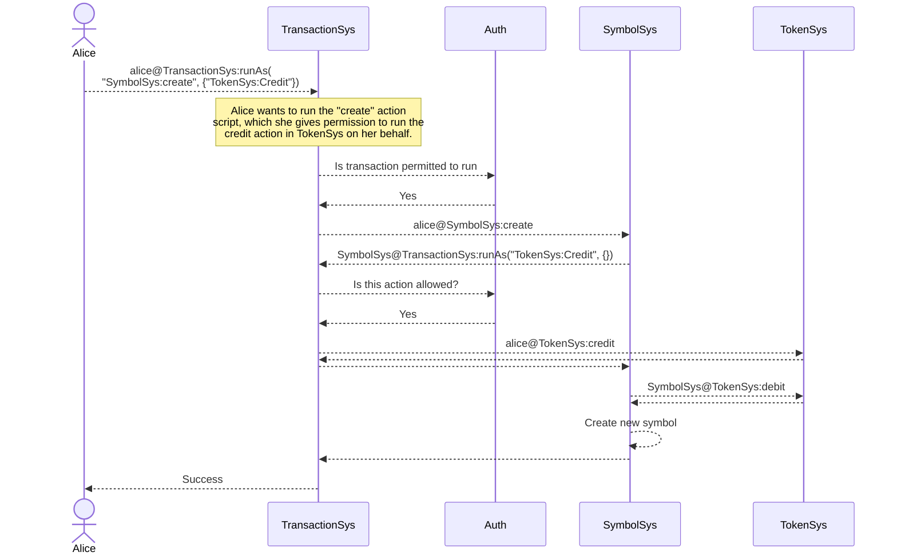

```mermaid
sequenceDiagram

actor Alice

Alice-->>TransactionSys: alice@TransactionSys:runAs( <br>"SymbolSys:create", {"TokenSys:Credit"}) 
Note over TransactionSys: Alice wants to run the "create" action<br>script, which she gives permission to run the<br> credit action in TokenSys on her behalf.
TransactionSys-->>Auth: Is transaction permitted to run
Auth-->>TransactionSys: Yes
TransactionSys-->>SymbolSys: alice@SymbolSys:create
SymbolSys-->>TransactionSys: SymbolSys@TransactionSys:runAs("TokenSys:Credit", {})
TransactionSys-->>Auth: Is this action allowed?
Auth-->>TransactionSys: Yes
TransactionSys-->>TokenSys: alice@TokenSys:credit
TokenSys-->>TransactionSys: 
TransactionSys-->>SymbolSys: 
SymbolSys-->>TokenSys: SymbolSys@TokenSys:debit
TokenSys-->>SymbolSys: 
SymbolSys-->>SymbolSys: Create new symbol
SymbolSys-->>TransactionSys: 
TransactionSys-->>Alice: Success

```