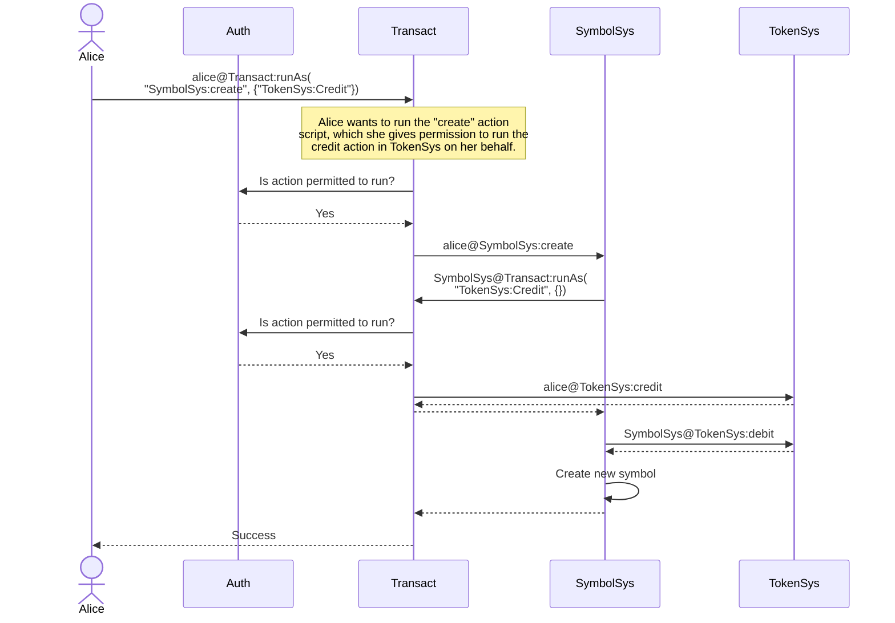

```mermaid
sequenceDiagram

actor Alice
participant Auth
participant Transact
participant SymbolSys
participant TokenSys

Alice->>Transact: alice@Transact:runAs( <br>"SymbolSys:create", {"TokenSys:Credit"}) 
Note over Transact: Alice wants to run the "create" action<br>script, which she gives permission to run the<br> credit action in TokenSys on her behalf.
Transact->>Auth: Is action permitted to run?
Auth-->>Transact: Yes
Transact->>SymbolSys: alice@SymbolSys:create
SymbolSys->>Transact: SymbolSys@Transact:runAs(<br>"TokenSys:Credit", {})
Transact->>Auth: Is action permitted to run?
Auth-->>Transact: Yes
Transact->>TokenSys: alice@TokenSys:credit
TokenSys-->>Transact: 
Transact-->>SymbolSys: 
SymbolSys->>TokenSys: SymbolSys@TokenSys:debit
TokenSys-->>SymbolSys: 
SymbolSys->>SymbolSys: Create new symbol
SymbolSys-->>Transact: 
Transact-->>Alice: Success

```