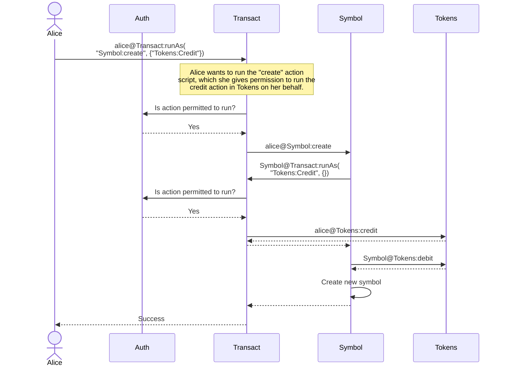

```mermaid
sequenceDiagram

actor Alice
participant Auth
participant Transact
participant Symbol
participant Tokens

Alice->>Transact: alice@Transact:runAs( <br>"Symbol:create", {"Tokens:Credit"}) 
Note over Transact: Alice wants to run the "create" action<br>script, which she gives permission to run the<br> credit action in Tokens on her behalf.
Transact->>Auth: Is action permitted to run?
Auth-->>Transact: Yes
Transact->>Symbol: alice@Symbol:create
Symbol->>Transact: Symbol@Transact:runAs(<br>"Tokens:Credit", {})
Transact->>Auth: Is action permitted to run?
Auth-->>Transact: Yes
Transact->>Tokens: alice@Tokens:credit
Tokens-->>Transact: 
Transact-->>Symbol: 
Symbol->>Tokens: Symbol@Tokens:debit
Tokens-->>Symbol: 
Symbol->>Symbol: Create new symbol
Symbol-->>Transact: 
Transact-->>Alice: Success

```