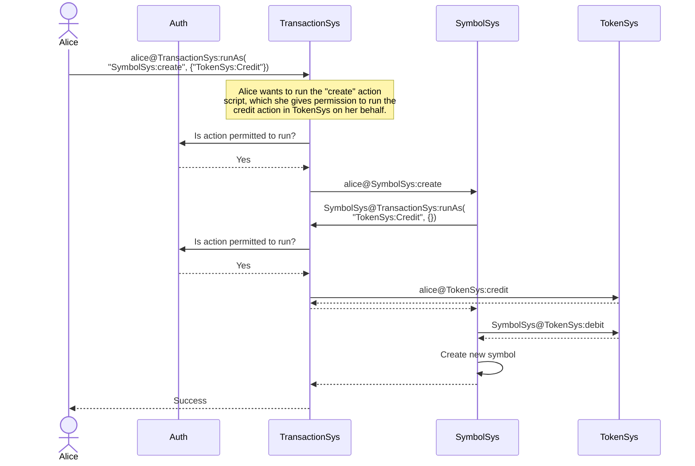

```mermaid
sequenceDiagram

actor Alice
participant Auth
participant TransactionSys
participant SymbolSys
participant TokenSys

Alice->>TransactionSys: alice@TransactionSys:runAs( <br>"SymbolSys:create", {"TokenSys:Credit"}) 
Note over TransactionSys: Alice wants to run the "create" action<br>script, which she gives permission to run the<br> credit action in TokenSys on her behalf.
TransactionSys->>Auth: Is action permitted to run?
Auth-->>TransactionSys: Yes
TransactionSys->>SymbolSys: alice@SymbolSys:create
SymbolSys->>TransactionSys: SymbolSys@TransactionSys:runAs(<br>"TokenSys:Credit", {})
TransactionSys->>Auth: Is action permitted to run?
Auth-->>TransactionSys: Yes
TransactionSys->>TokenSys: alice@TokenSys:credit
TokenSys-->>TransactionSys: 
TransactionSys-->>SymbolSys: 
SymbolSys->>TokenSys: SymbolSys@TokenSys:debit
TokenSys-->>SymbolSys: 
SymbolSys->>SymbolSys: Create new symbol
SymbolSys-->>TransactionSys: 
TransactionSys-->>Alice: Success

```