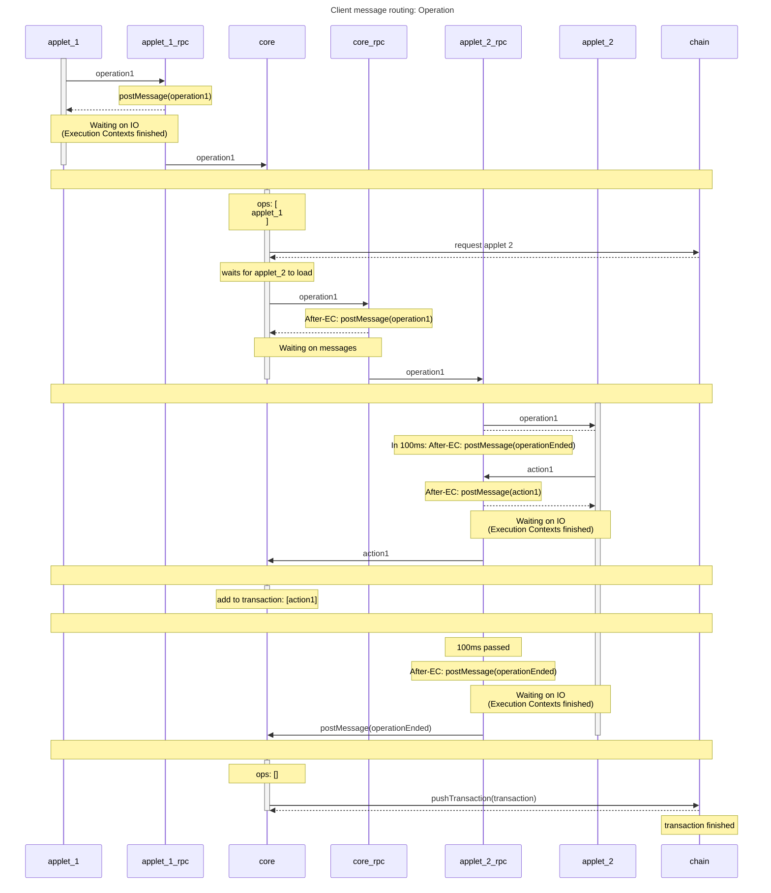
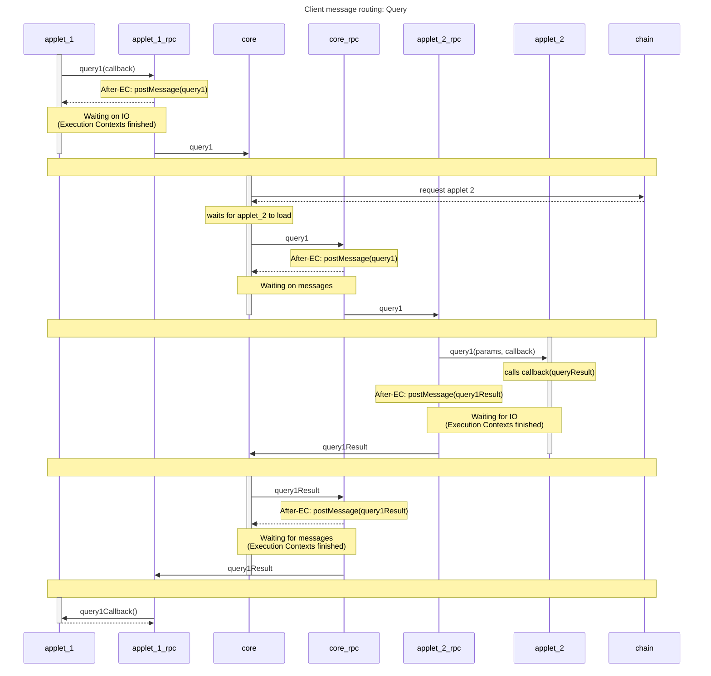

Whenever we call operation(), action(), or query() inside an applet, `Window.postMessage` is used to send a specific message to the common-sys window.

According to the [Window.postMessage documentation](https://developer.mozilla.org/en-US/docs/Web/API/Window/postMessage):

> After postMessage() is called, the MessageEvent will be dispatched only after all pending execution contexts have finished.
Therefore postMessage in the below diagrams does not immediately post to the other window. Instead it schedules a payload to be dispatched after the completion of all remaining execution contexts.

