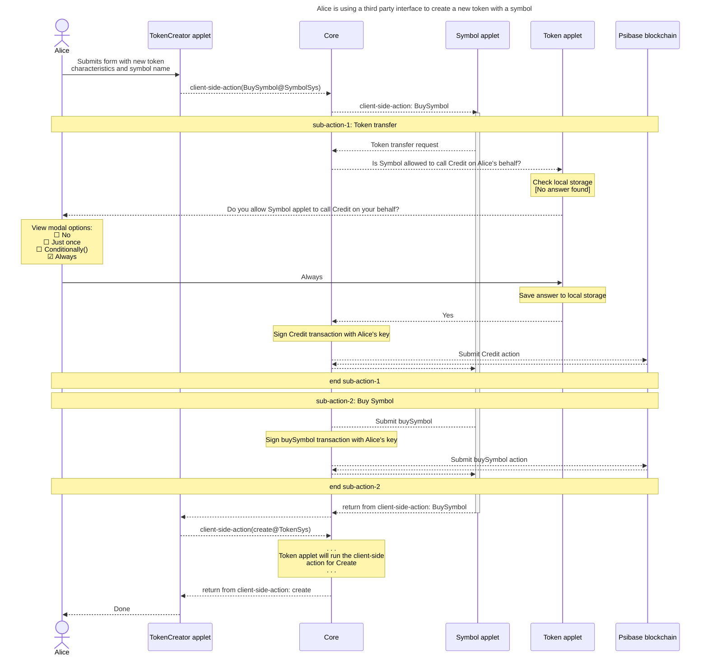

# Diagram to showcase modular client-side action interfaces

```mermaid
sequenceDiagram

actor Alice
participant TokenCreator applet
participant Core
participant Symbol applet
participant Token applet
participant Psibase blockchain

title Alice is using a third party interface to create a new token with a symbol
Alice->>TokenCreator applet: Submits form with new token<br> characteristics and symbol name
TokenCreator applet-->>Core: client-side-action(BuySymbol@SymbolSys)

Core-->>Symbol applet: client-side-action: BuySymbol
activate Symbol applet
note over Alice, Psibase blockchain: sub-action-1: Token transfer
Symbol applet-->>Core: Token transfer request
Core-->>Token applet: Is Symbol allowed to call Credit on Alice's behalf?
Note over Token applet: Check local storage<br>[No answer found]
Token applet-->>Alice: Do you allow Symbol applet to call Credit on your behalf?
Note over Alice: View modal options: <br> #9744; No <br> #9744; Just once <br> #9744; Conditionally() <br> #9745; Always
Alice->>Token applet: Always
Note over Token applet: Save answer to local storage
Token applet-->>Core: Yes
Note over Core: Sign Credit transaction with Alice's key
Core-->>Psibase blockchain: Submit Credit action
Psibase blockchain-->>Core: 
Core-->>Symbol applet: 
note over Alice, Psibase blockchain: end sub-action-1
note over Alice, Psibase blockchain: sub-action-2: Buy Symbol
Symbol applet-->Core: Submit buySymbol
Note over Core: Sign buySymbol transaction with Alice's key
Core-->>Psibase blockchain: Submit buySymbol action
Psibase blockchain-->>Core: 
Core-->>Symbol applet: 
note over Alice, Psibase blockchain: end sub-action-2
Symbol applet-->>Core: return from client-side-action: BuySymbol
deactivate Symbol applet

Core-->>TokenCreator applet: 
TokenCreator applet-->>Core: client-side-action(create@TokenSys)
Note over Core: . . . <br> Token applet will run the client-side <br>action for Create <br> . . .
Core-->>TokenCreator applet: return from client-side-action: create
TokenCreator applet-->>Alice: Done
```