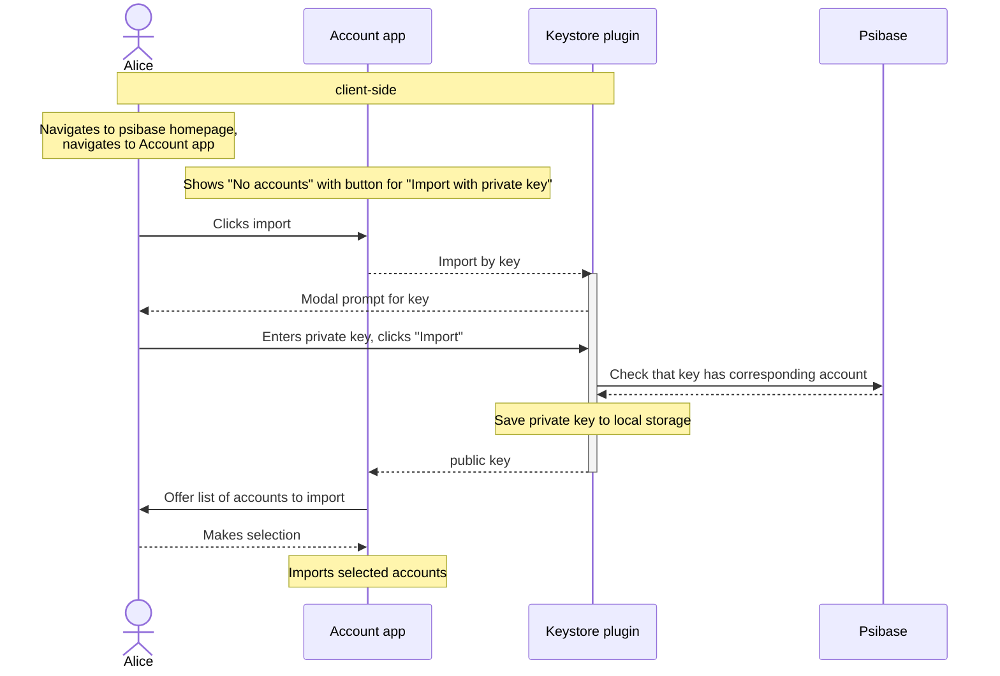

```mermaid

sequenceDiagram
   actor Alice
   participant Account app
   participant Keystore plugin
   participant Psibase
   note over Alice, Keystore plugin: client-side

   Note over Alice: Navigates to psibase homepage, <br>navigates to Account app
   Note over Account app: Shows "No accounts" with button for "Import with private key"
   Alice->>Account app: Clicks import
   Account app-->>Keystore plugin: Import by key
   activate Keystore plugin
   Keystore plugin-->>Alice: Modal prompt for key
   Alice->>Keystore plugin: Enters private key, clicks "Import"
   Keystore plugin->>Psibase: Check that key has corresponding account
   Psibase-->>Keystore plugin: 
   Note over Keystore plugin: Save private key to local storage
   Keystore plugin-->>Account app: public key
   deactivate Keystore plugin
   
   Account app->>Alice: Offer list of accounts to import
   Alice-->>Account app: Makes selection
   Note over Account app: Imports selected accounts

```
