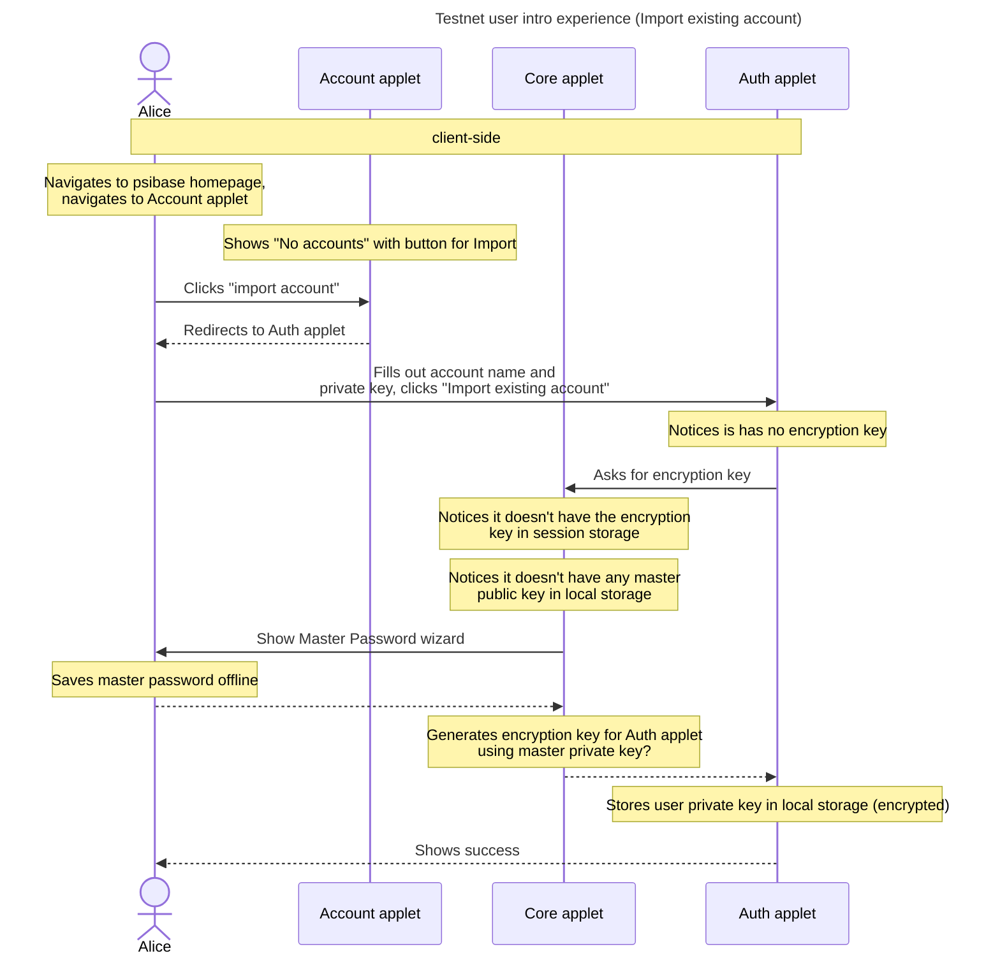

```mermaid
sequenceDiagram
   title Testnet user intro experience (Import existing account)
   actor Alice
   participant Account applet
   participant Core applet
   participant Auth applet
   note over Alice, Auth applet: client-side

   Note over Alice: Navigates to psibase homepage, <br>navigates to Account applet
   Note over Account applet: Shows "No accounts" with button for Import
   Alice->>Account applet: Clicks "import account"
   Account applet-->>Alice: Redirects to Auth applet
   Alice->>Auth applet: Fills out account name and<br>private key, clicks "Import existing account"
   Note over Auth applet: Notices is has no encryption key
   Auth applet->>Core applet: Asks for encryption key
   Note over Core applet: Notices it doesn't have the encryption<br>key in session storage
   Note over Core applet: Notices it doesn't have any master<br>public key in local storage
   Core applet->>Alice: Show Master Password wizard
   Note over Alice: Saves master password offline
   Alice-->>Core applet: 
   Note over Core applet: Generates encryption key for Auth applet<br>using master private key?
   Core applet-->>Auth applet: 
   Note over Auth applet: Stores user private key in local storage (encrypted)
   Auth applet-->>Alice: Shows success
   
```
