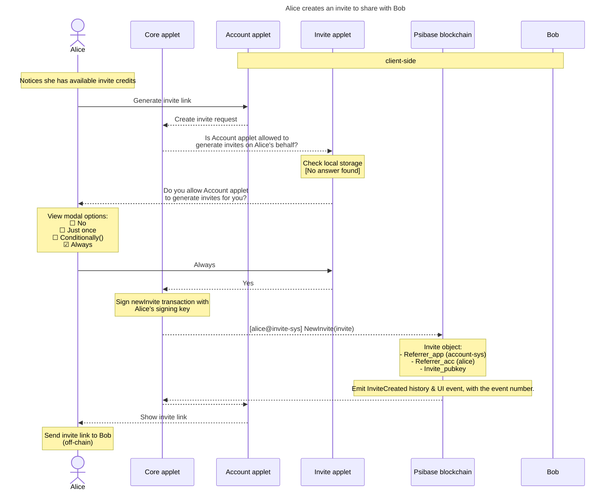
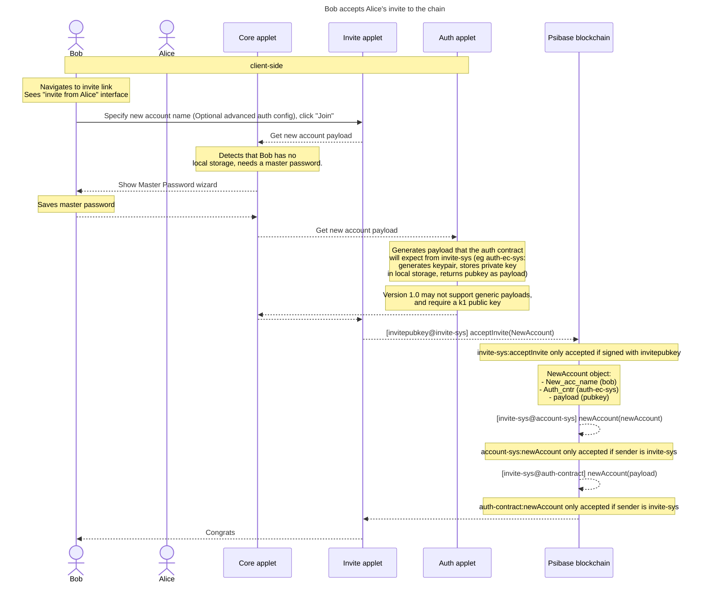

```mermaid

sequenceDiagram

   title Alice creates an invite to share with Bob
   actor Alice
   participant Core applet
   participant Account applet
   participant Invite applet
   participant Psibase blockchain

   note over Bob, Account applet: client-side

   note over Alice: Notices she has available invite credits
   Alice->>Account applet: Generate invite link
   Account applet-->>Core applet: Create invite request
   Core applet-->>Invite applet: Is Account applet allowed to <br>generate invites on Alice's behalf?
   Note over Invite applet: Check local storage<br>[No answer found]
   Invite applet-->>Alice: Do you allow Account applet<br> to generate invites for you?
   Note over Alice: View modal options: <br> #9744; No <br> #9744; Just once <br> #9744; Conditionally() <br> #9745; Always
   Alice->>Invite applet: Always
   Invite applet-->>Core applet: Yes
   Note over Core applet: Sign newInvite transaction with <br>Alice's signing key 
   Core applet-->>Psibase blockchain: [alice@invite-sys] NewInvite(invite)
   Note over Psibase blockchain: Invite object: <br>  - Referrer_app (account-sys)<br>  - Referrer_acc (alice)<br>  - Invite_pubkey
   Note over Psibase blockchain: Emit InviteCreated history & UI event, with the event number.
   Psibase blockchain-->>Core applet: 
   Core applet-->>Account applet: 
   Account applet-->>Alice: Show invite link
   Note over Alice: Send invite link to Bob<br>(off-chain)
```

```mermaid
sequenceDiagram

   title Bob accepts Alice's invite to the chain
   actor Bob
   actor Alice
   participant Core applet
   participant Invite applet
   participant Auth applet
   participant Psibase blockchain
   note over Bob, Auth applet: client-side

   Note over Bob: Navigates to invite link<br>Sees "invite from Alice" interface
   Bob->>Invite applet: Specify new account name (Optional advanced auth config), click "Join"
   Invite applet-->>Core applet: Get new account payload
   Note over Core applet: Detects that Bob has no<br>local storage, needs a master password.
   Core applet-->>Bob: Show Master Password wizard
   Note over Bob: Saves master password
   Bob-->>Core applet: 
   Core applet-->>Auth applet: Get new account payload
   Note over Auth applet: Generates payload that the auth contract<br> will expect from invite-sys (eg auth-ec-sys:<br>generates keypair, stores private key <br>in local storage, returns pubkey as payload)
   Note over Auth applet: Version 1.0 may not support generic payloads, <br>and require a k1 public key
   Auth applet-->>Core applet: 
   Core applet-->>Invite applet: 
   Invite applet-->>Psibase blockchain: [invitepubkey@invite-sys] acceptInvite(NewAccount)
   Note over Psibase blockchain: invite-sys:acceptInvite only accepted if signed with invitepubkey
   Note over Psibase blockchain: NewAccount object: <br>  - New_acc_name (bob)<br>  - Auth_cntr (auth-ec-sys)<br>  - payload (pubkey)
   Psibase blockchain-->>Psibase blockchain: [invite-sys@account-sys] newAccount(newAccount)
   Note over Psibase blockchain: account-sys:newAccount only accepted if sender is invite-sys
   Psibase blockchain-->>Psibase blockchain: [invite-sys@auth-contract] newAccount(payload)
   Note over Psibase blockchain: auth-contract:newAccount only accepted if sender is invite-sys
   Psibase blockchain-->>Invite applet: 
   Invite applet-->>Bob: Congrats
```