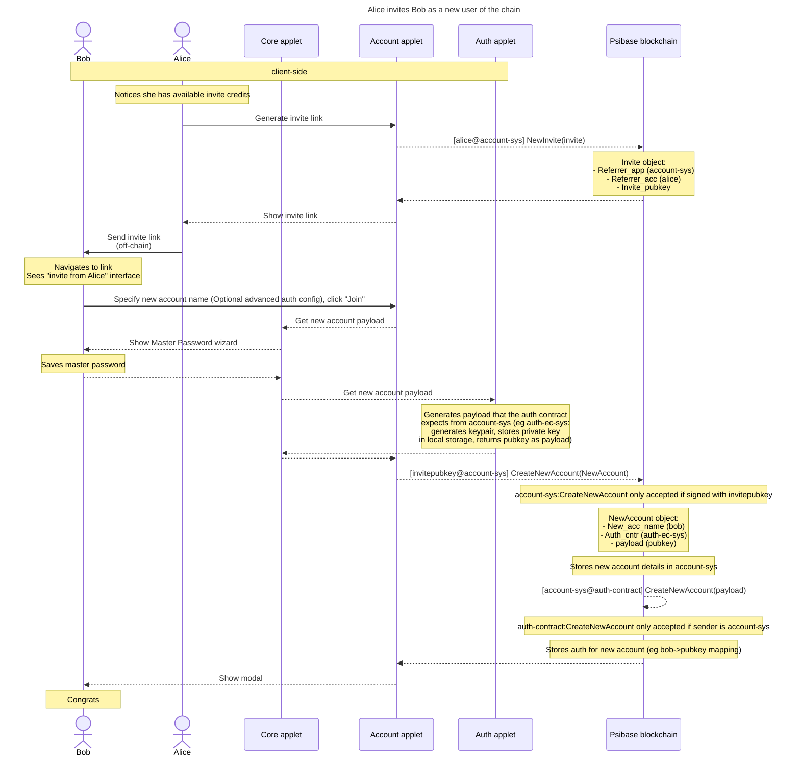

```mermaid

sequenceDiagram

   title Alice invites Bob as a new user of the chain
   actor Bob
   actor Alice
   participant Core applet
   participant Account applet
   participant Auth applet
   participant Psibase blockchain

   note over Bob, Auth applet: client-side

   note over Alice: Notices she has available invite credits
   Alice->>Account applet: Generate invite link
   Account applet-->>Psibase blockchain: [alice@account-sys] NewInvite(invite)
   Note over Psibase blockchain: Invite object: <br>  - Referrer_app (account-sys)<br>  - Referrer_acc (alice)<br>  - Invite_pubkey
   Psibase blockchain-->>Account applet: 
   Account applet-->>Alice: Show invite link
   Alice->>Bob: Send invite link <br>(off-chain)

   Note over Bob: Navigates to link<br>Sees "invite from Alice" interface
   Bob->>Account applet: Specify new account name (Optional advanced auth config), click "Join"
   Account applet-->>Core applet: Get new account payload
   Core applet-->>Bob: Show Master Password wizard
   Note over Bob: Saves master password
   Bob-->>Core applet: 
   Core applet-->>Auth applet: Get new account payload
   Note over Auth applet: Generates payload that the auth contract<br> expects from account-sys (eg auth-ec-sys:<br>generates keypair, stores private key <br>in local storage, returns pubkey as payload)
   Auth applet-->>Core applet: 
   Core applet-->>Account applet: 
   Account applet-->>Psibase blockchain: [invitepubkey@account-sys] CreateNewAccount(NewAccount)
   Note over Psibase blockchain: account-sys:CreateNewAccount only accepted if signed with invitepubkey
   Note over Psibase blockchain: NewAccount object: <br>  - New_acc_name (bob)<br>  - Auth_cntr (auth-ec-sys)<br>  - payload (pubkey)
   Note over Psibase blockchain: Stores new account details in account-sys
   Psibase blockchain-->>Psibase blockchain: [account-sys@auth-contract] CreateNewAccount(payload)
   Note over Psibase blockchain: auth-contract:CreateNewAccount only accepted if sender is account-sys
   Note over Psibase blockchain: Stores auth for new account (eg bob->pubkey mapping)
   Psibase blockchain-->>Account applet: 
   Account applet-->>Bob: Show modal
   Note over Bob: Congrats
```