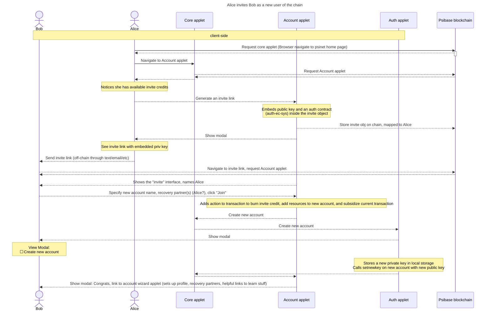

```mermaid

sequenceDiagram
   title Alice invites Bob as a new user of the chain
   actor Bob
   actor Alice
   participant Core applet
   participant Account applet
   participant Auth applet
   participant Psibase blockchain

   note over Bob, Auth applet: client-side

   Alice->>Psibase blockchain: Request core applet (Browser navigate to psinet home page)
   activate Psibase blockchain
   Psibase blockchain-->>Alice: 
   deactivate Psibase blockchain

   Alice->>Core applet: Navigate to Account applet
   Core applet-->>Psibase blockchain: Request Account applet
   Psibase blockchain-->>Core applet: 
   Core applet-->>Alice: 

   note over Alice: Notices she has available invite credits
   Alice-->>Account applet: Generate an invite link
   Note over Account applet: Embeds public key and an auth contract<br> (auth-ec-sys) inside the invite object
   Account applet-->>Psibase blockchain: Store invite obj on chain, mapped to Alice
   Account applet-->>Alice: Show modal
   Note over Alice: See invite link with embedded priv key
   Alice-->>Bob: Send invite link (off-chain through text/email/etc)
   
   Bob-->>Psibase blockchain: Navigate to invite link, request Account applet
   Psibase blockchain-->>Bob: 

   Account applet-->>Bob: Shows the "invite" interface, names Alice
   Bob-->>Account applet: Specify new account name, recovery partner(s) (Alice?), click "Join"
   Note over Account applet: Adds action to transaction to burn invite credit, add resources to new account, and subsidize current transaction
   Account applet-->>Core applet: Create new account
   Core applet-->>Auth applet: Create new account
   Auth applet-->>Bob: Show modal
   Note over Bob: View Modal: <br> #9744; Create new account
   Note over Auth applet: Stores a new private key in local storage<br>Calls setnewkey on new account with new public key
   Auth applet-->>Core applet: 
   Core applet-->>Account applet: 
   Account applet-->>Bob: Show modal: Congrats, link to account wizard applet (sets up profile, recovery partners, helpful links to learn stuff)

```