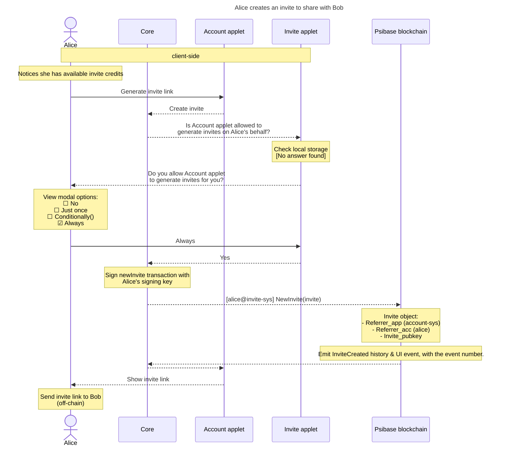
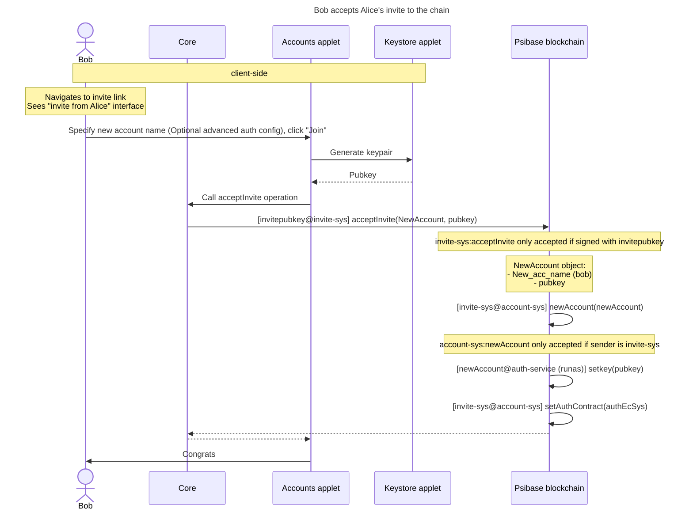

```mermaid

sequenceDiagram

   title Alice creates an invite to share with Bob
   actor Alice
   participant Core
   participant Account applet
   participant Invite applet
   participant Psibase blockchain

   note over Alice, Invite applet: client-side

   note over Alice: Notices she has available invite credits
   Alice->>Account applet: Generate invite link
   Account applet-->>Core: Create invite
   Core-->>Invite applet: Is Account applet allowed to <br>generate invites on Alice's behalf?
   Note over Invite applet: Check local storage<br>[No answer found]
   Invite applet-->>Alice: Do you allow Account applet<br> to generate invites for you?
   Note over Alice: View modal options: <br> #9744; No <br> #9744; Just once <br> #9744; Conditionally() <br> #9745; Always
   Alice->>Invite applet: Always
   Invite applet-->>Core: Yes
   Note over Core: Sign newInvite transaction with <br>Alice's signing key 
   Core-->>Psibase blockchain: [alice@invite-sys] NewInvite(invite)
   Note over Psibase blockchain: Invite object: <br>  - Referrer_app (account-sys)<br>  - Referrer_acc (alice)<br>  - Invite_pubkey
   Note over Psibase blockchain: Emit InviteCreated history & UI event, with the event number.
   Psibase blockchain-->>Core: 
   Core-->>Account applet: 
   Account applet-->>Alice: Show invite link
   Note over Alice: Send invite link to Bob<br>(off-chain)
```

```mermaid
sequenceDiagram

   title Bob accepts Alice's invite to the chain
   actor Bob
   participant Core
   participant Accounts applet
   participant Keystore applet
   participant Psibase blockchain
   note over Bob, Keystore applet: client-side

   Note over Bob: Navigates to invite link<br>Sees "invite from Alice" interface
   Bob->>Accounts applet: Specify new account name (Optional advanced auth config), click "Join"
   Accounts applet->>Keystore applet: Generate keypair
   Keystore applet-->>Accounts applet: Pubkey
   Accounts applet->>Core: Call acceptInvite operation
   Core->>Psibase blockchain: [invitepubkey@invite-sys] acceptInvite(NewAccount, pubkey)
   Note over Psibase blockchain: invite-sys:acceptInvite only accepted if signed with invitepubkey
   Note over Psibase blockchain: NewAccount object: <br>  - New_acc_name (bob)<br>  - pubkey
   Psibase blockchain->>Psibase blockchain: [invite-sys@account-sys] newAccount(newAccount)
   Note over Psibase blockchain: account-sys:newAccount only accepted if sender is invite-sys
   Psibase blockchain->>Psibase blockchain: [newAccount@auth-service (runas)] setkey(pubkey)
   Psibase blockchain->>Psibase blockchain: [invite-sys@account-sys] setAuthContract(authEcSys)
   Psibase blockchain-->>Core: 
   Core-->>Accounts applet: 
   Accounts applet->>Bob: Congrats
```