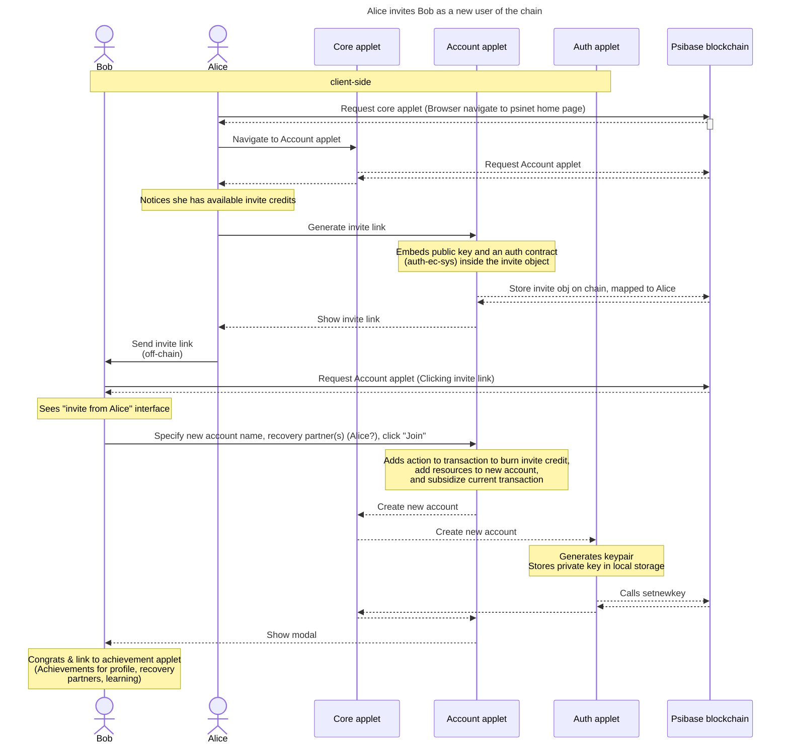

```mermaid

sequenceDiagram
   title Alice invites Bob as a new user of the chain
   actor Bob
   actor Alice
   participant Core applet
   participant Account applet
   participant Auth applet
   participant Psibase blockchain

   note over Bob, Auth applet: client-side

   Alice->>Psibase blockchain: Request core applet (Browser navigate to psinet home page)
   activate Psibase blockchain
   Psibase blockchain-->>Alice: 
   deactivate Psibase blockchain

   Alice->>Core applet: Navigate to Account applet
   Core applet-->>Psibase blockchain: Request Account applet
   Psibase blockchain-->>Core applet: 
   Core applet-->>Alice: 

   note over Alice: Notices she has available invite credits
   Alice->>Account applet: Generate invite link
   Note over Account applet: Embeds public key and an auth contract<br> (auth-ec-sys) inside the invite object
   Account applet-->>Psibase blockchain: Store invite obj on chain, mapped to Alice
   Psibase blockchain-->>Account applet: 
   Account applet-->>Alice: Show invite link
   Alice->>Bob: Send invite link <br>(off-chain)

   Bob->>Psibase blockchain: Request Account applet (Clicking invite link)
   Psibase blockchain-->>Bob: 

   Note over Bob: Sees "invite from Alice" interface
   Bob->>Account applet: Specify new account name, recovery partner(s) (Alice?), click "Join"
   Note over Account applet: Adds action to transaction to burn invite credit,<br> add resources to new account,<br> and subsidize current transaction
   Account applet-->>Core applet: Create new account
   Core applet-->>Auth applet: Create new account
   Note over Auth applet: Generates keypair <br>Stores private key in local storage
   Auth applet-->>Psibase blockchain: Calls setnewkey
   Psibase blockchain-->>Auth applet: 
   Auth applet-->>Core applet: 
   Core applet-->>Account applet: 
   Account applet-->>Bob: Show modal
   Note over Bob: Congrats & link to achievement applet<br> (Achievements for profile, recovery <br>partners, learning)
```