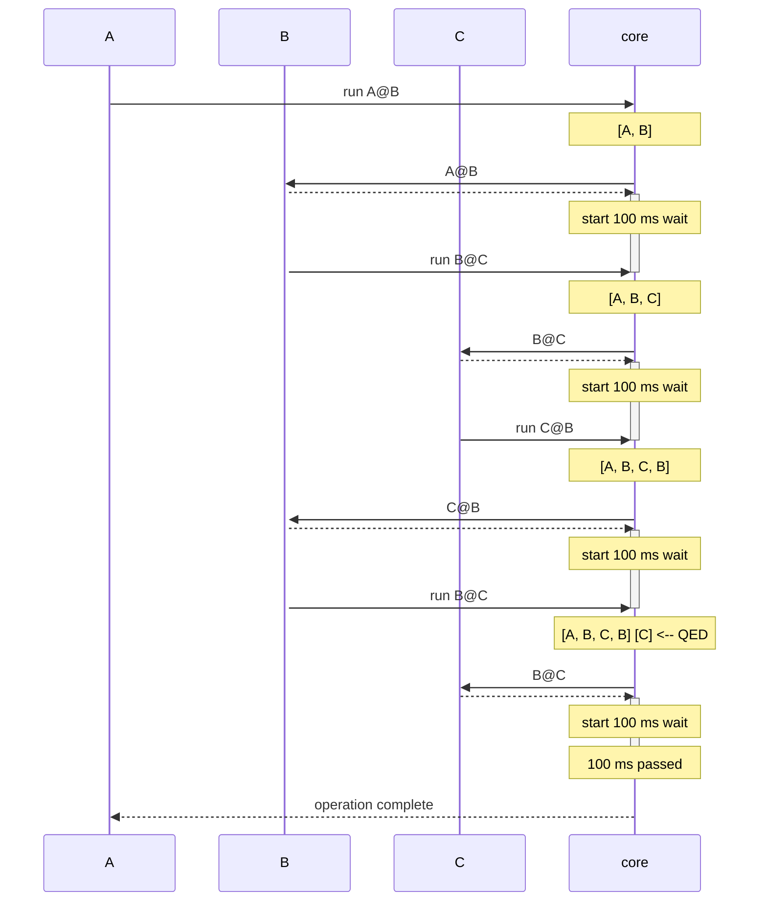

This shows why it is impossible to generate operation breadcrumbs.

```mermaid
sequenceDiagram


participant A
participant B
participant C
participant core

A->>core: run A@B
note over core: [A, B]
core->>B: A@B
activate B
B-->>core: 
activate core
note over core: start 100 ms wait
B->>core: run B@C
deactivate core
note over core: [A, B, C]
core->>C: B@C
C-->>core: 
activate core
note over core: start 100 ms wait
C->>core: run C@B
deactivate core
note over core: [A, B, C, B]
core->>B: C@B
B-->>core: 
activate core
note over core: start 100 ms wait
B->>core: run B@C
deactivate core
note over core: [A, B, C, B] [C] <-- QED
core->>C: B@C
C-->>core: 
activate core
note over core: start 100 ms wait
note over core: 100 ms passed
deactivate core
core-->>A: operation complete

```