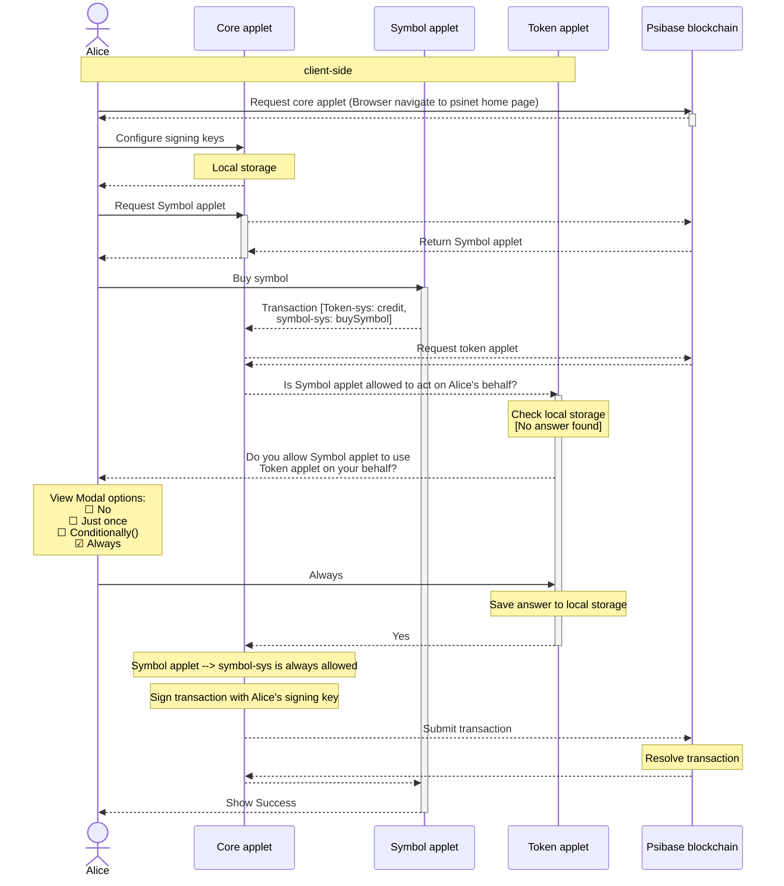

```mermaid

sequenceDiagram
    actor Alice
    participant Core applet
    participant Symbol applet
    participant Token applet
    participant Psibase blockchain

    note over Alice, Token applet: client-side

    Alice->>Psibase blockchain: Request core applet (Browser navigate to psinet home page)
    activate Psibase blockchain
    Psibase blockchain-->>Alice: 
    deactivate Psibase blockchain

    Alice->>Core applet: Configure signing keys
    Note over Core applet: Local storage
    Core applet-->>Alice: 

    Alice->>Core applet: Request Symbol applet
    activate Core applet
    Core applet-->>Psibase blockchain: 
    Psibase blockchain-->>Core applet: Return Symbol applet
    Core applet-->>Alice: 
    deactivate Core applet

    Alice->>Symbol applet: Buy symbol
    activate Symbol applet
    Symbol applet-->>Core applet: Transaction [Token-sys: credit,<br> symbol-sys: buySymbol]
    Core applet-->>Psibase blockchain: Request token applet
    Psibase blockchain-->>Core applet: 
    Core applet-->>Token applet: Is Symbol applet allowed to act on Alice's behalf?
    activate Token applet
    Note over Token applet: Check local storage <br> [No answer found]
    Token applet-->>Alice: Do you allow Symbol applet to use <br> Token applet on your behalf?
    Note over Alice: View Modal options: <br> #9744; No <br> #9744; Just once <br> #9744; Conditionally() <br> #9745; Always
    Alice->>Token applet: Always
    Note over Token applet: Save answer to local storage
    Token applet-->>Core applet: Yes
    deactivate Token applet
    Note over Core applet: Symbol applet --> symbol-sys is always allowed
    Note over Core applet: Sign transaction with Alice's signing key
    Core applet-->>Psibase blockchain: Submit transaction
    Note over Psibase blockchain: Resolve transaction
    Psibase blockchain-->>Core applet: 
    Core applet-->>Symbol applet: 
    Symbol applet-->>Alice: Show Success
    deactivate Symbol applet

```