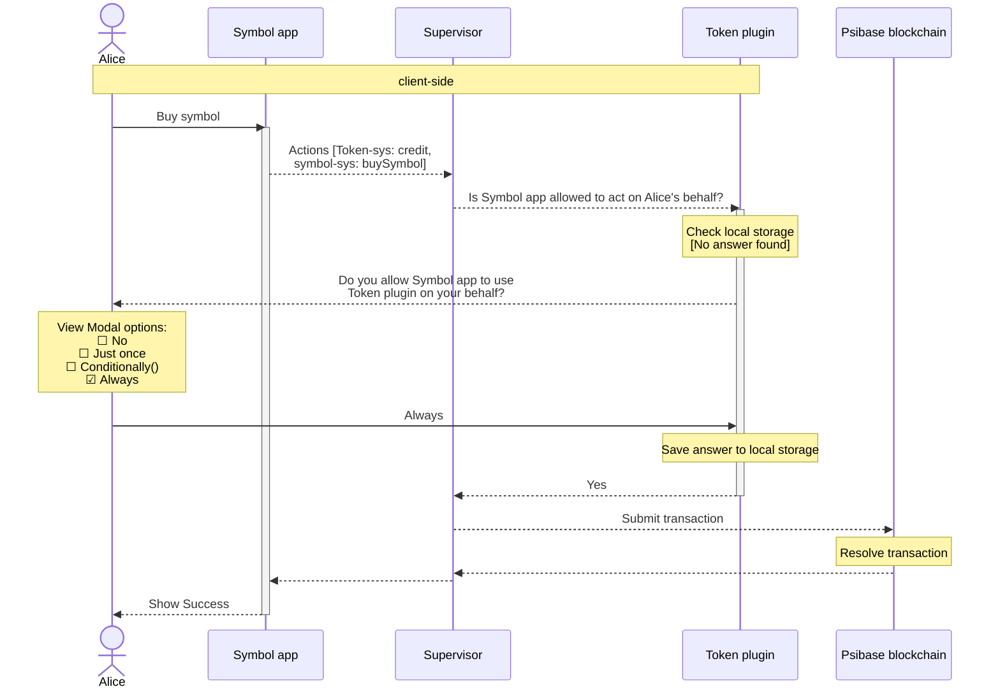

> Outdated, apps should not be directly adding actions via supervisor, or else they will be submitted in separate transactions.

```mermaid

sequenceDiagram
    actor Alice
    participant Symbol app
    participant Supervisor
    participant Token plugin
    participant Psibase blockchain

    note over Alice, Token plugin: client-side

    Alice->>Symbol app: Buy symbol
    activate Symbol app
    Symbol app-->>Supervisor: Actions [Token-sys: credit,<br> symbol-sys: buySymbol]
    Supervisor-->>Token plugin: Is Symbol app allowed to act on Alice's behalf?
    activate Token plugin
    Note over Token plugin: Check local storage <br> [No answer found]
    Token plugin-->>Alice: Do you allow Symbol app to use <br> Token plugin on your behalf?
    Note over Alice: View Modal options: <br> #9744; No <br> #9744; Just once <br> #9744; Conditionally() <br> #9745; Always
    Alice->>Token plugin: Always
    Note over Token plugin: Save answer to local storage
    Token plugin-->>Supervisor: Yes
    deactivate Token plugin
    Supervisor-->>Psibase blockchain: Submit transaction
    Note over Psibase blockchain: Resolve transaction
    Psibase blockchain-->>Supervisor: 
    Supervisor-->>Symbol app: 
    Symbol app-->>Alice: Show Success
    deactivate Symbol app

```