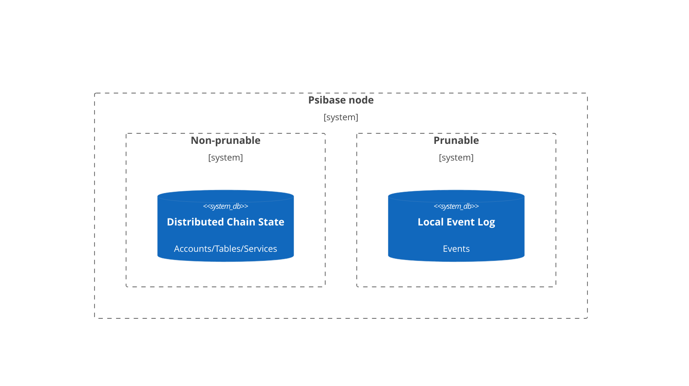

# Background

Blockchain applications should aim to provide a user experience that exceeds those available in traditional centralized applications. To accomplish this goal, application user-interfaces must be able to easily retrieve information about blockchain services.

A vital component of the solution in Psibase blockchains is the event system. If you're an application developer, it's worth taking time to understand it deeply.

# Events - What are they?

Events are objects that are stored in a database on the blockchain node. Crucially, these event objects are not stored in blockchain state, and are therefore only kept around for a limited time, configurable by the blockchain node itself.



To use the event system requires some development on both the blockchain service side (back-end) and the applet side (UI/front-end). On the back-end, the blockchain service is responsible for:

1. Defining the events it can emit
2. Emitting the events
3. Exposing access to these events through RPC queries

On the front-end, the applet is simply responsible for:

1. Reading events history exposed by the service
2. Displaying relevant events
3. Subscribing to events

## When are events consumed by a front-end?

The primary reason that events are consumed on the front-end is to view historical chain activity related to a particular blockchain service. There is another use-case that aids in bridging multiple Psibase blockchains through inter-blockchain communication, but that use-case is outside the scope of this document.

A wallet application may want to display a historical view of all past transfers into and out of a particular user account. All those historical transfers are not saved in active blockchain state, but each of those historical transfers would have emitted a `transferred` event, which the UI could query to efficiently retrieve a list of all past transfers.

Keep in mind, some nodes may have smaller storage capacity, and may therefore be configured to "forget" past events beyond a particular time horizon. Therefore if you need to guarantee access to historical events to a specific time window, the safest way to accomplish this would be to configure and run your own full node. On the other hand, if your application simply needs to display the current state of a blockchain service, it may not be necessary to use the event system at all.

# Emitting event chains

One challenge with an event system is in maintaining lookup efficiency. To show a list of historical token transactions, it would be inefficient to search through the entire event list to find the relevant events. Rather, Psibase provides a mechanism to aid in the construction of manual indices to drastically improve lookup efficiency.

Whenever an event is emitted from a service, a unique event ID is returned to the caller. That event ID is known as the Event Head because it's the most recently emitted event of its type. The event head should be stored in blockchain state, and each event will itself include a field that indicates the previous event in that index. The result is that the Event Log contains followable event chains:

<br/>

**Event Log**

| ID  | prevEvent | other | event | data |
| --- | --------- | ----- | ----- | ---- |
| 1   | 0         | ...   | ...   | ...  |
| `2` | 0         | ...   | ...   | ...  |
| 3   | 0         | ...   | ...   | ...  |
| `4` | `2`       | ...   | ...   | ...  |
| 5   | 1         | ...   | ...   | ...  |
| 6   | 0         | ...   | ...   | ...  |
| 7   | `4`       | ...   | ...   | ...  |

```
eventHead = 7

event chain = 7, 4, 2
```

<br/>

For example, in the Token Service, a `Transferred` event is defined, and is included in an index of events called `UserEvents`:

<details>
  <summary>Reveal code</summary>

```cpp
  struct Events
  {
      struct History
      {
          // Define the transferred event
          void transferred(TID tokenId, uint64_t prevEvent, psibase::TimePointSec time, Account sender, Account receiver, Quantity amount, StringView memo) {}
      };
  };

  // Specify the details needed to create an index of events.
  using UserEvents = psibase::EventIndex<&TokenHolderRecord::lastHistoryEvent, "prevEvent">;

  // Reflect the events
  PSIBASE_REFLECT_EVENTS(TokenSys)
  PSIBASE_REFLECT_HISTORY_EVENTS(TokenSys,
      method(transferred, tokenId, prevEvent, time, sender, receiver, amount, memo)
  );
```

</details>

<br>

The definition of `UserEvents` indicates that the head event ID (most recently emitted event related to a Token Holder) is stored in the `lastHistoryEvent` field of the `TokenHolderRecord` record, and the field stored in the event that specifies the ID of the previous event is named, `prevEvent`.

Notice that when the transferred event gets emitted by the Token service, the ID of the previous transferred event is included (via the `prevEvent` field) in the new event, and the event ID of the new event is saved to state (in the `lastHistoryEvent` field of the sender's `TokenHolderRecord`):

<details>
  <summary>Reveal code</summary>

```cpp
void TokenSys::debit(TID tokenId, AccountNumber sender, Quantity amount, const_view<String> memo)
{
    // ...

    auto senderHolder             = getTokenHolder(sender);
    senderHolder.lastHistoryEvent = emit().history().transferred(
        tokenId, senderHolder.lastHistoryEvent, time, sender, receiver, amount, memo);
    db.open<TokenHolderTable>().put(senderHolder);

    auto receiverHolder             = getTokenHolder(receiver);
    receiverHolder.lastHistoryEvent = emit().history().transferred(
        tokenId, receiverHolder.lastHistoryEvent, time, sender, receiver, amount, memo);
    db.open<TokenHolderTable>().put(receiverHolder);

    // ...
}
```

</details>

<br>

Notice that the transferred event is emitted twice, in order to generate the event for the sender's "UserEvents" index, and another event for the receiver's "UserEvents" index. As you will see, Psibase has mechanisms for efficiently querying event chains created in this way, for the small price of storing only one extra field (per desired index) in blockchain state.

# Providing GraphQL access to event chains

In Psibase, it is very simple to provide GraphQL access to any event chain. In the below example, you can see how the Token RPC Service exposes an index of all events (via the `events` query), and an index on just the "Holder Events" (via the `userEvents` query):

<details>
  <summary>Reveal code</summary>

```cpp
  // Create a QueryableService object using TokenSys service details
  auto tokenSys = QueryableService<TokenSys::Tables, TokenSys::Events>{TokenSys::service};

  // Construct and reflect the query object
  struct TokenQuery
  {
      auto events() const
      {
          return tokenSys.allEvents();
      }
      auto userEvents(AccountNumber holder, optional<uint32_t> first, const optional<string>& after) const
      {
          return tokenSys.eventIndex<TokenSys::UserEvents>(holder, first, after);
      }
  };
  PSIO_REFLECT(TokenQuery,
      method(events),
      method(userEvents, holder, first, after)
  )

  // Expose the defined queries over a GraphQL interface
  optional<HttpReply> RTokenSys::serveSys(HttpRequest request)
  {
      if (auto result = serveGraphQL(request, TokenQuery{}))
          return result;

      return nullopt;
  }
```

</details>

<br>

Once the above Service and RPC Service are deployed, a front-end developer may access `https://token-sys.<domain>/graphql` to see these queries are now available as part of the TokenSys GraphQL schema:

<details>
  <summary>Reveal</summary>

```
  ...
  type Query {
      events: TokenSys_Events!
      userEvents(holder: String! first: Float after: String): TokenSys_EventsHistoryConnection!
  }

```

</details>

<br>

A query for the Holder Events index can be easily constructed by following that GraphQL Schema:

<details>
  <summary>Reveal</summary>

```
  query {
  userEvents(holder: "alice") {
      pageInfo {
          hasNextPage
          endCursor
      }
      edges {
          node {
              event_id
              event_type
              event_all_content
          }
      }
  }
}
```

</details>

<br>

Which, when submitted to a full-node, returns the Holder Events index as expected:

<details>
  <summary>Reveal</summary>

```
  {
      "data": {
          "userEvents": {
              "pageInfo": {
                  "hasNextPage": false,
                  "endCursor": "10"
              },
              "edges": [
                  {
                      "node": {
                          "event_id": "15",
                          "event_type": "transferred",
                          "tokenId": 1,
                          "prevEvent": "14",
                          "time": "2022-09-21T22:05:56.000Z",
                          "sender": "alice",
                          "receiver": "bob",
                          "amount": {
                              "value": "1200000000"
                          },
                          "memo": {
                              "contents": "Working"
                          }
                      }
                  },
                  {
                      "node": {
                          "event_id": "14",
                          "event_type": "transferred",
                          "tokenId": 1,
                          "prevEvent": "10",
                          "time": "2022-09-19T21:08:49.000Z",
                          "sender": "bob",
                          "receiver": "alice",
                          "amount": {
                              "value": "1000000000"
                          },
                          "memo": {
                              "contents": "Working"
                          }
                      }
                  },
                  {
                      "node": {
                          "event_id": "10",
                          "event_type": "transferred",
                          "tokenId": 1,
                          "prevEvent": "0",
                          "time": "2022-09-19T16:15:21.000Z",
                          "sender": "symbol-sys",
                          "receiver": "alice",
                          "amount": {
                              "value": "100000000000"
                          },
                          "memo": {
                              "contents": "memo"
                          }
                      }
                  }
              ]
          }
      }
  }
```

</details>

<br>

# Event types

All emitted events are either History events or Merkle events. These two different event types are used for two separate use-cases, and using the wrong type may cause excessive billing to the Service developer.

## History events (Long-term events)

The most common type of event is the history event. History events are emitted and stored to allow for the efficient historical event queries previously described. These events are more expensive to emit than UI events, because they are stored longer.

## Merkle events (Inter-blockchain communication events)

If you need a particular events to be provable on another Psibase chains, you would emit a Merkle event. Emitting a merkle event will ensure that the event is included in a merkle proof for that block, which could be used to prove that an event happened to another psibase blockchain.

If an events shouldn't need to be verified on another chain, then a merkle event need not be emitted.

# Conclusion

In Psibase, the philosophy is that "transactions" or "groups of actions" should not be user-facing. Unlike other blockchains that provide users transaction IDs (txids) for each blockchain interaction, Psibase provides Event IDs. Proof of any event can then be established by providing someone a link to a query that returns the event.

Events in Psibase are not simply stored in an ever-growing log with correspondingly growing search times. Rather, developers can create custom indices on all events emitted by their service, guaranteeing fast historical access times.

No third-party tools are therefore needed to index and expose access to on-chain events. All events may be easily exposed to the public over GraphQL interfaces by adding a few simple lines of code in an RPC service.

The Psibase event system is a powerful example of one of the many innovations that allow Psibase blockchains to uniquely meet the growing needs of the decentralized internet.
