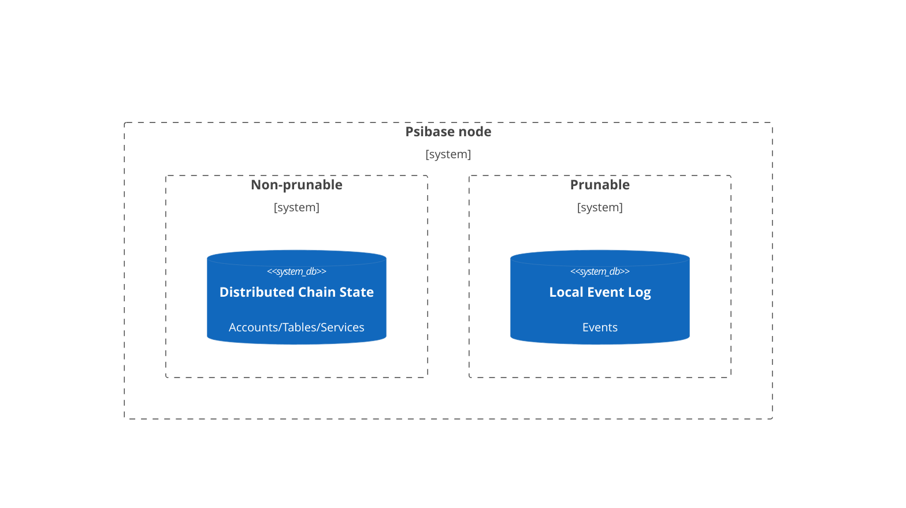

# Events

## Background

Many modern web services not only need the ability to display data regarding the current state of an application, but it is often helpful to also display a record of the historical events that modified or were otherwise relevant to the application state. This implies that the state of an application should also include a historical record of events that modify other state. The challenge is that individual web service developers often lack the domain expertise to design an efficient solution, which should include Event creation, storage, queryability, and pruning.

The Psibase platform acknowledges this challenge, and provides an efficient, flexible, and simple solution for all web service developers. This greatly simplifies the expertise required to develop professional web services with excellent user-experience, minimizes time spent working with third-party services, and maximises the time developers are able to spend building their actual service.

The Psibase event system is one of its many important innovations. If you're an application developer, it's worth taking time to understand it.

## What are Psibase events?

Events are queryable objects that are stored in a database and that describe past events related to a particular web service. Since events do not store the active service state, they could be pruned without affecting the core operations of a particular service, and therefore Psinode allows node operators to configure the times beyond which events are automatically pruned.



A web service is responsible for defining the types of events it can emit, emitting the events, and exposing access to the events over some RPC interface. Any Psibase applet may then query the events through that RPC interface and display them according to its users' needs. Psibase applets are also able to use the Event Sourcing design pattern, in which they may subscribe to events and define handlers for automatic execution whenever such events are emitted.


### When are events consumed by a front-end?

The primary reason that events are consumed in an applet is to view historical events related to a particular web service. If your application only needs to display the current state of a web service, it may not be necessary to use the Psibase event system at all. Another use-case allows cryptographic proofs to be generated for events, which could allow separate Psibase networks that do not trust each other to mathematically prove to each other when various events happen, but this use-case is outside the scope of this document.

Imagine a web service that facilitates the transfer of some kind of "tokens." Such an application may not only want to display a user's current balance of these tokens, but also display a historical view of any events that would have affected the user balance. Such historical transfers are an example usecase for the Psibase event system. To accomplish this, a web service developer would emit a `transferred` event after each transfer, which would facilitate the creation and storage of an event into the prunable event database that could be queried by the front-end (applet) to display the list of historical events.

Psinode may be deployed on hardware with limited storage capacity, and therefore the Psinode operators may configure event stores to prune more quickly than would be desired by a particular web service. Therefore, the safest way to guarantee your applet will keep access to a sufficiently large history of events is to run your own Psinode network, rather than rely on a third-party Psinode network deployment.

## Event chaining

One challenge with an event system is in maintaining lookup efficiency. If all events were simply stored in a list, lookups would require linear-time searches through the list to construct the subset of events relevant to the query. Rather, Psibase provides a mechanism to aid in the construction of manual indices on events to drastically improve lookup efficiency.

Whenever an event is emitted from a service, a unique event ID is returned to the caller. That event ID is known as the Event Head because it's the most recently emitted event of its type. Each event includes a field that records the ID of the previous event of its type, and the event head is stored in active application state. The result is that the Event Log contains easily-followable event chains:

<br/>

### Event Log example

| ID  | prevEvent | other | event | data |
| --- | --------- | ----- | ----- | ---- |
| 1   | 0         | ...   | ...   | ...  |
| `2` | 0         | ...   | ...   | ...  |
| 3   | 0         | ...   | ...   | ...  |
| `4` | `2`       | ...   | ...   | ...  |
| 5   | 1         | ...   | ...   | ...  |
| 6   | 0         | ...   | ...   | ...  |
| 7   | `4`       | ...   | ...   | ...  |

- event head = 7
- event chain = 7, 4, 2

<br/>

For example, in the example Token Service, a `Transferred` event is defined, and is included in an index of events called `UserEvents`:

<details>
  <summary>Reveal code</summary>

```cpp
  struct Events
  {
      struct History
      {
          // Define the transferred event
          void transferred(uint64_t prevEvent, TID tokenId, psibase::TimePointSec time, Account sender, Account receiver, Quantity amount, StringView memo) {}
      };
  };

  // Specify the details needed to create an index of events.
  using UserEvents = psibase::EventIndex<&TokenHolderRecord::lastHistoryEvent, "prevEvent">;

  // Reflect the events
  PSIBASE_REFLECT_EVENTS(TokenSys)
  PSIBASE_REFLECT_HISTORY_EVENTS(TokenSys,
      method(transferred, prevEvent, tokenId, time, sender, receiver, amount, memo)
  );
```

</details>

<br>

The definition of `UserEvents` indicates that the head event ID is stored in the `lastHistoryEvent` field of the `TokenHolderRecord` record, and the field stored in the event that specifies the ID of the previous event is named, `prevEvent`.

When the `transferred` event gets emitted by the service, the ID of the previous transferred event is included (via the `prevEvent` field) in the new event, and the event ID of the new event is saved to state (in the `lastHistoryEvent` field of the sender's `TokenHolderRecord`):

<details>
  <summary>Reveal code</summary>

```cpp
void TokenSys::debit(TID tokenId, AccountNumber sender, Quantity amount, const_view<String> memo)
{
    // ...

    auto senderHolder             = getTokenHolder(sender);
    senderHolder.lastHistoryEvent = emit().history().transferred(
        tokenId, senderHolder.lastHistoryEvent, time, sender, receiver, amount, memo);
    db.open<TokenHolderTable>().put(senderHolder);

    auto receiverHolder             = getTokenHolder(receiver);
    receiverHolder.lastHistoryEvent = emit().history().transferred(
        tokenId, receiverHolder.lastHistoryEvent, time, sender, receiver, amount, memo);
    db.open<TokenHolderTable>().put(receiverHolder);

    // ...
}
```

</details>

<br>

Notice that the `transferred` event is emitted twice, in order to generate the event for the sender's `UserEvents` index, and another event for the receiver's `UserEvents` index. As you will see, Psibase has mechanisms for efficiently querying event chains created in this way.

## Providing GraphQL access to event chains

In Psibase, it is very simple to provide GraphQL access to any event chain. In the below example, you can see how the Token Service exposes an index of all events (via the `events` query), and an index on just the user events (via the `userEvents` query):

<details>
  <summary>Reveal code</summary>

```cpp
  // Create a QueryableService object using TokenSys service details
  auto tokenSys = QueryableService<TokenSys::Tables, TokenSys::Events>{TokenSys::service};

  // Construct and reflect the query object
  struct TokenQuery
  {
      auto events() const
      {
          return tokenSys.allEvents();
      }
      auto userEvents(AccountNumber holder, optional<uint32_t> first, const optional<string>& after) const
      {
          return tokenSys.eventIndex<TokenSys::UserEvents>(holder, first, after);
      }
  };
  PSIO_REFLECT(TokenQuery,
      method(events),
      method(userEvents, holder, first, after)
  )

  // Expose the defined queries over a GraphQL interface
  optional<HttpReply> RTokenSys::serveSys(HttpRequest request)
  {
      if (auto result = serveGraphQL(request, TokenQuery{}))
          return result;

      return nullopt;
  }
```

</details>

<br>

Once the above Service and RPC Service are deployed, a front-end developer may access `https://token-sys.<domain>/graphql` to see these queries are now available as part of the GraphQL schema:

<details>
  <summary>Reveal</summary>

```
  ...
  type Query {
      events: TokenSys_Events!
      userEvents(holder: String! first: Float after: String): TokenSys_EventsHistoryConnection!
  }

```

</details>

<br>

A query for the User Events index can be easily constructed by following that GraphQL Schema:

<details>
  <summary>Reveal</summary>

```
  query {
  userEvents(user: "alice") {
      pageInfo {
          hasNextPage
          endCursor
      }
      edges {
          node {
              event_id
              event_type
              event_all_content
          }
      }
  }
}
```

</details>

<br>

Which, when submitted to a Psinode, returns the User Events index as expected:

<details>
  <summary>Reveal</summary>

```json
{
  "data": {
    "userEvents": {
      "pageInfo": {
        "hasNextPage": false,
        "endCursor": "10"
      },
      "edges": [
        {
          "node": {
            "event_id": "15",
            "event_type": "transferred",
            "tokenId": 1,
            "prevEvent": "14",
            "time": "2022-09-21T22:05:56.000Z",
            "sender": "alice",
            "receiver": "bob",
            "amount": {
              "value": "1200000000"
            },
            "memo": {
              "contents": "Working"
            }
          }
        },
        {
          "node": {
            "event_id": "14",
            "event_type": "transferred",
            "tokenId": 1,
            "prevEvent": "10",
            "time": "2022-09-19T21:08:49.000Z",
            "sender": "bob",
            "receiver": "alice",
            "amount": {
              "value": "1000000000"
            },
            "memo": {
              "contents": "Working"
            }
          }
        },
        {
          "node": {
            "event_id": "10",
            "event_type": "transferred",
            "tokenId": 1,
            "prevEvent": "0",
            "time": "2022-09-19T16:15:21.000Z",
            "sender": "symbol-sys",
            "receiver": "alice",
            "amount": {
              "value": "100000000000"
            },
            "memo": {
              "contents": "memo"
            }
          }
        }
      ]
    }
  }
}
```

</details>

<br>

## Event types

All emitted events are either History events or Merkle events.

### History events

The most common type of event is the history event. History events are emitted and stored to allow for the efficient historical event queries previously described.

### Merkle events

Emitting a merkle event will ensure that a merkle proof is generated for that event, which is a type of cryptographic proof that could be used to prove to a third-party Psibase network that an event has occured.

If the developer isn't concerned with the interaction of their service with multiple Psibase deployments, then she should not emit a merkle event.

## Conclusion

Event IDs are unique between all web services on a particular Psibase deployment. Because of that, proof of an event on a Psibase deployment can be established by sharing a link to a query for an event ID that returns the relevant event.

Psibase events are not simply stored in an ever-growing list with linear search times. Rather, developers can create custom indices on events emitted by their service, guaranteeing fast historical access times.

Unlike other web service deployment architectures, no third-party tools are needed to index and expose access to events. All events may be easily exposed to the public over GraphQL interfaces by adding a few simple lines of code in an RPC service.

The Psibase event system is a powerful example of one of the many innovations that allows Psibase to uniquely meet the growing needs of modern web applications.
