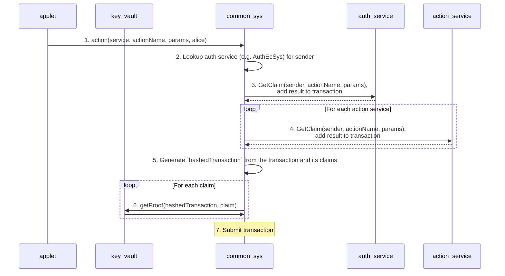

# Signing a transaction

If you're building a third-party app intended to integrate with a Psibase chain, you will find instructions for manually signing and pushing transactions in the section called "[Signing (js)](../http.md#signing-js)".

But if you're building an applet to be served directly from a Psibase chain, then you have access to libraries that simplify the process of constructing and signing transactions. In both cases, your transaction must contain claims that specify the public keys that your transaction signatures will authenticate, and proofs, or signatures, that prove the claims.

## Detailed flow

The following diagram describes how the architecture automatically gathers the claims and proofs used to authenticate your transaction if you're serving your app directly from a chain:

The following is an explanation of each step in the diagram to aid understanding:

1. In step 1, alice interacts with an application in such a way that it schedules an action to be called on a service on chain
2. Recall the structure of an "Account" object as specified by the [account-sys](../system-service/account-sys.md) system service. Every account has an auth service responsible for checking that certain claims are present whenever the user sends a transaction. Therefore here in step 2, the applet stored at common-sys (the core component of front-end infrastructure), looks up the auth service for the sender.
3. In step 3, the applet served by the users' auth service has the opportunity to add a claim to the transaction by implementing the GetClaim query. 
4. In step 4, every service specified as the recipient of an action within this transaction is also given the opportunity to add a claim to the transaction by serving an applet implementing the GetClaim query. This is done because it may occasionally be necessary for a service to add additional claims based on the action name, sender, or action parameters.
5. In step 5, now that the common-sys applet has accumulated all claims for this transaction, it hashes the transaction object.
6. The hash of the transaction can now be used to generate digital signatures, proving all the claims that were previously attached to this transaction. Therefore in step 6, the KeyVault applet is asked to generate all the proofs (digital signatures) using the keys specified in each claim. If the user does not have the private keys necessary to prove a claim, then the proof cannot be generated and the transaction will fail.
7. Now that the common-sys applet has collected all claims and proofs, the final transaction object is submitted to the chain for processing.

## Conclusion

This transaction signing flow is needed for applets to accommodate the fully programmable Psibase permission system. For most use-cases, applets don't need to worry about signing and permissions, as signing is done automatically by simply submitting actions within an applet. But if custom permissions are needed to submit a particular action, this architecture allows for maximum flexibility in collecting the claims and proofs necessary to authenticate the transaction.
