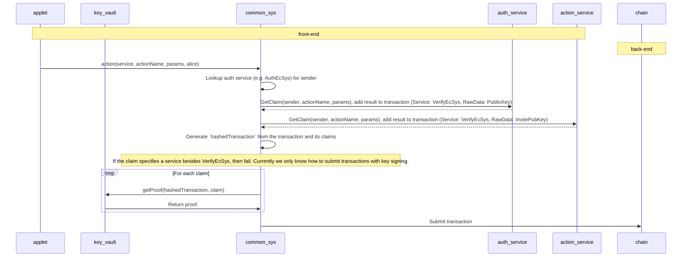

# Signing a transaction

If you're building a third-party app intended to integrate with a Psibase chain, you will find instructions for manually signing and pushing transactions in the section called "[Signing (js)](../http.md#signing-js)".

But if you're building an applet to be served directly from a Psibase chain, then you have access to libraries that simplify the process of constructing and signing transactions. In both cases, your transaction must contain claims that specify the public keys that your transaction signatures will authenticate, and proofs, or signatures, that prove the claims.

The following diagram describes how the architecture automatically gathers the claims and proofs used to authenticate your transaction if you're serving your app directly from a chain:

