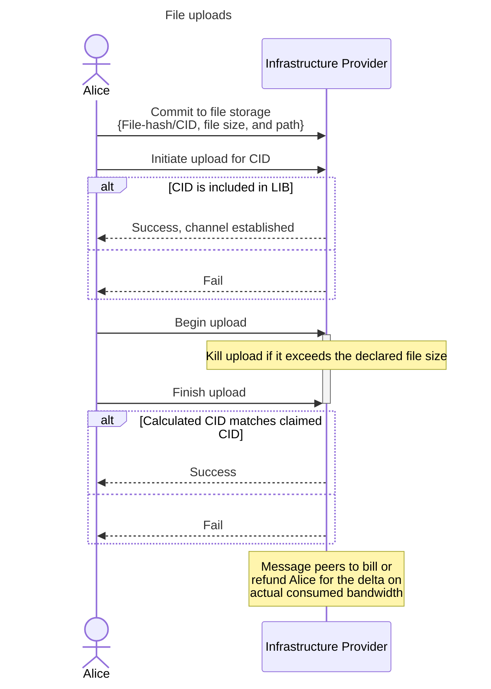

# Disk Storage - Introduction

Psibase services and their corresponding application state are perfectly replicated across all nodes on the network in a performant database that can even store to disk but uses an in-memory cache to maximize retrieval performance. But a mechanism is needed to better scale data storage and retrieval capabilities in a way that doesn't jeapordize performance of application-critical state and business-logic. Psibase nodes therefore also provide the infrastructure that enables the use of slower but lower-cost disk storage for specific data without attempting to use the in-memory cache. This also enables the data storage and retrieval process to be asynchronous with block production and propagation.

## IPFS

IPFS is a growing standard for file storage in the Web3 industry. It provides significant benefits over traditional location or name-based file systems, and provides an efficient peering protocol that can be leveraged to distribute files in decentralized networks.

Psibase infrastructure nodes are also IPFS gateways that allow users to upload data for pinning on the IPFS network. Pinned files are shared between infrastructure providers, providing redundancy and ensuring consistent access to stored files. It is not required that users access files by their content hash or by running their own IPFS clients. IPFS is primarily used by infrastructure providers to facilitate file storage and peering, rather than for interaction with users.

# Protocol overview

Psibase infrastructure providers allow users to upload and download content to IPFS via their node as a gateway. When uploading, a user will pay a fee proportional to the size of the uploaded file. When downloading, either by using an infrastructure provider as an IPFS gateway or by directly peering with infrastructure providers from a user's own IPFS client, users get free bandwidth up to a certain amount every 24 hours, beyond which users must pay a fee proportional to the consumed download bandwidth. 

Infrastructure providers in the active set will automatically peer with each other to share pinned user files and ensure adequate redundancy. Third-party IPFS clients may also pin user files. If these third-party clients also stake sufficient collateral on Psibase, then Infrastructure Providers may also peer to these third-party clients to download pinned user-files. If the hash of the content downloaded from third-party IPFS clients doesn't match the claimed CID, then that client's collateral is burned.

## User authentication

In general, this file-sharing protocol treats authenticated users differently from unauthenticated users. Unauthenticated accounts are unable to upload at all, since they are unable to be charged a fee, and downloads are not guaranteed. Downloads may still be possible for unauthenticated users, subject to bandwidth availability on each IP's infrastructure, with priority given to the resources that would help unauthenticated accounts perform authentication. Fundamentally therefore, the download service provided by the infrastructure providers is a [club good](https://en.wikipedia.org/wiki/Club_good) rather than a public good.

Users can authenticate using a form of standard HTTP [bearer token authentication](https://www.oauth.com/oauth2-servers/differences-between-oauth-1-2/bearer-tokens/). To successfully authenticate and receive a bearer token, a user must send a specific transaction to the chain which will undergo the normal authentication process to ensure the user is permitted to act as the specified transaction sender. Upon successful transaction authentication, the bearer token is issued to the user and is valid for a specific time period. Authenticated users should submit the bearer token with their subsequent HTTP requests, in order to ensure that their download bandwidth is given priority over non-users. Using bearer tokens in this way ensures that we don't need to cryptographically authenticate a user for every read request, which significantly reduces the load on infrastructure provider nodes and therefore reduces costs for the end user.

## Billing

File storage and servicing file uploads and downloads can be costly activities for infrastructure providers, especially with arbitrarily large files. To account for this, we have developed a billing framework that we believe limits IP exposure to spam and resource attacks, while also providing an enjoyable experience to application developers and their users.

### Billing overview

* All fees are paid in the same system gas resource that is used to pay regular transaction fees.
* File uploaders pay upfront (before starting any upload) for the right to upload a file.
* The cost to upload is proportional to the size of the file that will be uploaded.
* Uploaded files can be deleted by the original uploader and users will have their original cost to upload reimbursed as gas tokens.
* Once a file is uploaded, it will remain available on the network until the original uploader deletes the file or it is blacklisted by the infrastructure providers.
* Beyond the limited amount of free download bandwidth, authenticated users pay proportional to the size of their downloads and unauthenticated users may not receive service at all.

### Billing details - Upload

To upload, an authenticated user submits an action that declares the intent to upload a specific file CID (contents hash), the file size, the target service which will own the content, and the path at which the content is addressible.

```c++
void fileUpload(string CID, uint64_t fileSize, AccountNumber service, string path);
```

The user is then not only billed for the regular costs of running the transaction, but is also billed an additional amount proportional to the specified `fileSize`. The total amount billed to the user for this transaction is the sum of the following fees: 

* CPU cost of the transaction
* RAM cost of the table entry {CID, fileSize, service, path}
* Disk cost of fileSize
* Expected Bandwidth cost of transferring fileSize * 2

The actual cost of the disk storage is also stored with the table entry in RAM, to allow for refunds at that rate if the user deletes or replaces this file later.

If the transaction and associated billing is successful, the user is given a new authentication bearer token that has upload priveleges up to the file-size declared in `fileUpload`. If this bearer token expires, then the user must refresh the token by resubmitting the `fileSize` action, at which time the billing amount will be adjusted (additional fee or refund) to account for changes in the expected bandwidth cost and file storage cost. 

The actual cost of the bandwidth for transferring the file will depend on the network load at the time of the upload, and so it is impossible to accurately bill for the cost of the bandwidth up front. For this reason, after the upload, there is an opportunity to either bill the user an additional amount if the bandwidth costs were significantly higher than expected, or to refund the user if the upload cost was less than 2x the expected bandwidth costs originally charged. The reason the entire bandwidth amount is not billed after the upload is because it is possible for users to fail to have sufficient gas available to pay for the bandwidth after an upload, so an amount is billed up front to limit the potential liability to only the delta between the paid bandwidth cost and the actual bandwidth cost.

If the user's network connection is poor and failing after partial uploads, the user has the right to attempt to resume uploads at any time before the bearer token expires. After the bearer token expires, if the file has not been successfully uploaded, there is no guarantee that the file upload will be able to be resumed (even if the user refreshes their upload bearer token.

If the user uploads a file that does not match the CID declared in `fileUpload`, then the file can be deleted and the user will not be issued a refund. Furthermore, an upload connection will be terminated by the infrastructure provider as soon as the size of the file transfer exceeds the `fileSize` declared in `fileUpload`.

A user can delete an uploaded file at any time by executing a delete action, and will be reimbursed for the space freed by the deleted file. The amount reimbursed will be the amount that was originally paid, *not* the amount that would be paid at the time of deletion to store a file of the given size. The reimbursed amount will, like all billing and refunds, be denominated in resource tokens and directed at the user's gas tank. Therefore, if a user makes a small change to a file and wants to replace the uploaded file, a delete & upload will effectively only bill the user for the file size delta, adjusted for any changes in billing rates between file versions.

#### <b>Diagram</b>

The following sequence diagram further explains the file upload procedure.



### Billing details - Download

When someone without a Psibase account uses their browser to access Psibase, they connect through a public infrastructure provider. The bandwidth they consume by downloading the files necessary to serve web pages is provided to them for free. As a free service, it is dependent on the current available bandwidth on that IP, and priority connections are given to authenticated users with accounts on the Psibase network. 

Anyone who exceeds a certain bandwidth rate may have their bandwidth throttled by the network. Authenticated users avoid bandwidth throttling by paying a fixed cost per byte of downloaded data in order to maintain their priority connection. This fixed cost is a single rate shared by all IPs, and can be changed at any time with the consensus of the active IP. Sharing a single download bandwidth rate (rather than allowing IPs to set their own individual rates) is intended to prevent IPs from setting excessively high bandwidth rates in order to save costs and effectively outsource download services to the other IPs.

To download a file, a user makes a normal web request to a node for a resource at a particular path. If the request includes a bearer token, the user is implicitly authenticated, and therefore given bandwidth priority. The node looks up the CID stored at the path of the specified service, and then services that file from its own local IPFS storage. If the file is served, then the file size is added to the user's daily consumed bandwidth allowance. To avoid state changes for every read, a node may store the amount of consumed bandwidth on a per-IP basis and update the chain in batch settlements. If the consumed bandwidth exceeds the daily allowance, the user is billed per byte of downloaded data. This also implies that a use trying to maximize their free download bandwidth could download up to the daily allowed limit from all infrastructure providers before paying for any additional bandwidth. This functionally results in load-balancing across multiple infrastructure providers and helping to ensure that each IP is correctly serving IPFS data.

If the CID of the file does exist in an irreversible block, but the node does not have the CID, it may simply return a 404 error code to the HTTP request.

### Billing details - Security

Infrastructure providers will not allow the same account to authenticate multiple concurrent upload or download sessions. If a new authentication token is requested, the old one is expired. This prevents possible delayed billing attacks where upload/downloads are performed simultaneously by the same account.

### Automatic billing and refunds

Throughout this process, there are instances where infrastructure providers are given the ability to bill from or issue a refund to a particular user corresponding to their specific interaction with that user. This implies the ability for a single infrastructure provider to automatically charge a user, even a variable amount (in the case of real-time bandwidth consumption), without the user explicitly signing the transaction that authorizes the billing. However, though the specific amount is not authorized by the user, when the user attempts to upload or download a file, they are implicitly consenting to a maximum billable amount, which prevents the infrastructure providers from billing arbitrarily large amounts for uploads/downloads. Additionally, the charges are only billed from a user's gas tank, which is a further limitation on the total billable amount by a single infrastructure provider. And furthermore, the billed amount does not go to the infrastructure provider who issues the charge, and therefore there is no financial incentive for an infrastructure provider to overcharge for services, as it is simply used for rate limiting. Therefore, an infrastructure provider's capabilities are still quite limited and do not pose any risk that the consent of the user is violated.

Maximum refunds are similarly proportional to the originally charged amount, ensuring that a single infrastructure provider is unable to issue arbitrarily large refunds. Furthermore, refunds are issued in the form of the gas resource token, which is untradeable and only usable to pay for future transaction costs. 

## Data availability

### Irreversibility

Infrastructure providers must wait until CID specified by `fileUpload` exists in an irreversible block before allowing a user to service the upload. The reason is because before blocks are irreversible, it is not guaranteed that the content an infrastructure provider sees in their own block is going to persist, and therefore allowing an upload risks unnecessary resource consumption.

### Peering


#### <b>Third-party peer downloads from IPs</b>

If a user prefers, they can run their own IPFS client and attempt to peer files directly from the IPFS network. For the purposes of billing and connection priority, IPFS peers are treated identically to non-IPFS clients in that IPs will bill authenticated connections per byte of download bandwidth consumed beyond the fixed limit and at the fixed rate. However, since IPFS may split requested files into chunks served by multiple peers, this could allow them to save costs by reducing the amount of bandwidth they consume from each IP, thereby increasing the likelihood that their downloads stay below daily bandwidth allowances. The Infrastructure Providers do not need to allow IPFS peering requests from third-party clients who are unable to authenticate their connection with a Psibase account.

#### <b>IP peer downloads from others</b>

Infrastructure providers may peer to any other IPFS client who claims to hold a file for which a CID exists in an irreversible block. By default, an IP will only peer download a file from a party who is either a current active infrastructure provider or a third-party who has posted a bond sufficient to cover the cost of the bandwidth needed to transfer the file.

In order for a bond to be sufficient to cover the download of any particular file, it must be greater than or equal to the number of IPs in the active set multiplied by the cost of the bandwidth to transfer the file. This is because the file may be transferred to the entire IP set before it is discovered that the file was fraudulent, and therefore a fraudulent file can waste `file_size * nr_active_ip_set` total bandwidth.

After any download, if the file verification fails (the content hash doesn't match the CID), then an IP can blacklist the client and report the download failure. If 2/3rds of active IPs report a download failure for the same client, the client's bond is automatically burned. If the client belongs to an IP candidate, that candidate is automatically unregistered. If the client belongs to an active IP, they are removed from the active set and unregistered.

This capability allows anyone to run their own node to save on upload bandwidth costs. Since, if they are honest, the BPs will be able to peer the file from the user without a problem, their bond is never slashed, and they don't have to pay for the regular upload bandwidth fee incurred by executing a traditional upload. This helps decrease the load on the active IP set and further decentralize service provision by introducing third-parties who host files and service peering requests from the active validator set. 

Successfully peering a verified file from a third-party can be thought of as a proof of work. Therefore, a Psibase network could even consider a standard network token issuance directed to those who service peer download requests from IPs proportionally to the bandwidth they service. This would be a way for a network to subsidize greater file access decentralization.

## Infrastructure providers

### Running an infrastructure provider

To run an infrastructure provider, one needs to run a full node that also contains all pinned IPFS files. Registering as an infrastructure provider is intended to be an implicit claim that one's node contains all pinned IPFS data. If this is true for the majority of infrastructure providers and candidates, then even large changes to the active IP set should be stable and continually allow a majority of IPs to offer download services for the pinned IPFS files. This rule cannot be enforced objectively, because it is not possible to prove that another node has downloaded all files without individually downloading and validating each file from them, which would consume excessive bandwidth. However, a node that does not have all CIDs downloaded but who is elected to be an active Infrastructure Provider will either be unable to serve various resources, or may proxy an excessive number of web requests to other infrastructure providers. Both behaviors are therefore detectable and subjective community consensus can either remove them, slash their bond, or both.

When starting up a new infrastructure provider, the node will peer all IPFS data from the IPFS network. At minimum, therefore, the user running the infrastructure provider node must be able to pay for the bandwidth necessary to transfer all pinned files.

### Publishing upload rates

Every IP must publish their current rate that they charge for upload bandwidth. If they fail to set a rate, users will be able to consume the infrastructure provider's network bandwidth for free. This rate is then used to enforce a maximum billable amount after an upload is performed. Furthermore, as infrastructure providers adjust their rates, browser clients can automatically select the cheapest upload service providers to effectively achieve decentralized load balancing. <span style="color:red"> TODO - However, don't we have the same issue I described for download? An IP could set an excessively large upload rate to effectively outsource their upload responsibility to others, centralizing the service provision. If this was a shared fee instead, it would also simplify calculating the bond amount for third-party IPFS clients.</span>

### Infrastructure provider properties

The message that indicates that a user should be billed/refunded for an attempt to perform an upload or download will only be accepted if it comes from another active infrastructure provider. Therefore, if an infrastructure provider exits the active set partway through a user-upload, they will be unable to charge the user. As long as the IP has a bond sufficient to cover the file upload bandwidth, other producers will still peer the file from it and the file could still be fully uploaded. In this case, the user was able to upload the file for free. This is not a problem, since there's no way for the user to game this possibility to consistently achieve free uploads. If the bond of the former active infrastructure provider is insufficient to cover the bandwidth, the file upload will have failed to propagate on the network, but the user also will not have incurred any cost, so they must simply try the upload again with an active IP.

### Blacklists

An active IP with a valid file (the file hash matches its declared CID) should keep a file pinned, regardless of origin. If an IP is compelled by the legal requirements of their jurisdiction to blacklist some content, then they may do so by adding a CID to a blacklist. The blacklist is an IP-specific on-chain list of CIDs for which the IP will not request any peering from others and will not provide even if requested for download. Of course, if valid content is blacklisted then the community has the right and the ability to remove the IP from the active set.

# Conclusion

This protocol allows for disk storage with file verification, peering, and configurable redundancy. It allows Psibase infrastructure providers to save costs on data storage, and pass those cost savings on to users. It reduces the overall cost of infrastructure, maximizing the potential number of independent node deployments in public networks, thereby improving decentralization. This approach can help scale Psibase networks far beyond the storage capacity limits incurred by requiring all data to be stored in RAM, which is particularly important for Psibase networks whose intention is to store application front-ends alongside their webservices.
