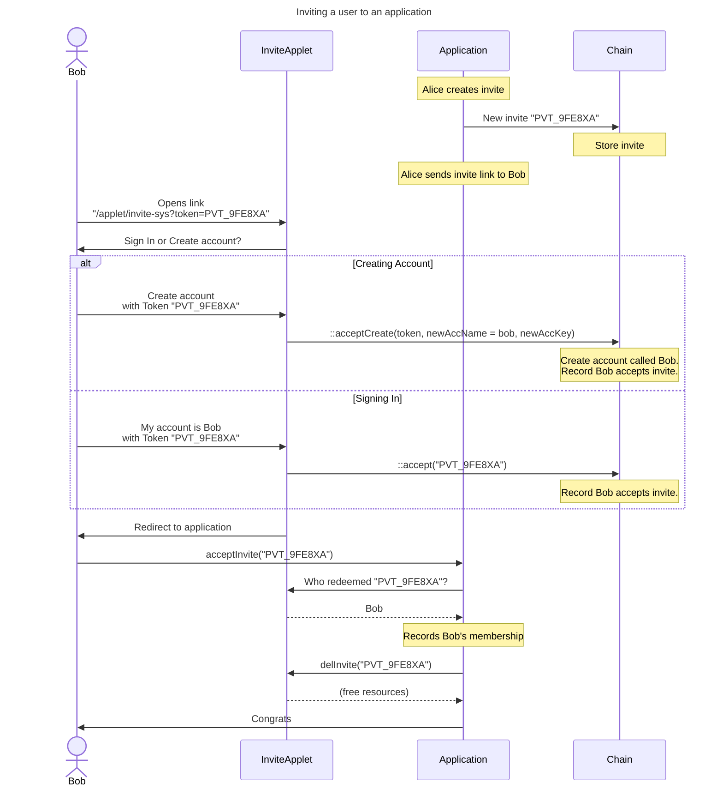

# Invites

## Background

A Psibase deployment allows many applications to run on the same infastructure, which allows for many benefits, such as account sharing, data sharing, and inter-application-messaging. Account sharing means that there is a concept of an "account" that exists independent of any particular deployed application and that can be reused between them.

In traditional web applications, the cost to create and store an account are borne by the company who produced the web application. This is usually done because the value of acquiring another user exceeds the associated creation and storage costs. But in many modern web applications (particularly those in the "web-3" or blockchain space), accounts are paid for by the new user either explicitly through an account creation cost or implicitly through minimum account value requirements.

In Psibase, new accounts are always created through the process of an existing user inviting a new user. This provides minimal friction for the new user, who only need to accept an invite. The cost of creating a new invite can be configured to be covered by the infrastructure provider, in which case they may use another strategy for rate limiting invite creation (such as setting a whitelist or blacklist on the accounts allowed to create invites).

## Layers of invitation

There are two related contexts for the creation and acceptance of an invite:
1. A user wants to invite another user to create a generic account in a Psibase ecosystem, not particular to any one application. 
2. A user wants to invite another user to join a specific application.

In both of those contexts (generic or specific invite), there are three scenarios for the invite accepter:
1. The accepter already has a Psibase account and they do not wish to create a new one.
2. The accepter already has a Psibase account, but they would like to create a new one for the purposes of accepting this invite.
3. The accepter has no Psibase account, and therefore must create a new one by accepting the invite.

Psibase provides mechanisms to handle all of the above scenarios and their permutations, even allowing application developers to create a thin wrapper around the generic invite process to white-label the new user onboarding directly into their application. 

## Psibase onboarding flow

When a user creates an invite, a keypair is generated. The public key uniquely identifies that specific invite, and the private key is embedded in a sharable link that allows the link recipient to prove that they are the recipient of the invite.

The following sequence diagram provides an outline of the high level user flow for the process of inviting a user to an application:

## Conclusion

This user experience flow is one of the most important user experience flows, as it's the new user's first interaction with an application deployed on Psibase. As such, the Psibase design is intended to maximize simplicity and user immersion. The same general onboarding flow can and should be experienced by new users to every application deployed on Psibase. Ideally, this experience will be comparable to the experience of signing in using OAuth on traditional web applications.
