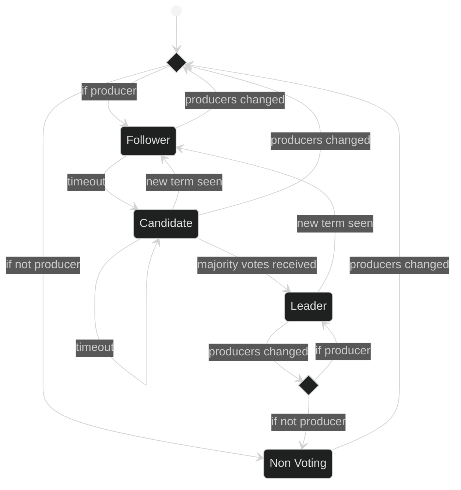

# Consensus Algorithms

- [CFT](#cft)
- [BFT](#bft)
- [Joint Consensus](#joint-consensus)

## CFT

This consensus algorithm is based on RAFT and has the following properties:
- The network will make progress as long as more than 50% of the current producers are active.
- If any producer node generates a message that is not permitted by the protocol, the behavior is undefined.

The nodes start by electing a leader with a simple majority vote. The leader is responsible for producing blocks and tracking irreversibility. If a node does not receive new blocks after a randomly chosen timeout, it will attempt to promote itself to be the leader by starting a new term and requesting votes from other nodes. In any term, a node will vote for the first candidate that is up-to-date.

### Irreversibility

Followers send confirmation to the leader after the block is successfully applied (Note: because this consensus algorithm assumes that all nodes are honest, the performance could be improved by sending a confirmation as soon as the block is stored durably). The leader advances irreversibility to the highest block in its own term that has been confirmed by more than half the producers (including itself).

### Messages

`append_entries_request`
`append_entries_response`
`request_vote_request`
`request_vote_response`

## BFT

BFT consensus has the following properties:
- The network will eventually make progress as long as the latency for a message sent at time t is in o(t)
- Up to f producers can fail in arbitrary ways without disrupting the network. There must be at least 3f+1 producers in the network.
- If more than f producers fail, the behavior is undefined

### Block Production

Blocks are produced by the leader. Leader selection is round-robin.

### Irreversibility

- Blocks are ordered first by term, then by block height.
- Blocks go through two rounds of confirmation, prepare and commit. Each producer broadcasts its confirmations to all other producer nodes.
- A producer can only commit a block that has been prepared by 2f+1 producers.
- If a producer commits a block A it can only prepare a conflicting block B that is better than A if at least 2f+1 nodes have already prepared an ancestor of B that is better than A.
- A block is considered irreversible if it has been committed by 2f+1 nodes.

### View Change

Each producer maintains a view change timer to detect failure in the leader. The view change timer is restarted whenever irreversibility advances. When the view change timer expires, a producer broadcasts a `view_change_message` to all other producers and increments the current term, moving to the next leader.

- After initiating a view change, a producer will not restart the view change timer until it sees 2f+1 view change messages.
- Consecutive view changes during which the chain does not make progress, cause the view change timeout to increase by a flat amount for each view change after the first.
- A view change will trigger immediately if at least f+1 producers are in a later term. This view change is independent of the view change timer and may skip terms.

### Messages

`append_entries_request`
`prepare_message`
`commit_message`
`view_change_message`

## Joint Consensus

Changes to the consensus algorithm or to the set of block producers are managed by joint consensus. Joint consensus defines a transition period during which the the old producers and the new producers cooperate to produce blocks. Joint consensus begins on the block containing the new producer schedule and ends after this block becomes irreversible. The precise behavior depends on the combination of the old and new consensus algorithms.

### CFT → CFT

The leader is selected from any of the old or new producers. Leader elections and irreversibility require majorities of both the old and the new producers.

### CFT → BFT

The leader is selected by election from the old producers. Irreversibility requires a majority of the old producers and a quorum of the new producers. Leader election requires a majority of the old producers and a quorum of the new producers.

### BFT → CFT

The leader is selected from the old producers. The new producers commit, but do not prepare blocks. Commit require prepares by a quorum of the old producers. Irreversibility requires commits from a quorum of the old producers and a majority of the new producers.

### BFT → BFT

The leader is selected from the old producers. Committing a block and advancing irreversibility require quorums of both the old and the new producers. Switching forks is permitted if a quorum of either the old or the new producers have prepared the new fork.
