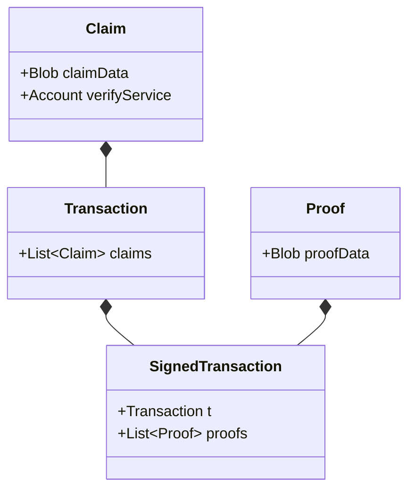
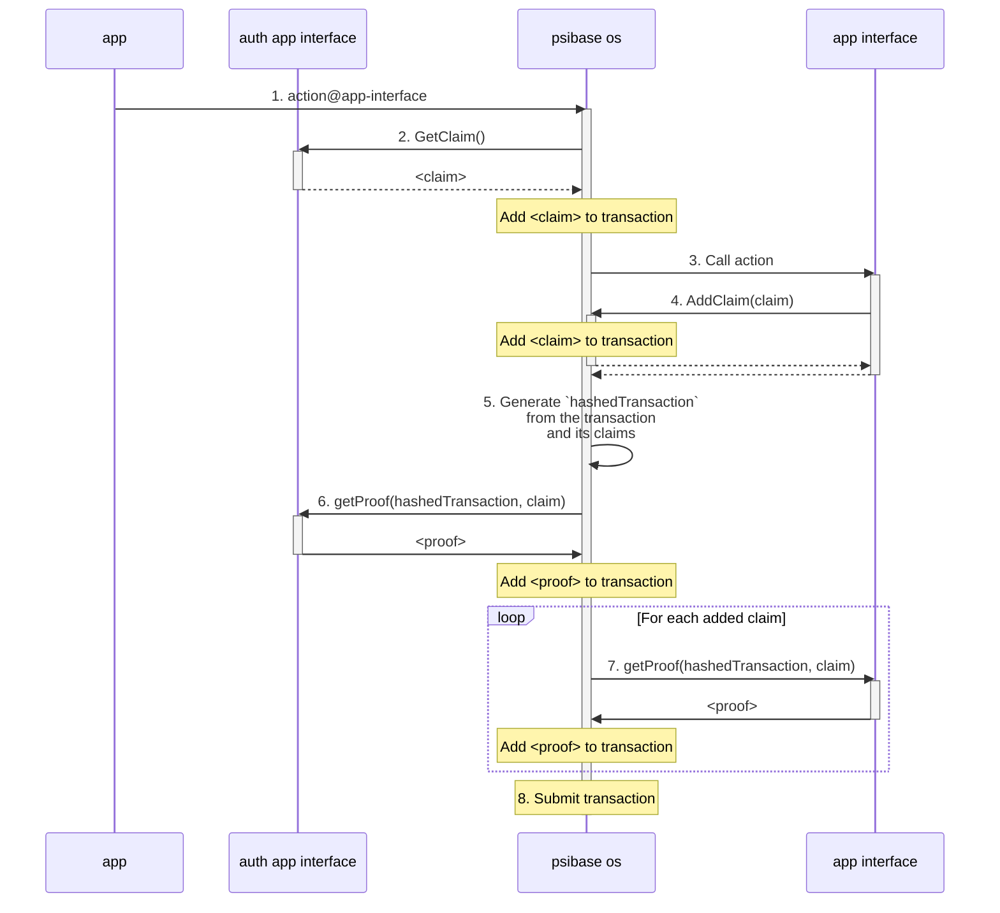

# Smart authorization

Authorization in psibase is fully dynamic and programmable. Accounts may use various services on the network to customize how their specific account should be authorized when submitting transactions. For example, a common strategy in other distributed app architectures is for accounts to digitally sign their transactions. Another common strategy for authorization is commonly called, "multi-sig" or multi-signature authorization, where more than one digital signature is added to the transaction. But in general, the logic for how to authorize an account can be configured by setting the auth service for a specific account, and the auth service itself is just a [service](../development/services/README.md) that anyone could write. Custom auth services may be written to enable the use of custom cryptographic curves or custom authorization strategies.

> 💻 **Developer note**: Key signing is a very common way to go about account authorization. If you're building a third-party app intended to integrate with psibase network, see the signing docs for [external apps](../development/front-ends/reference/js-libraries.md#signing). But if you're building a psibase app, then you have access to libraries that simplify the process of constructing and authorizing transactions. See the below section called [Psibase OS](#psibase-os) for more details.

## Overview

### Definitions

**Claim** - Something that the submitter of a transaction claims to know (e.g. a public key)
**Proof** - The evidence that the transaction submitter really does know it (e.g. a cryptographic signature)
**Transaction** - A payload that specifies the intent of the sender to execute some code on the network
**Auth service** - A service (configurable by each account) that specifies what claims are needed to authorize transactions from that account
**Verify service** - A service that knows how to verify proof of a claim

### How it works

1. Every account stored in the default [account-sys app](../default-apps/account-sys.md) must specify a service, called an auth service, that is used to ensure transactions submitted in their name make some claims (ideally that only the real sender could claim). 
2. Every transaction gets submitted with at least one claim and a corresponding proof.
3. The claims in the transaction must include whatever is needed to authorize actions from the sender, as specified by the sender’s auth service.
4. The auth service will verify the transaction claims, and a corresponding verification service will verify the proof, authorizing (or failing) the transaction.

## Architecture

A `SignedTransaction` is constructed on the client-side. A `SignedTransaction` is defined as follows:

> Note: A `SignedTransaction` should be eventually renamed to something more generic, like `AuthedTransaction`, since "Signed" implies the specific claim/proof technique of using digital signatures.

The submitted `SignedTransaction` is sent to the AuthService defined by an account (e.g. [AuthSys](../default-apps/auth-sys.md)) and the corresponding verification service. These services will fail the transaction if either the claims in the transaction are incorrect, or if the proof does not prove the claim.

## Psibase OS

When building Psibase apps, the construction of each transaction submitted to the network is done automatically, including any claim and proof aggregation. The following sequence diagram shows the client-side interactions involved when PsibaseOS aggregates claims and proofs.

The following is an explanation of each step in the diagram to aid understanding:

1. Alice calls an action on an app interface.
2. Psibase OS gives the user's configured auth app interface the opportunity to add a claim to the transaction.
3. Psibase OS calls the app interface action
4. If (and only if) an app interface calls a service action, then it is allowed to add a claim to the transaction.
5. Psibase OS has accumulated all actions and claims for this transaction, so it calculates the hash of the transaction object which can be used for the generation of proofs (such as digital signatures).
6. The user's configured auth app interface is asked to generate a proof for the claim it added.
7. Each app interface that added a claim is asked for a proof of the claim.
8. Psibase OS has collected all claims and proofs, therefore the final transaction object is packed and submitted to the network.

## Conclusion

Smart authorization gives psibase a fully programmable account authorization system. Furthermore, regardless of any custom permissions that must be satisfied for a particular user to submit a transaction, this architecture completely abstracts authorization from the app being used. This keeps both the user and developer experience simple.
