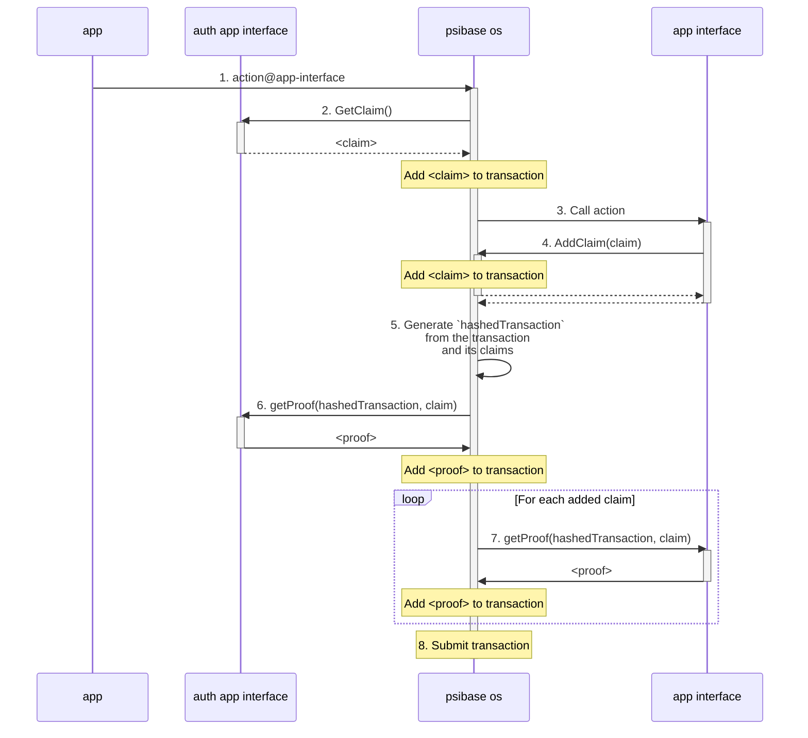

# Smart authorization

Authorization in psibase is fully dynamic and programmable. Cryptographic key signing is only one possible strategy for authorizing an account. The logic for how to authorize an account can be configured by setting the auth service for a specific account.

Key signing is a very common way to go about account authorization. If you're building a third-party app intended to integrate with psibase network, see the signing docs for [external apps](../development/front-ends/external-apps.md#signing-js).

But if you're building a psibase app, then you have access to libraries that simplify the process of constructing and authorizing transactions. Ultimately, the [Psibase OS](./psibase-os.md) will ensure that your transaction will contain the claims necessary for authorizing that account (such as the claim, "I know public key X"), and it will automatically attempt to aggregate the necessary proofs to prove each claim (such as a digital signature proving public key "X").

## Auth services

Every account has an auth service (saved in [account-sys](../default-apps/account-sys.md)) responsible for checking that certain claims are present whenever the user sends a transaction.

## Detailed flow

The following diagram describes how the architecture automatically gathers the claims and proofs used to authenticate your transaction if you're serving your app directly from a chain.

This entire flow (except for the final step of transaction submission) happens on the client-side when a user interacts with a psibase app.

The following is an explanation of each step in the diagram to aid understanding:

1. Alice calls an action on an app interface.
2. Psibase OS gives the user's configured auth app interface the opportunity to add a claim to the transaction.
3. Psibase OS calls the app interface action
4. If (and only if) an app interface calls a service action, then it is allowed to add a claim to the transaction.
5. Psibase OS has accumulated all actions and claims for this transaction, so it calculates the hash of the transaction object which can be used for the generation of proofs (such as digital signatures).
6. The user's configured auth app interface is asked to generate a proof for the claim it added.
7. Each app interface that added a claim is asked for a proof of the claim.
8. Psibase OS has collected all claims and proofs, therefore the final transaction object is packed and submitted to the network.

## Conclusion

Smart authorization gives psibase a fully programmable account authorization system. Furthermore, regardless of any custom permissions that must be satisfied for a particular user to submit a transaction, this architecture completely abstracts authorization from the app being used. This keeps both the user and developer experience simple.
