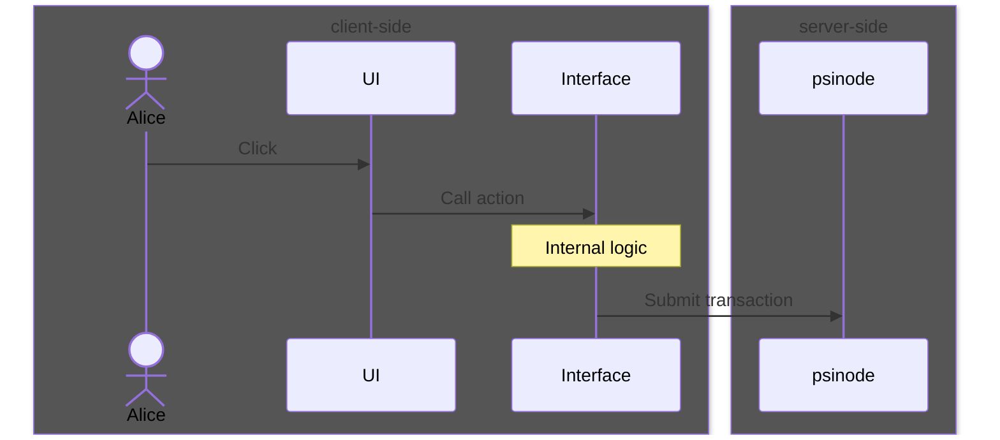
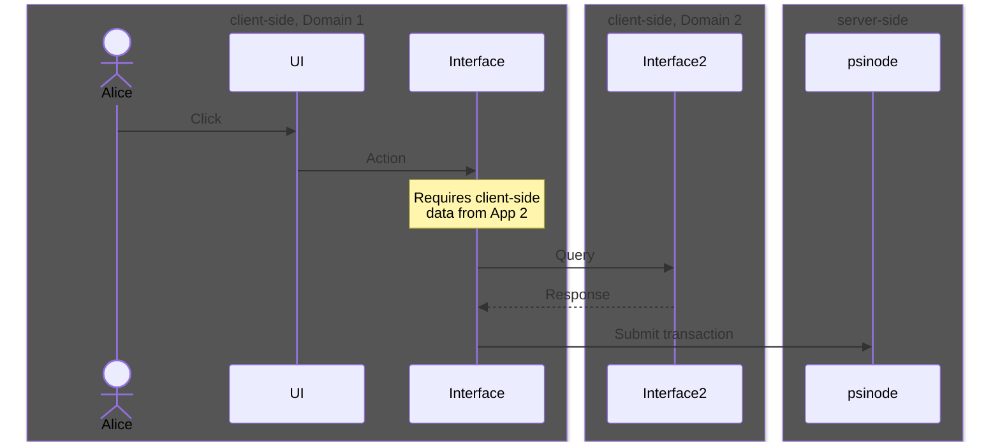
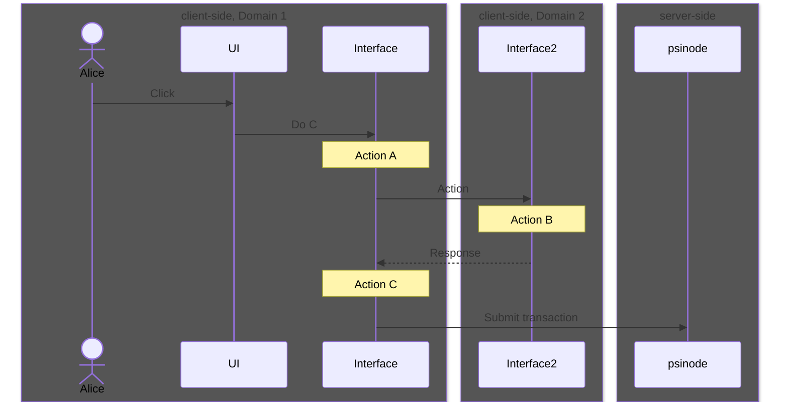
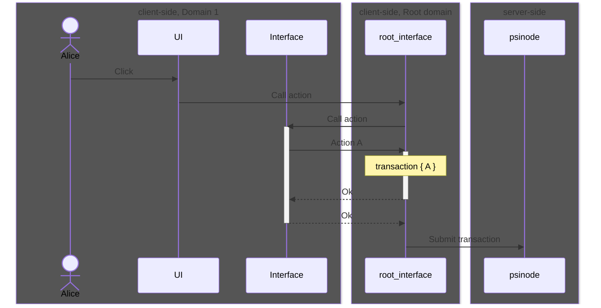
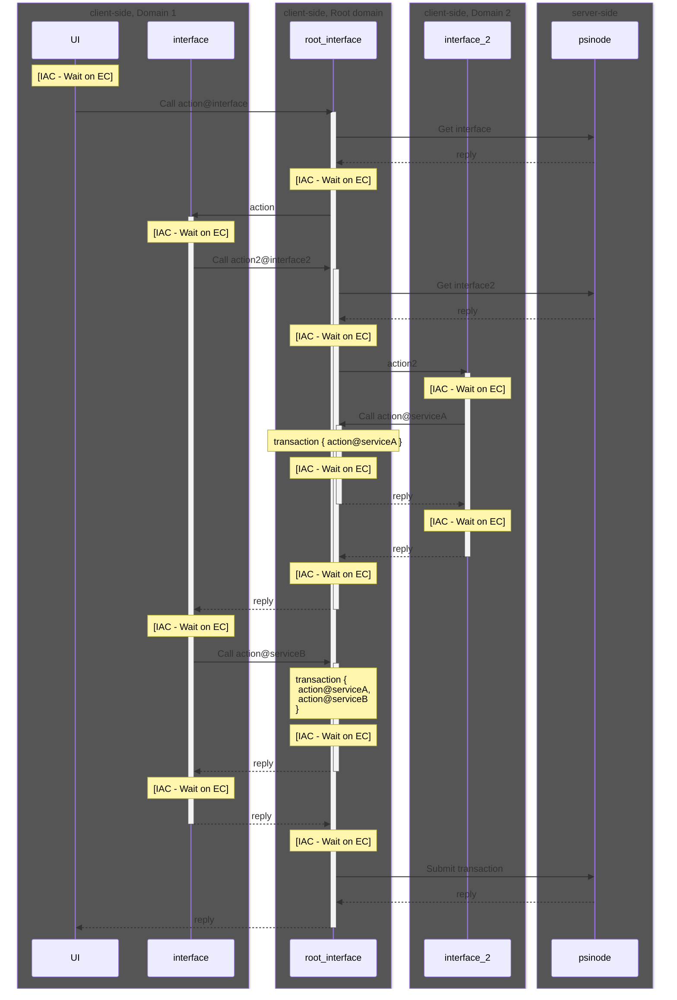
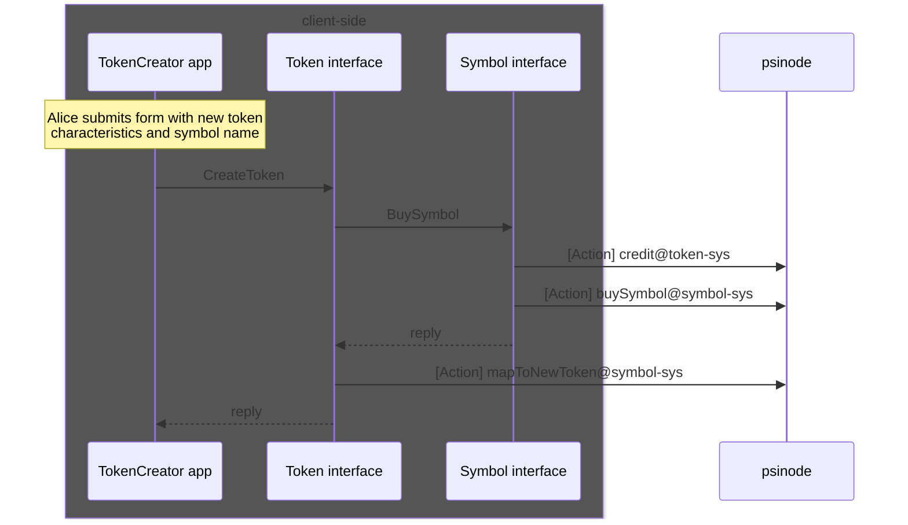

# Interfaces

Psibase allows anyone to write a service that maintains a server-side database and can respond to queries. That database can also store front-end code that clients download and use to interact with the service.

In addition to UI code, Psibase also introduces the concept of Interfaces, which are similar to services, but which run within a client's browser. These interfaces are intended to facilitate most interactions between users and services.



# Inter-app communication

Apps built on Psibase make use of shared infrastructure, and as such have the option to interoperate in ways that are difficult or impossible for traditional web apps. On the server side, Psibase services can simply call synchronous actions on each other. On the client-side, Interfaces can make synchronous or asynchronous calls between each other.

The libraries that are provided to service/interface developers make it easy to make such inter-app calls. On the client-side, when inter-app calls are made, each app interface is instantiated in its own domain, which ensures that local data remains isolated from all other apps except that which is intentionally exposed through an interface.



## Cross-domain communication

Calls made across domains are done so via `Window.PostMessage`.

According to the [Window.postMessage documentation](https://developer.mozilla.org/en-US/docs/Web/API/Window/postMessage):

> After postMessage() is called, the MessageEvent will be dispatched only after all pending execution contexts have finished.

Therefore `postMessage` does not immediately (synchronously) post to the other domain. Instead it schedules a payload to be dispatched after the completion of all remaining execution contexts. In order for cross-domain calls to appear synchronous, the caller should await the inter-applet call.

## Cross-domain security considerations

Listening for cross-domain messages has a reputation for being potentially dangerous. It is similar to the concerns that arise from the capability of one service to make synchronous calls into another. If the callee service does not do the proper checks and manually enforce the proper criteria to authorize actions, then they can be exploited.

Similarly, cross-domain messaging can be dangerous if the proper checks are not in place to ensure that the messages are going to/from whoever is intended. For this reason, it is not recommended for UIs or interfaces to manually add message event listeners to handle cross-domain messaging.

If interfaces make use of the core Psibase libraries that enable inter-app communication, then many of the security concerns are handled automatically. For example, it is automatically enforced that messages into your interface are only allowed to come from the root domain. The root interface will also only accept messages from apps that it explicitly opened.

# Transaction packing

Transactions contain the data and authentication payload necessary to execute a service action on the server. Transactions may contain multiple actions. Interfaces are responsible for filling the transaction objects with actions.

An interface is by default ignorant of all actions added into a transaction except any that it was itself responsible for adding. This improves privacy on the client-side by ensuring that interfaces are only aware of the user's actions that are relevant to it.

Actions are added to transactions in a FIFO queue. For example, the following sequence diagram will finally submit a transaction containing actions in the order: A, B, C.



# Transaction submission

For simplicity, the previous diagrams have shown the app interface as the component that submits the final transaction. But that would conflict with the principle of only allowing an Interface to know about the actions that it was itself responsible for adding to the transaction.

Instead, that responsibility is given to the root interface. The root interface refers to the interface running on the root domain which is actually the primary domain loaded in the client's browser (specific apps are all loaded within their own domains using iFrames).

The sequence looks more like the following, if we include the Root domain: 



# The complete IAC interaction

The following sequence diagram shows an example of a complete interaction involving inter-app communication (IAC) as well as transaction packing and submission. It also attempts to show how the cross-domain messaging only occurs after the completion of all active execution contexts (EC). A key interaction that is intentionally left out of the following diagram for simplicity is the root domain process for the aggregation of digital signatures and other authorization payloads.



# Simplified mental model

Inter-app communication is a complex coordination process facilitated by the root domain app. However, for most purposes, UI and interface developers do not need to understand this complexity. For most purposes, it is sufficient to imagine that when you call into another application, it is a simple synchronous call directly into the other application. 

With this simplified mental model, it is easier to see how these IAC capabilities lead to powerful client-side app composability. Consider the following example of an app that manages the creation of a token using some of the Psibase example Token and Symbol services & interfaces.



As you can see, someone creating an app to facilitate the creation of tokens would simply need to call the correct Token interface action. The Token interface allows you to specify a symbol and will automatically purchase a symbol from a symbol market and map it to the new token. All of the various interactions result in calling three separate actions in Psibase services. Those three actions will automatically be packaged into one single transaction, enabling for maximally efficient processing of the action on the server (authentication logic only runs once to verify the sender is authorized for the whole transaction, rather than authorization logic executing once for each action submitted in separate transactions).


# Writing an interface

Although the code executes client-side, interfaces are very similar to services. For example, just as in the context of the execution of a service action the service has full control over its own database, interfaces are permitted to silently call actions on their own service (Without additional confirmation prompts to the end user). Therefore, failing to include the proper security checks in the interface could allow the service to be exploited, corrupting shared data. This is unlike the more familiar concerns of UI developers which are traditionally much more limited. 

Furthermore, writing an interface often requires detailed knowledge about how to correctly call service actions, and in what order. 

For these reasons, interfaces should be thought of as the responsibility of the back-end / service developer. Correspondingly, they can be written in the same programming language as services (Rust).

## Example

The following is an incomplete example intended to provide an introduction to what it may look like to implement a service and its corresponding interface, as well as call into that interface from a UI.

The example is related to user votes for candidates in an ongoing election.

### Election service

This is written in Rust, compiled to wasm, and published to a particular account.

Transactions that are submitted to psinode contain actions that specify the service/action name/parameters necessary to execute this code server-side.

```rs
    /// Vote for a candidate
    #[action]
    fn vote(candidate: AccountNumber) {
        let current_time = get_current_time();
        check(current_time >= get_election().voting_start_time, "election has not started");
    
        let table = VotesTable::new();
        let voter = get_sender();
        let voting_record = table.get_index_pk().get(&(voter));
        check_none(voting_record, "voter has already submitted a vote");

        // Update voter record
        let new_voting_record = VotingRecord {
            voter,
            candidate,
            voted_at: current_time,
        };
        table.put(&new_voting_record).unwrap();

        // Update candidate record
        let mut candidate_record = get_candidate(candidate);
        candidate_record.votes += 1;
        CandidatesTable::new().put(&candidate_record).unwrap();
    }
```

### Election interface

This is written in Rust, compiled to WebAssembly, and published to a specific endpoint of a particular service. For example, assuming that an infrastructure provider for a Psibase network was hosting client-side code at `my-psibase-node.com`, then if an interface was published to the "interface" endpoint of a service called "election," it could be retrieved by making a GET request to `election.my-psibase-node.com/interface`. Ultimately, this interface is executed client-side, just like the UI code.

The js libraries provided to the UI developers make it easy to make interface calls, abstracting the process of requesting and instantiating the interface wasm.


```rs
    #[interface_action]
    fn vote(candidate: AccountNumber)
    {
        let voter = get_sender();
        get_service().vote(candidate);

        // Cache vote client-side in browser local storage
        save_vote(voter, sender);
    }

    #[interface_action]
    fn get_vote()
    {
        return get_vote(voter); // Returns cached local storage object
    }
```

Notice that `get_vote` is a call that can be made into the interface that does not call any service actions. It simply queries local browser storage to return a cached value. Although client-side services are written in rust, they have full access to the browser environment including local storage.

### Election UI

This is just a piece of the front-end code that could be bundled and served from the root path of a particular service (Such as `election.my-psibase-node.com/`).  

The simplest way for front-end javascript code to call into an interface would look like this:

```js
import { iac } from "@psibase/lib";

try {
    await iac.call("election", "vote", { candidate: "bob"});
} catch (e) {
    console.error(e);
}

```

This method, however, has no type-checking or autocomplete. To address this, in the future, it will be possible for the interface developer to easily generate javascript and/or typescript bindings that will facilitate making calls into their interface. These bindings can then be deployed to a package registry like npm and easily bundled into the front-end code for better type-checking and/or autocomplete. In this case, the front-end code may look more like:

```js
import { election } from "@electionapp/lib"

try {
    await election.vote("bob");
} catch (e) {
    console.error(e);
}

```

The intention is that the only code bundled in with a front-end app is the interface API, not the entire interface binary. The binary is requested at run-time by the client's browser. This implies that any changes to the interface API can break client code, just as changes to the service API can break client code. However, just as service implementations can be seamlessly updated to fix bugs or make improvements, interface implementations can also change, and all users of the app interface will automatically use the updated code. 

Bundling an interface directly into a front-end could have disasterous consequences in multiple ways:

1. It would give interfaces access to client data in the caller app's domain, rather than in its own isolated domain.
2. It would allow the interface to silently make calls to the caller app's service, in effect giving root access to the bundled interface.
3. It would waste server space, since it would duplicate the storage for wasm binaries in every app that bundled it.

Therefore, the simplest development procedure must by default only bundle the interface API, and make real-time requests for the wasms from the server.