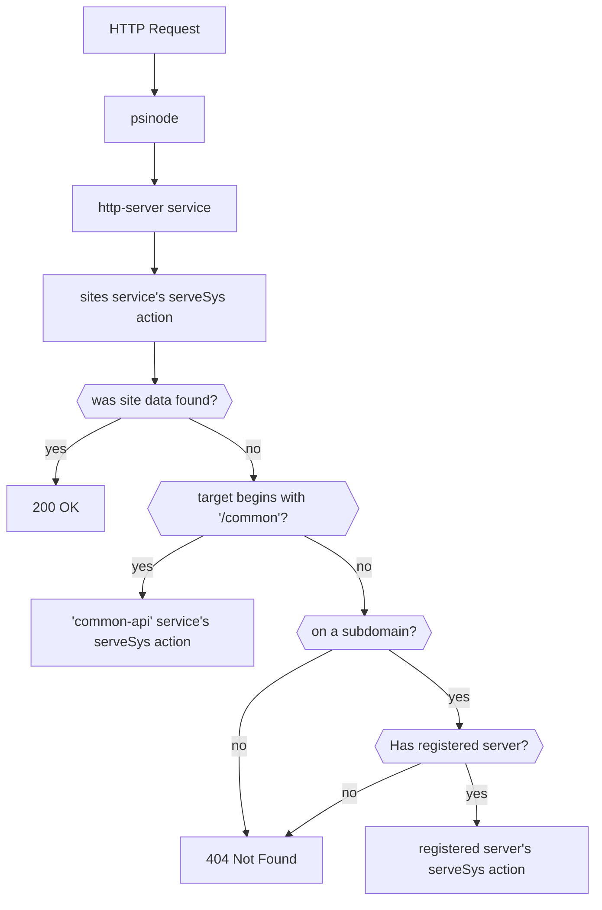

# C++ Web Services

## Routing



`psinode` passes most HTTP requests to the [SystemService::HttpServer] service, which then routes requests to the appropriate service's [serveSys](#psibaseserverinterfaceservesys) action (see diagram). The services run in RPC mode; this prevents them from writing to the database, but allows them to read data they normally can't. See [psibase::DbId].

[SystemService::CommonApi] provides services common to all domains under the `/common` tree. It also serves the chain's main page.

[SystemService::Sites] provides web hosting for non-service accounts or service accounts that did not [register](#registration) for HTTP handling.

`psinode` directly handles requests which start with `/native`, e.g. `/native/push_transaction`. Services don't serve these.

## Registration

Services which wish to serve HTTP requests need to register using the [SystemService::HttpServer] service's [SystemService::HttpServer::registerServer] action. There are multiple ways to do this:

- `psibase deploy` has a `--register-proxy` option (shortcut `-p`) that can do this while deploying the service.
- `psibase register-proxy` can also do it. TODO: implement `psibase register-proxy`.
- A service may call `registerServer` during its own initialization action.

A service doesn't have to serve HTTP requests itself; it may delegate this to another service during registration.

## HTTP Interfaces

Services which serve HTTP implements this interface:

- [psibase::ServerInterface] (required)
  - [psibase::HttpRequest]
  - [psibase::HttpReply]

{{#cpp-doc ::psibase::ServerInterface}}
{{#cpp-doc ::psibase::HttpRequest}}
{{#cpp-doc ::psibase::HttpReply}}

## Helpers

These help implement basic functionality:

- [psibase::serveSimpleUI]
- [psibase::serveActionTemplates]
- [psibase::servePackAction]
- [psibase::serveSchema]
- [psibase::serveGraphQL]
- [psibase::makeConnection]
  - [psibase::PageInfo]
  - [psibase::Edge]
  - [psibase::Connection]
- [psibase::EventDecoder]
- [psibase::EventQuery]

Here's a common pattern for using these functions:

```c++
std::optional<psibase::HttpReply> serveSys(psibase::HttpRequest request)
{
   if (auto result = psibase::serveActionTemplates<ExampleService>(request))
      return result;

   if (auto result = psibase::servePackAction<ExampleService>(request))
      return result;

   if (request.method == "GET" && request.target == "/")
   {
      static const char helloWorld[] = "Hello World";
      return psibase::HttpReply{
            .contentType = "text/plain",
            .body        = {helloWorld, helloWorld + strlen(helloWorld)},
      };
   }

   return std::nullopt;
}
```

{{#cpp-doc ::psibase::serveSimpleUI}}
{{#cpp-doc ::psibase::serveActionTemplates}}
{{#cpp-doc ::psibase::servePackAction}}
{{#cpp-doc ::psibase::serveSchema}}
{{#cpp-doc ::psibase::serveGraphQL}}
{{#cpp-doc ::psibase::makeConnection}}
{{#cpp-doc ::psibase::PageInfo}}
{{#cpp-doc ::psibase::Edge}}
{{#cpp-doc ::psibase::Connection}}
{{#cpp-doc ::psibase::EventDecoder}}
{{#cpp-doc ::psibase::EventQuery}}
