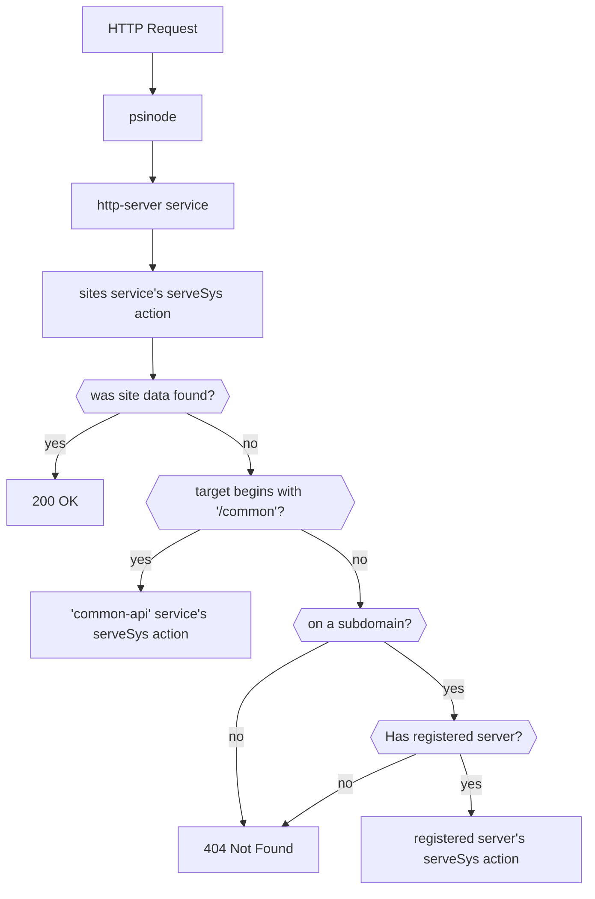

# Rust Web Services

## Routing



`psinode` passes most HTTP requests to the [SystemService::HttpServer] service, which then routes requests to the appropriate service's [serveSys](https://docs.rs/psibase/latest/psibase/server_interface/struct.ServerActions.html#method.serveSys) action (see diagram). The services run in RPC mode; this prevents them from writing to the database, but allows them to read data they normally can't. See [psibase::DbId](https://docs.rs/psibase/latest/psibase/enum.DbId.html).

[SystemService::CommonApi] provides services common to all domains under the `/common` tree. It also serves the chain's main page.

[SystemService::Sites] provides web hosting for non-service accounts or service accounts that did not [register](#registration) for HTTP handling.

`psinode` directly handles requests which start with `/native`, e.g. `/native/push_transaction`. Services don't serve these.

## Registration

Services which wish to serve HTTP requests need to register using the [SystemService::HttpServer] service's [SystemService::HttpServer::registerServer] action. This is usually done by setting the `package.metadata.psibase.server` field in `Cargo.toml` to add this action to the package installation process.

A service doesn't have to serve HTTP requests itself; it may delegate this to another service during registration.

## HTTP Interfaces

Services which serve HTTP implement these interfaces:

- [psibase::server_interface](https://docs.rs/psibase/latest/psibase/server_interface/index.html) (required)
  - [psibase::HttpRequest](https://docs.rs/psibase/latest/psibase/struct.HttpRequest.html)
  - [psibase::HttpReply](https://docs.rs/psibase/latest/psibase/struct.HttpReply.html)
- [psibase::storage_interface](https://docs.rs/psibase/latest/psibase/storage_interface/index.html) (optional)

## Helpers

These help implement basic functionality:

- [psibase::serve_simple_ui](https://docs.rs/psibase/latest/psibase/fn.serve_simple_ui.html)
- [psibase::serve_simple_index](https://docs.rs/psibase/latest/psibase/fn.serve_simple_index.html)
- [psibase::serve_action_templates](https://docs.rs/psibase/latest/psibase/fn.serve_action_templates.html)
- [psibase::serve_schema](https://docs.rs/psibase/latest/psibase/fn.serve_schema.html)
- [psibase::serve_pack_action](https://docs.rs/psibase/latest/psibase/fn.serve_pack_action.html)

Here's a common pattern for using these functions.
[`#[psibase::service]`](https://docs.rs/psibase/latest/psibase/attr.service.html) defines `Wrapper`;
the `serve_*` functions fetch action definitions from Wrapper.

```rust
#[psibase::service]
#[allow(non_snake_case)]
mod service {
    use psibase::*;

    #[action]
    fn serveSys(request: HttpRequest) -> Option<HttpReply> {
        if request.method == "GET"
        && (request.target == "/" || request.target == "/index.html")
        {
            return Some(HttpReply {
                contentType: "text/html".into(),
                body: "<b>This is my UI</b>".into(),
                headers: vec![],
            });
        }

        None.or_else(|| serve_schema::<Wrapper>(&request))
            .or_else(|| serve_action_templates::<Wrapper>(&request))
            .or_else(|| serve_pack_action::<Wrapper>(&request))
    }
}
```
