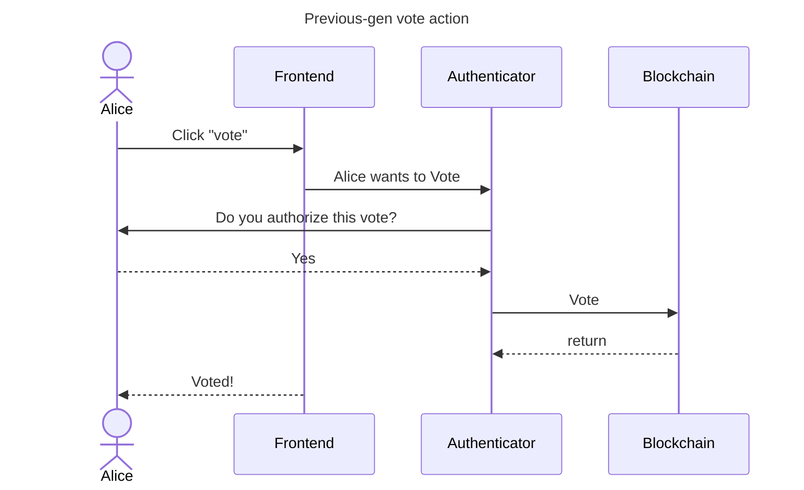
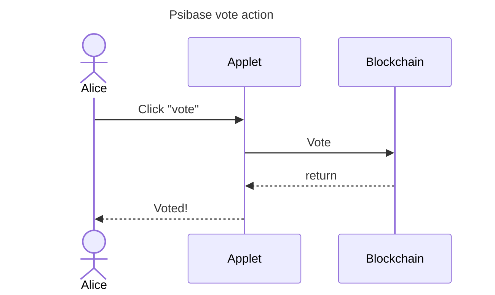

# Applets

- [What is an applet](#what-is-an-applet)
- [Decentralized front-end](#decentralized-front-end)
- [Security model](#security-model)
  - [Security model comparison](#security-model-comparison)
  - [Security model implications](#security-model-implications)
- [Scaling state and computation](#scaling-state-and-computation)

## What is an applet?

An applet is the name for the client-side code served to the browser by a Psinode and inherently coupled to an account on a psibase blockchain. An applet could be as simple as a static web page, or it could be a dynamic interface to the service running on its corresponding account on the blockchain. Since applets may be linked to services, they are solely responsible for presenting any information that would be relevant to a user trying to use the service. Anyone may write traditional front-end user-interfaces that interact with psibase chains, but they will be unable to take advantage of the robust infrastructure provided to all front-ends that are deployed as psibase applets, such as permission and key management services.

## Decentralized front-end

If applets are the front-ends to blockchain services, then any full-node running the blockchain also contains all front-ends to those services. That means that the front-ends are fully decentralized, and there is no single server that could shut down access to that service. Even if certain full-nodes are attempt to censor the applet for some services, users could simply find another full-node from which to request the applet, or they could run their own full node to gain full access to all blockchain applets and services.

This also means that for each applet deployed by a developer, there will be numerous web addresses & domain names that all point to the same applet, just as there are many API endpoints to which a user can submit transactions on all previous-generation blockchains.

## Security model

An applet is served by its own service, and it is therefore capable of executing actions on its own service on behalf of the user without requiring the user to manually grant permission. It's functionally an extension of the service itself.

But, for an applet to execute actions and operations on another applet would require that the user gives permission to the originating applet to act on their behalf within the context of another applet.

The core infrastructure provided for applet development handles these permission requests automatically so that applets can simply focus on writing the logic that performs the necessary operations. All permissions management and authentication will be automatically facilitated for all applets that are served from a psibase chain.

### Security model comparison

Below shows the comparison between a sample vote interaction in a previous generation blockchain application vs a psibase applet.

Hopefully this makes it clear that the steps needed to use psibase applets have the potential to be minimized to produce a seamless and immersive UX that meets the expectations of users of traditional (non-blockchain) web applications. Note that the above example implies that "vote" is an action on the blockchain Service that is coupled to the Applet. If the action is part of a third-party service unrelated to the applet, then the user is still required to give manual permission for the applet to submit the relevant action to the blockchain.

### Security model implications

The positive implications of this security model are significant. The majority of the breakdown in user-experience in other "Web 3" applications comes from the need for a user to use external Authenticators and authenticators to grant front-ends permission to sign transactions on their behalf. In psibase blockchains, all such signature requests are eliminated for any transactions that only involve the applet updating the blockchain state for its own service. psibase applications therefore have the potential to offer users the most seamless possible user-experience out of all decentralized applications.

## Scaling state and computation

Applets have the ability to not only store data in blockchain state through services, but they are able to store data in local browser-storage on the client-side. Imagine, for example, a contact-list applet that stored the "friends" of a particular user. It would be wasteful and a potential breach of privacy to store such a list of friends on-chain. In psibase, a contact-list applet could simply store the account names of a user's friends in browser-local storage. That list of friends could then be used, with user permission, by other third-party applets where it would be helpful to have a list of "friends" for a given account (such as games, or instant-messaging, etc.). Therefore, psibase applets not only have the ability to leverage infrastructure to share public storage (the psibase blockchain), but they can request that the user grant them access to additional data stored client-side. This allows for much more data-rich applications to be built for a much lower-cost, as the data need not all be stored on the blockchain side.

Similarly, computation may be performed client-side that drastically minimizes the computation needed to be done on-chain. The psibase infrastructure includes libraries that facilitate inter-applet communication to allow applets to pass messages between each other, perform computation, store data, and interact with external services purely on the client-side. This means it is also easy to reuse operations defined in one applet in another applet, allowing for massively composable applications to be built that need not "reinvent the wheel" each time they need to perform an operation that is already performed by another applet. 

For example, if a blockchain service requires that actions are always called on it in a particular order, the corresponding applet for that service may define a single operation that takes the parameters necessary to call both actions in the correct order, and expose that operation to other client-side applets. Third-party applets, in this case, would not ever need to know the requirement that actions are called in a particular order, and would instead rely on the discrete operation defined in the applet. For more information on this inter-applet communication, see [Inter-applet communication](inter-applet-communication.md).

