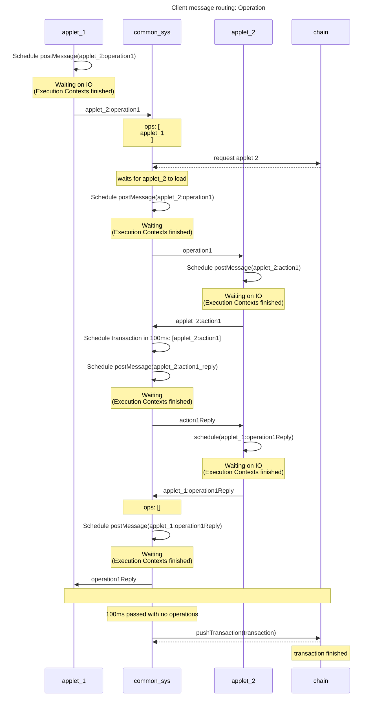
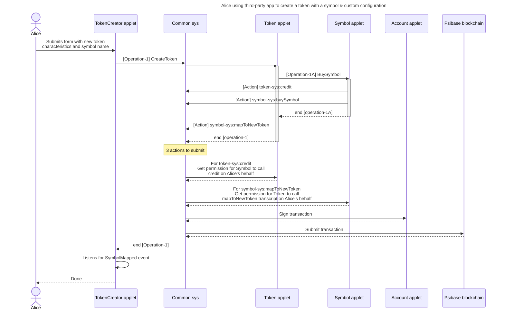

# Applet interfaces

- [What are they](#what-are-they)
  - [Operation example](#operation-example)
- [Queries](#queries)
  - [Query example](#query-example)
- [Security](#security)
- [Error handling](#error-handling)
- [Event sourcing](#event-sourcing)
- [Message routing](#message-routing)
- [Composability](#composability)
- [Action scripts](#action-scripts)

## What are they?

Applets must define, in a structured way, the operations they know how to perform. If done correctly, these operations can not only be used internally to the applet who owns the operations, but these operations could be called by any other applet loaded client-side on a user's browser. This allows one applet to create an interface defining interactions with its own local state, its service, other applet local state, or other services. This drastically increases the level of abstraction it is possible for applets on a psibase blockchain to provide each other.

### Operation Example

To create a new symbol, it is necessary to first transfer an amount of tokens to the symbol service that is sufficient to cover the cost of the new tokens. But rather than forcing every other applet for whom the process of creating a new symbol is part of their own operational requirements to independently learn the process needed to create a symbol, the symbol service can simply define an operation that performs the correct sequence to create a symbol. If it does so, then it effectively abstracts the complexity of symbol creation from the outside world, who now only need to know that they call the "Create" operation on the symbol applet.

```javascript
// applet/symbol-sys/index.js

initializeApplet(async () => {
    setOperations([
        {
            id: "create",
            exec: async (sender, {symbol}) => {
                let maxDebit = getCurrentSymbolPrice() * 1.1;
                let tokenApplet = new AppletId("token-sys", "");
                operation(tokenApplet, "credit", {
                    symbol: "PSI",
                    receiver: "symbol-sys",
                    amount: maxDebit,
                    memo: "To cover cost of symbol creation",
                });
                action("symbol-sys", "create", {symbol, maxDebit});
            },
        }
    ]);
});
```

In the above sample implementation of the symbol-sys:create operation, there is not only a call to the symbol-sys:create action on the symbol service, but there is also a call to the token-sys:credit operation, which is an operation defined by another applet. In Psibase, tokens and symbols are separate. In fact, tokens know nothing about symbols, but there is a standard symbol service which knows about tokens. So if one was to attempt to credit tokens to another by submitting an action directly to the token service, it would first be necessary to look up the tokenId associated with a particular symbol in the symbol service. But in this case, the token-sys applet defined an operation that accepts a symbol in order to hide that complexity from all other applets.

Hopefully this starts to elucidate how the concept of client-side operations can be used to improve abstraction and composability in psibase services & applets beyond what is possible in other blockchain development environments.

## Queries

Queries allow applets to query each other for information on the client side. In order to return the result that the caller is looking for, it may be necessary for an applet to reference chain state or local (client-side) storage. The applet being queried always knows which applet was the sender of the request, and can therefore may want to prompt the user to explicitly allow the sharing of data if the data is potentially sensitive. Both operations and queries can return objects. The only difference between operations and queries is that queries are not allowed to call action() or operation(), and may only call another query(). 

### Query example

The account-sys applet defines a mechanism to allow other applets to ask for the name of the currently logged-in user, using something similar to the following definition:

```javascript
// applet/account-sys/index.js

initializeApplet(async () => {
    setQueries([
        {
            id: "getLoggedInUser",
            exec: ({sender}) => {
                return users.find(u=>u.loggedIn === true);
            },
        }
    ]);
});
```

In the above example implementation, the sender is not checked, and therefore any applet would be permitted to know the name of the currently logged-in user. This is just an example, however, the actual account-sys applet will prompt the user to explicitly confirm or deny the right of another applet to determine the name of the currently logged-in user.

## Security

From the perspective of each applet, the origin of the window on whom postMessage is called during all inter-applet communication is restricted to be the common-sys applet. That means it is not possible for an attacker applet to embed your applet within their own and mimic common-sys.

In common-sys, each time an applet is opened in an iFrame, all incoming messages from it are restricted to the domain listed in the initial src property of the iFrame. Therefore, if the iFrame navigates away to a different origin, common-sys will reject all messages from it. Furthermore, all messages sent from core to a particular iFrame are explicitly restricted such that they will only be processed if the origin of the iFrame matches the origin when the iFrame was first opened. 

## Error handling

Both operation() and query() return a javascript Promise object to the caller. If there are any errors thrown during the execution of an operation or query, the errors will be routed back to the `reject` path of the corresponding Promise. That means callers can simply wrap their calls to operation() and query() in a standard try/catch block to listen for errors.

```javascript
// applet/my-applet/index.js

try
{
    operation(tokenApplet, "credit", {
        symbol: "PSI",
        receiver: "dlarimer",
        amount: 5,
        memo: "Happy birthday!",
    });
} 
catch (e) 
{
    console.error(e);
}

```
## Event sourcing

It is possible that the user may be using an applet to construct a transaction, rather than wanting to construct it and immediately push it to chain (for example if trying to propose a multisignature transaction).

This means that an applet should not be written to expect a callback when an operation is executed. Instead, psibase blockchains use an event-sourcing model, where an applet should subscribe to the on-chain events that it cares about, and it will be automatically notified when those events are emitted. 

## Message routing

Whenever we call operation(), action(), or query() inside an applet, `Window.postMessage` is used to send a specific message to the common-sys window.

According to the [Window.postMessage documentation](https://developer.mozilla.org/en-US/docs/Web/API/Window/postMessage):

> After postMessage() is called, the MessageEvent will be dispatched only after all pending execution contexts have finished.

Therefore postMessage in the below diagram does not immediately post to the other window. Instead it schedules a payload to be dispatched after the completion of all remaining execution contexts. Below is a detailed diagram showing how messages are routed from one applet, through the common-sys infrastructure, to another applet, and back.



Queries work the same way as operations, except that the handlers for queries cannot call action() or operation(), but can only call another query(). 

## Composability

The existence of a framework that permits front-ends to communicate with each other in an authenticated way is very powerful. This enabled a level of application composability on the front-end that could greatly simplify the efforts of a developer who is attempting to build a powerful application. The next diagram shows how the author of a TokenCreator applet only needs to implement very minimal code in order to achieve what is ultimately quite a complex operation.



This could have important implications for DeFi and other industries where composability is an important factor.

