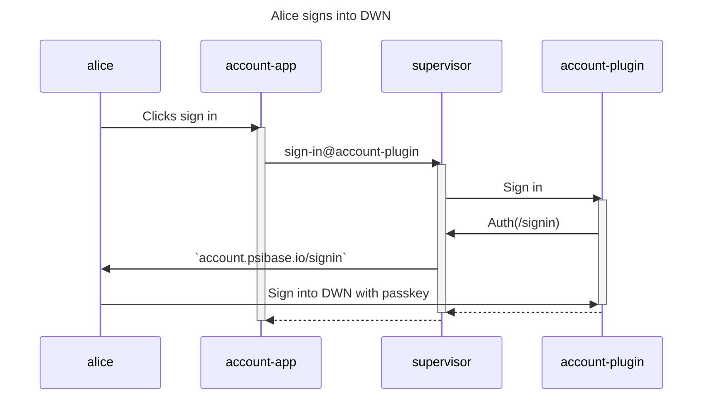
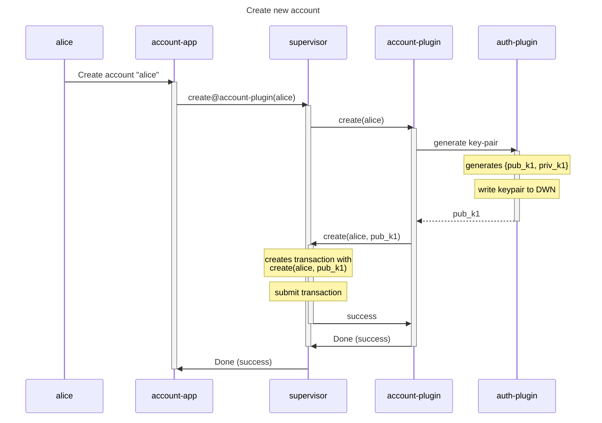
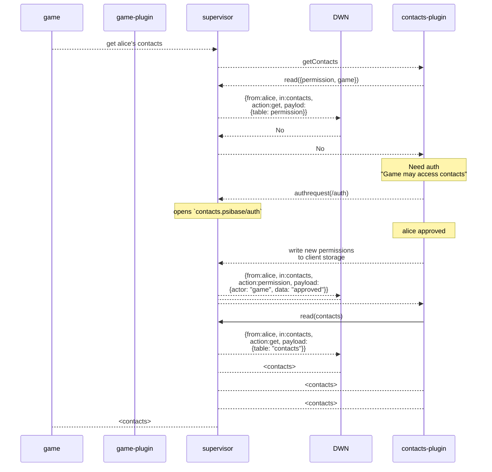

# Decentralized web nodes

DWNs are used as the mechanism to ensure that users remain sovereign over any data that is not stored as public blockchain data. Using DWNs allows users to change devices, browsers, or root domains, and still enjoy the same app user experience.

## Creation of a psibase account

Creating a psibase account has two steps:
1. Sign into your DWN
2. Create your new account

## Reading DWN state

Diagram 1: Alice's game app wants access to alice's contacts

Note: In this model, I had been thinking that the supervisor/app would have a shared symmetric key with which the supervisor would encrypt dwn data. This would require the supervisor to be the one to read the data from the dwn though, exclusing external apps. Not sure if needed if the same UX can be provided to users.

> Todo: Need to make a diagram where the data stored in a dwn is not only accessibly by the supervisor, but available also to external apps.
