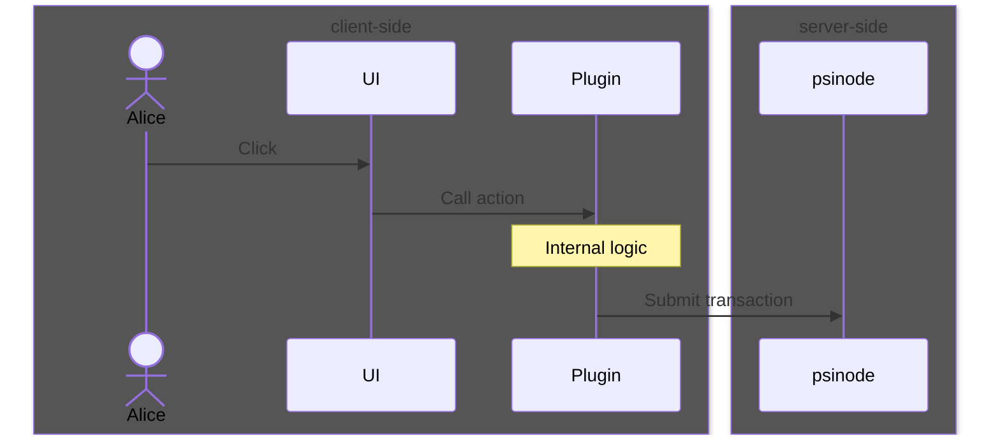
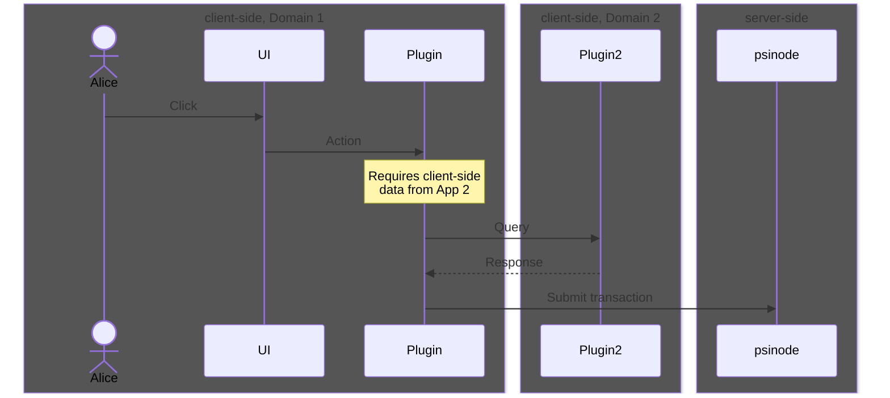
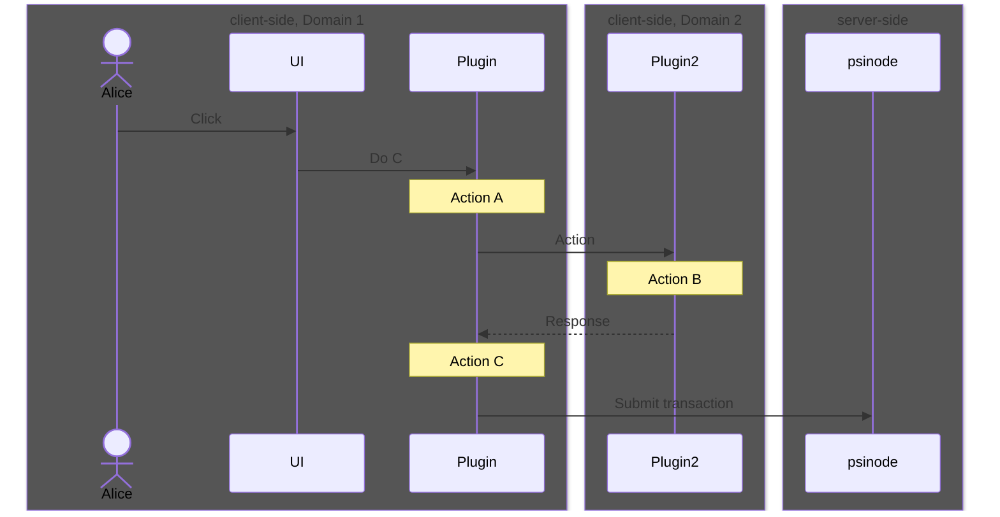
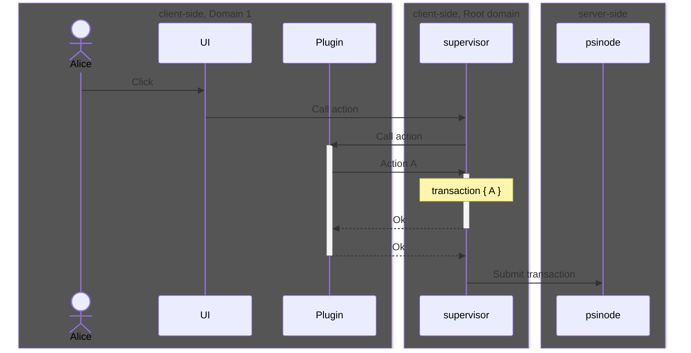
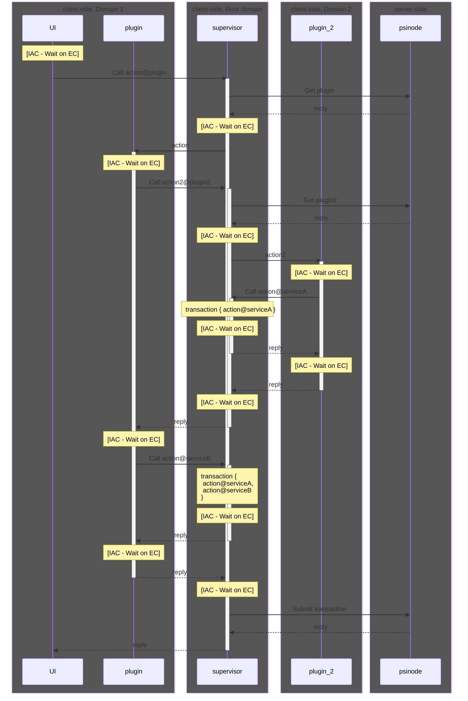
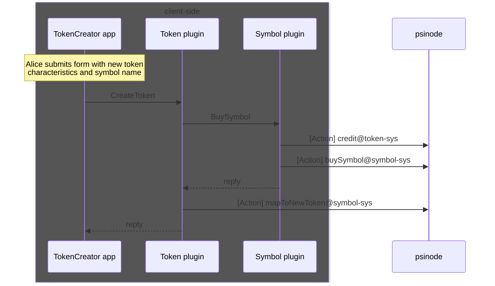

# Plugins

Plugins run within a client's browser. They are intended to facilitate interactions between user interfaces and services.

# Communication with plugins

Apps built on psibase make use of shared infrastructure, and as such have the option to interoperate in ways that are difficult or impossible for traditional web apps. On the server side, psibase services can simply call synchronous actions on each other. On the client-side, plugins can also make calls between each other.

On the client-side, an app may call a function defined in another app's plugin. When this happens, a message is passed from the user interface of one app to the [supervisor](./supervisor.md), which then instantiates the target plugin in its own app domain, which ensures that local app data remains isolated except that which is intentionally exposed through an plugin.

## Cross-domain communication

Calls made across domains are done so via `Window.PostMessage`.

According to the [Window.postMessage documentation](https://developer.mozilla.org/en-US/docs/Web/API/Window/postMessage):

> After postMessage() is called, the MessageEvent will be dispatched only after all pending execution contexts have finished.

Therefore `postMessage` does not immediately (synchronously) post to the other domain. Instead it schedules a payload to be dispatched after the completion of all remaining execution contexts. In order for cross-domain calls to appear synchronous, the caller should await the asynchronous call.

## Cross-domain security considerations

Cross-domain messaging can be dangerous if the proper checks are not in place to ensure that the messages are going to/from whoever is intended. 

The supervisor will only listen for cross-domain messages from apps that it instantiated, and plugins will only listen more messages that come directly from the supervisor.

If plugins make use of the standard psibase development libraries, then many of the security concerns are handled automatically. For example, it is automatically enforced that messages into your plugin are only allowed to come from the root domain.

# Transaction packing

Transactions contain the data and authentication payload necessary to execute a service action on the server. Transactions may contain multiple actions. Plugins are responsible for filling the transaction objects with actions.

A plugin is by default ignorant of all actions added into a transaction except any that it was itself responsible for adding. This improves privacy on the client-side by ensuring that plugins are only aware of the user's actions that are relevant to it.

Actions are added to transactions in a FIFO queue. For example, the following sequence diagram will finally submit a transaction containing actions in the order: A, B, C.

# Transaction submission

For simplicity, the previous diagrams have shown the plugin as the component that submits the final transaction. But that would conflict with the principle of only allowing a plugin to know about the actions that it was itself responsible for adding to the transaction.

Instead, that responsibility is given to the [supervisor](./supervisor.md). The supervisor refers to the code running on the root domain which is actually the primary domain loaded in the client's browser (specific apps are all loaded within their own domains using iFrames).

The sequence looks more like the following, if we include the Root domain: 

# A complete interaction

The following sequence diagram shows an example of a complete interaction involving an app, the supervisor, as well as multiple plugins. The diagram also includes transaction packing and submission. It attempts to show how the cross-domain messaging only occurs after the completion of all active execution contexts (EC). A key interaction that is intentionally left out of the following diagram for simplicity is the supervisor's process for the aggregation of digital signatures and other authorization payloads.

# Simplified mental model

Plugin communication is a complex coordination process facilitated by the [supervisor](./supervisor.md). However, for most purposes, UI and plugin developers do not need to understand this complexity. For most purposes, it is sufficient to imagine that calls into plugins are simple and direct.

With this simplified mental model, it is easier to see how these capabilities lead to powerful client-side app composability. Consider the following example of an app that manages the creation of a token using some of the psibase example Token and Symbol services & plugins.

As you can see, someone creating an app to facilitate the creation of tokens would simply need to call the correct Token plugin action. The Token plugin allows you to specify a symbol and will automatically purchase a symbol from a symbol market and map it to the new token. All of the various interactions result in calling three separate actions in psibase services. Those three actions will automatically be packaged into one single transaction, enabling for maximally efficient processing of the action on the server (authentication logic only runs once to verify the sender is authorized for the whole transaction, rather than authorization logic executing once for each action submitted in separate transactions).

# Plugin developers

Although the code executes client-side, plugins are very similar to services. For example, just as in the context of the execution of a service action the service has full control over its own database, plugins are permitted to silently call actions on their own service (Without additional confirmation prompts to the end user). Therefore, failing to include the proper security checks in the plugin could allow the service to be exploited, corrupting shared data. This is unlike the more familiar concerns of UI developers which are traditionally much more limited. 

Furthermore, writing a plugin often requires detailed knowledge about how to correctly call service actions, and in what order. 

For these reasons, plugins should be thought of as the responsibility of the back-end / service developer. Correspondingly, they can be written in the same programming language as services (Rust).

# Updating plugins

The intention is that the only code bundled in with a front-end app is the plugin API, not the entire plugin binary itself. The binary is requested at run-time by the client's browser. This is similar to how calls made to services will be bundled in with user interfaces and other client-code, but the implementation of the service actions are server side.

This implies that any changes to the plugin API can break client code, just as changes to the service API can break client code. However, just as service implementations can be seamlessly updated to fix bugs or make improvements, plugin implementations can also change, and all users of the plugin will automatically use the updated code.
