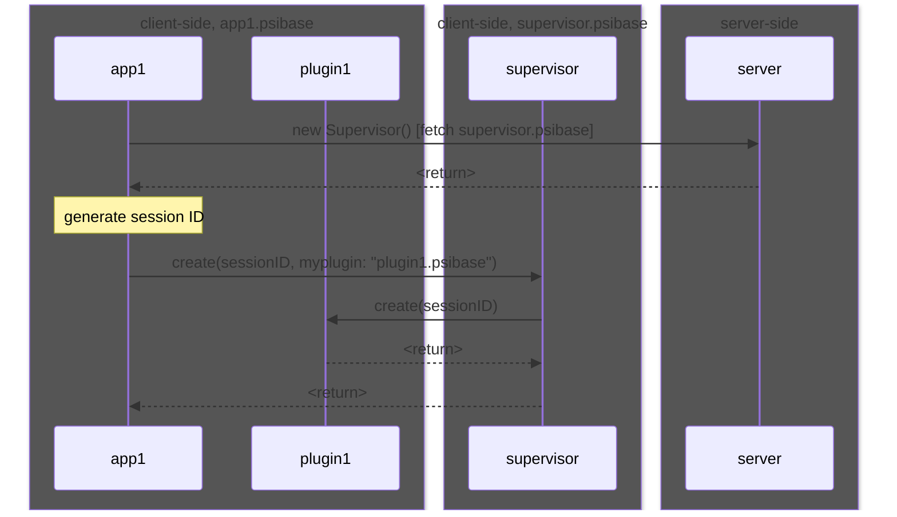
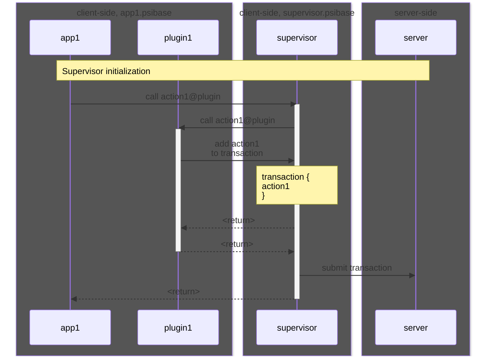
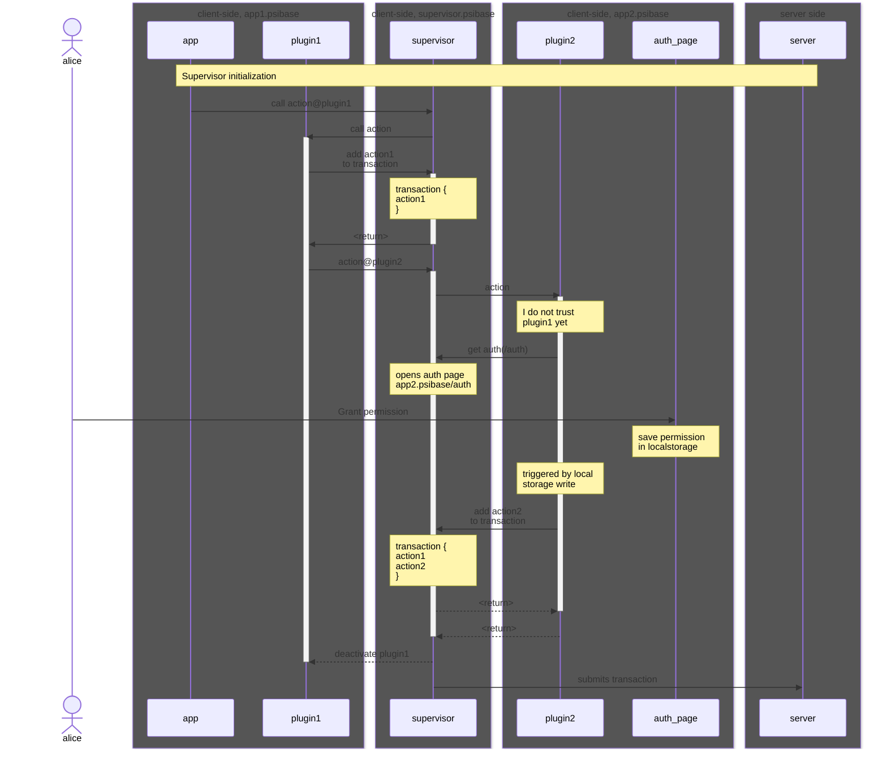

# Supervisor

The supervisor is the name of the client-side code that is run by a psibase app to mediate communication between apps and provide certain services to apps. All plugins run within the supervisor, and can interact with each other via message passing through the supervisor. The supervisor also provides core functionality to each psibase app, such as transaction packing, transaction submission, acquiring user authorization, resource management, and more.

## Capabilities

Supervisor is responsible for:

- [Client side peering](#client-side-peering) - For exchange of data using WebRTC
- [Event subscription feeds](#event-subscription-feeds) - Allowing UIs to respond to server-side [events](./events.md)
- [Communication with plugins](./plugins.md#communication-with-plugins) - For modularizing app functionality
- Transaction signing and authorization ([Smart authorization](../blockchain/smart-authorization.md))
- Packing transactions into the [`fracpack`](../data-formats/fracpack.md) binary format

### Client-side peering

> ➕ TODO: Document client-side WebRTC-based peering capabilities facilitated by Supervisor.

### Event subscription feeds

Psibase apps may be interested in reacting to the emission of an [events](./events.md) from a service. In psibase networks, it is the supervisor that is responsible for providing an interface that allows a psibase app to subscribe to notifications for certain events.

The supervisor will poll the root domain to watch for events that have been subscribed to by any psibase apps. When an event occurs, it will notify the psibase app using an `"Event"` message.

> Note: These events are polled at a particular frequency, such as once per second. This notification system is therefore not designed to benefit apps which have hard real time event notification requirements. For such requirements it is recommended to run your own infrastructure provider node.

### Communication with plugins

Let's inspect inter-app communication via plugins at 3 levels of detail.

First, here's what the frontend code looks like for an app to call method `method_name` on app `app2`:

```
const supervisor = new Supervisor();
const res = await supervisor.call({
    app: "app2",
    method: "method_name",
    params: { ... },
})
```

#### Proposed Supervisor API

```
const myplugin = "plugin1.psibase";
// uniquely identify this app
const sessionID = uuid();
// allow Supervisor to preload needed plugins
const preloadPlugins = [
    "app2"
];
const supervisor = await Supervisor.connect(sessionID, myplugin, preloadPlugins);
const res = await supervisor.call({
    app: "app2",
    method: "method_name",
    params: { ... },
})
```

App1's call is routed through the Supervisor, which then routes the call to the intended app.
This hierarchy of apps ensures all apps can verify the source/destination of their function calls is the Supervisor, which provides a security guaranty.

```svgbob
.-------------------------------------------.
| 🔒 app1.psibase.tld                       |
|-------------------------------------------|
|                                           |
|   .-------------------------------------. |
|   | supervisor.psibase.tld [hidden]     | |
|  <-->                                   | |
|   |   .-----------------------------.   | |
|   |   | app1.psibase.tld/plugin     |   | |
|   |  <-->                           |   | |
|   |   |                             |   | |
|   |   '-----------------------------'   | |
|   |   .-----------------------------.   | |
|   |   | app2.psibase.tld/plugin     |   | |
|   |  <-->                           |   | |
|   |   |                             |   | |
|   |   '-----------------------------'   | |
|   '-------------------------------------' |
|                                           |
'-------------------------------------------'
```

When App1 instantiates the Supervisor, Supervisor is embedded in a hidden iframe.
The Supervisor, in turn, embeds another iframe that contains `app2`'s plugin.
Finally, Supervisor mediates the call from app1 to app2's plugin (as well as a return value).

```svgbob
.------------------------------------------------------------------------------------.
| 🔒 html at _top https://app1.psibase.tld                                           |
|------------------------------------------------------------------------------------|
|                                                                                    |
|   .-----------------------------------------------------------------------------.  |
|   | [hidden] iframe.src = https://supervisor.psibase.tld                        |  |
|   |-----------------------------------------------------------------------------|  |
|  <-->                                                                           |  |
|   |   .----------------------------------------------------------------------.  |  |
|   |   | [hidden] iframe.src = https://app2.psibase.tld/common/wasm-loader    |  |  |
|   |   |----------------------------------------------------------------------|  |  |
|   |  <-->                                                                    |  |  |
|   |   |    wasm-loader loads plugin for the requested app                    |  |  |
|   |   |    Plugin: https://app2.psibase.tld/plugin.wasm                      |  |  |
|   |   |                                                                      |  |  |
|   |   '----------------------------------------------------------------------'  |  |
|   |                                                                             |  |
|   |   .----------------------------------------------------------------------.  |  |
|   |   | [hidden] iframe.src = https://app3.psibase.tld/common/wasm-loader    |  |  |
|   |   |----------------------------------------------------------------------|  |  |
|   |  <-->                                                                    |  |  |
|   |   |    wasm-loader loads plugin for the requested app                    |  |  |
|   |   |    Plugin: https://app3.psibase.io/plugin.wasm                       |  |  |
|   |   |                                                                      |  |  |
|   |   '----------------------------------------------------------------------'  |  |
|   |                                                                             |  |
|   '-----------------------------------------------------------------------------'  |
|                                                                                    |
'------------------------------------------------------------------------------------'
```

The supervisor is instantiated in an iframe by a psibase app, and is responsible for instantiating plugins in their own subdomains using hidden iframes.

For example, if `app1.psibase` is requested from a psibase infrastructure provider, then the element stored at the root path in that service is returned to the client. That UI element is the root page of the psibase app, which will then request the supervisor from its domain on the server. After the supervisor loads, the psibase app can call into the supervisor in order to execute functionality defined in app2's plugin.

> ⚠️ For security, plugins should only listen for messages from the supervisor (identified by its domain). Otherwise, an attacker app could instantiate the victim app within its own iframe and impersonate the supervisor.

#### Supervisor initialization

An app uses a library call that instantiates the supervisor inside a hidden iframe and gives the supervisor an ID for identifying the window/session (to help distinguish messages if the app is open in multiple browser tabs).

Q: Is it still a thing for the Supervisor to say where the plugin is?

TASK: Update below if/as Supervisor API changes



NOTE: plugin location will be assumed to be the default of <app subdomain>/plugin.wasm unless otherwise specified during initialization.

#### Adding actions

A psibase app can both read from and write to its server side state. The process of writing to server-side state is called "submitting a transaction". A transaction is a structured payload that is authorized to execute an action on one or more services on behalf of a user. An action in a service is a callable function that updates the server-side state.

A psibase app must wrap its client-side logic for calling actions into a [plugin](./plugins.md). On the client-side, apps may reach across the domain boundary using the [`Window.PostMessage`](https://developer.mozilla.org/en-US/docs/Web/API/Window/postMessage) API. This functionality is used to allow communication between the app, the supervisor, and all plugins. Plugins only need to listen to messages from the supervisor. The supervisor itself listens both to messages from its parent window and also to any of the child windows it creates.

A transaction context is started when an app first calls into a plugin, meaning that actions can now be added into a transaction object by plugins sending action requests to the supervisor. When the initial call into the plugin is complete, the transaction context is closed and the transaction object will not accept any more actions. The transaction object is then authorized and submitted to the server.



#### Requesting user permission

When a function in one plugin calls a function in another plugin, either function is permitted to add actions into the current transaction object. However, a plugin may not necessarily trust the legitimacy of the call to its plugin if it came from a source other than its own app. Therefore, all plugins have the ability to ask the supervisor to open a pop-up window in order to explicitly confirm that the user is granting permission to the caller app to make this request on their behalf.

When a plugin asks the supervisor to open a popup, it provides a path relative to its own domain at which the UI for a user confirmation dialog can be retrieved. The supervisor then opens this popup in another window on behalf of the plugin.

> User experience note: The first time the supervisor requests user authentication, a user will need to enable popups from the supervisor in their browser. This is an unfortunate side-effect of pop-up blockers, but it will only happen once and the only domain that needs this permission is the supervisor domain.



## Message formats

> This section is incomplete. More details are needed.

The supervisor listens for messages posted to its window messages with the following payload:

```json
{
  "message": {
    "session": "number", // A number identifying the session/window on which the supervisor was instantiated
    "type": "...", // Where the type is one of the supported supervisor message types
    "payload": "..." // Contents depends on the message type
  }
}
```

Supported supervisor message types:

- `"Action"` - Used when requesting the supervisor add an action to the pending transaction
- `"IAC"` - Used when calling a function defined in a plugin of another application
- `"IACResponse"` - A response to a prior IAC
- `"Event"` - A notification from the supervisor that an event to which your app subscribed has been emitted
- `"TransactionReceipt"` - A response with the payload returned by the node to whom a transaction was submitted
- `"ChangeHistory"` - A notification fired by a psibase app when its history changes, used for synchronizing the URL

Depending on the type of message, the payload is required to contain different parameters and the supervisor will behave differently.

> ➕ TODO: document supervisor message bodies

## Message sequences

### Transaction construction

An app's user interface may call an `"IAC"` message on a supervisor, which lets plugins request actions to be added to a transaction. A transaction may be packed with multiple actions, which eases the authentication burden on the infrastructure providers who only need to run the authorization code once for the entire set of actions in the transaction, rather than once for each independent transaction.

The supervisor will open a transaction at the start of a call to a plugin. Plugins may send the `"Action"` message to the supervisor to attempt to add the action into the transaction. Furthermore, plugins may themselves use the `"IAC"` message to call into other plugins. The supervisor will handle packing all the transactions (depth-first) that were requested by each plugin accessed by the entire interaction.

A plugin signals that it is complete by sending the `"IACResponse"` message to the supervisor. Once the initial plugin function sends its `"IACResponse"` message, the transaction (which may now have many actions added to it) is considered closed to new actions.

> 🕓 Timeouts: If the supervisor does not receive an `"IACResponse"` message from a plugin in less than 100ms after it is initially called, then it will consider it failed. Caller plugins will be notified of the failure.

### Transaction authorization

Once the transaction construction is complete and new actions cannot be added, then it must be authorized using [smart authorization](../blockchain/smart-authorization.md) and submitted.

Authorizing a transaction is a multi-step process that requires aggregating one or more claims into the transaction, calculating the transaction hash, and then aggregating a proof for each claim (See [smart authorization](../blockchain/smart-authorization.md) docs for more details). Once the claims and proofs have been added into the transaction object the transaction is ready to be packed into a binary format and sent to an infrastructure provider node.

### Transaction packing

Transactions need to be packed into the [`fracpack`](../data-formats/fracpack.md) format before they are submitted. To do this, first, actions must be packed. To pack an action, supervisor will expect that the service on whom an action is being called handles requests made to `POST /pack_action/x`, wher `x` is the name of the action. The message body will include the action arguments, and the service is responsible for returning the packed `application/octet-stream` back to the supervisor, which can then include the packed actions in its transaction.

Supervisor must then use endpoints that are exposed by psibase infrastructure provider nodes: `POST /common/pack/Transaction` and `POST /common/pack/SignedTransaction`. These endpoints are used to pack the transaction, which can then be sent to the node.
