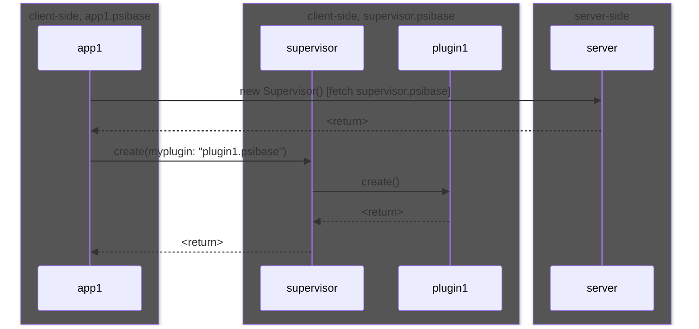
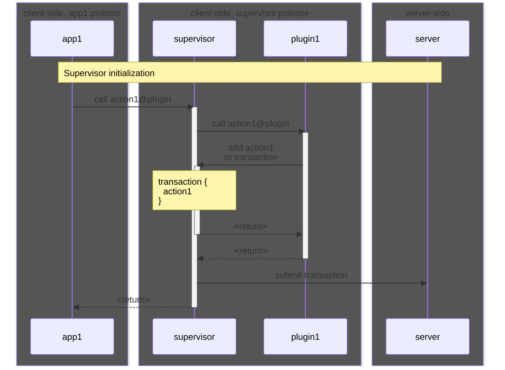
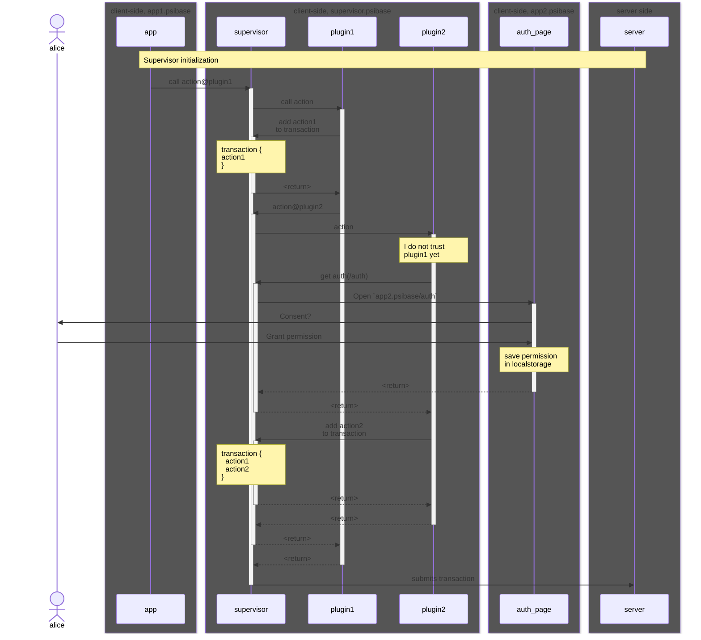

# Supervisor

The supervisor is the name of the client-side code that is run by a psibase app to mediate communication between apps and provide certain services to apps. All plugins run within the supervisor, and can interact with each other via message passing through the supervisor. The supervisor also provides core functionality to each psibase app, such as transaction packing, transaction submission, acquiring user authorization, resource management, and more.

## Capabilities

Supervisor is responsible for:

- [Client side peering](#client-side-peering) - For exchange of data using WebRTC
- [Event subscription feeds](#event-subscription-feeds) - Allowing UIs to respond to server-side [events](./events.md)
- [Communication with plugins](./plugins.md#communication-with-plugins) - For modularizing app functionality
- Transaction signing and authorization ([Smart authorization](../blockchain/smart-authorization.md))
- Packing transactions into the [`fracpack`](../data-formats/fracpack.md) binary format
- Facilitating client-controlled storage from plugins on behalf of the user

### Client-side peering

> ➕ TODO: Document client-side WebRTC-based peering capabilities facilitated by Supervisor.

### Event subscription feeds

Psibase apps may be interested in reacting to the emission of an [events](./events.md) from a service. In psibase networks, it is the supervisor that is responsible for providing an interface that allows a psibase app to subscribe to notifications for certain events.

The supervisor will poll the root domain to watch for events that have been subscribed to by any psibase apps. When an event occurs, it will notify the psibase app using an `"Event"` message.

> Note: These events are polled at a particular frequency, such as once per second. This notification system is therefore not designed to benefit apps which have hard real time event notification requirements. For such requirements it is recommended to run your own infrastructure provider node.

### Communication with plugins

#### Inter-app communication via plugins at 3 levels of detail.

First, here's what the frontend code looks like for an app to call method `method_name` on app `app2`:

```
const supervisor = new Supervisor();
const res = await supervisor.call({
    app: "app2",
    method: "method_name",
    params: { ... },
})
```

##### Proposed Supervisor API

```
const services = [{
    service: "sample_srvc_name",
}, {
    service: "srvc_name2",
    plugin: "plugin2" // optional; assumed to be simply "plugin" by default
}
];

const supervisor = await Supervisor.connect(options: {
    services   // optional: for, e.g., preloading. the <wasm filename>.wasm
    // if not provided, Supervisor will load the wasm specified in supervisor.call()
});

const res = await supervisor.call({
    service: "service_name",
    plugin: "plugin_name", // optional
    method: "method_name",
    params: {
        arg1: "arg value 1"
    }
});
```

App1's call is routed through the Supervisor, which then routes the call to the intended app.
This hierarchy of apps ensures all apps can verify the source/destination of their function calls is the Supervisor, which provides a security guaranty.

```svgbob
.-------------------------------------------.
| 🔒 app1.psibase.tld                       |
|-------------------------------------------|
|                                           |
|   .-------------------------------------. |
|   | supervisor.psibase.tld [hidden]     | |
|  <-->                                   | |
|   |   .-----------------------------.   | |
|   |   | app1.psibase.tld/plugin     |   | |
|   |  <-->                           |   | |
|   |   |                             |   | |
|   |   '-----------------------------'   | |
|   |   .-----------------------------.   | |
|   |   | app2.psibase.tld/plugin     |   | |
|   |  <-->                           |   | |
|   |   |                             |   | |
|   |   '-----------------------------'   | |
|   '-------------------------------------' |
|                                           |
'-------------------------------------------'
```

App1 instantiates the Supervisor in a hidden iframe. The Supervisor mediates the calls and returns between plugins.

```svgbob
.------------------------------------------------------------------------------------.
| 🔒 html at _top https://app1.psibase.tld                                           |
|------------------------------------------------------------------------------------|
|                                                                                    |
|   .-----------------------------------------------------------------------------.  |
|   | [hidden] iframe.src = https://supervisor.psibase.tld                        |  |
|   |-----------------------------------------------------------------------------|  |
|  <-->                                                                           |  |
|   |   .----------------------------------------------------------------------.  |  |
|   |   | App2 Plugin                                                          |  |  |
|   |   |----------------------------------------------------------------------|  |  |
|   |  <-->                                                                    |  |  |
|   |   |    Source: https://app2.psibase.tld/plugin.wasm                      |  |  |
|   |   |                                                                      |  |  |
|   |   '----------------------------------------------------------------------'  |  |
|   |                                                                             |  |
|   |   .----------------------------------------------------------------------.  |  |
|   |   | App3 Plugin                                                          |  |  |
|   |   |----------------------------------------------------------------------|  |  |
|   |  <-->                                                                    |  |  |
|   |   |    Plugin: https://app3.psibase.io/plugin.wasm                       |  |  |
|   |   |                                                                      |  |  |
|   |   '----------------------------------------------------------------------'  |  |
|   |                                                                             |  |
|   '-----------------------------------------------------------------------------'  |
|                                                                                    |
'------------------------------------------------------------------------------------'
```

#### Supervisor initialization



#### Adding actions

A psibase app can both read from and write to its server side state. The process of writing to server-side state is called "submitting a transaction". A transaction is a structured payload that is authorized to execute an action on one or more services on behalf of a user. An action in a service is a callable function that updates the server-side state.

A psibase app should wrap its logic for calling these server-side actions into an executable program that runs on the client side, called a [plugin](./plugins.md). Any front-end application can then interact with the supervisor in order to use plugin interfaces to call actions.

A transaction context is started when an app first calls into a plugin, meaning that actions can now be added into a transaction object by plugins sending action requests to the supervisor. When the initial call into the plugin is complete, the transaction context is closed and the transaction object will not accept any more actions. The transaction object is then authorized and submitted to the server.



#### Requesting user permission

Any plugin can add actions to the transaction being constructed. However, a plugin does not necessarily trust the legitimacy of a call to its plugin if it came from a source other than its own app. Therefore, before adding actions to the transaction, all plugins can present a window to the user to get their explicit consent for the callee app to allow the caller's request.

When a plugin asks the supervisor to open a popup, it provides a path relative to its own domain at which the UI for a user confirmation dialog can be retrieved. The supervisor then opens this popup in another window on behalf of the plugin.

> User experience note: The first time the supervisor requests user authentication, a user will need to enable popups from the supervisor in their browser. This is an unfortunate side-effect of pop-up blockers, but it will only happen once and the only domain that needs this permission is the supervisor domain.


