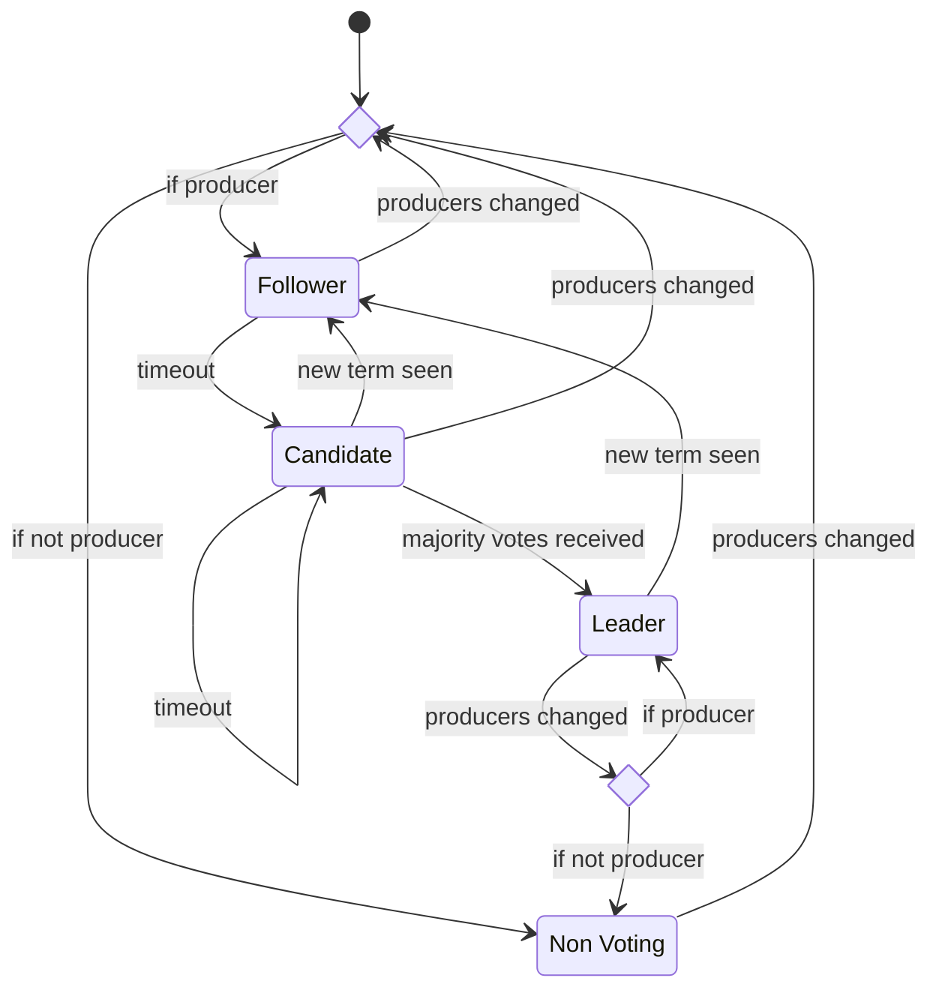

## CFT

This consensus algorithm is based on RAFT and has the following properties:
- The network will make progress as long as more than 50% of the current producers are active.
- If any producer node generates a message that is not permitted by the protocol, the behavior is undefined.

The nodes start by electing a leader with a simple majority vote. The leader is responsible for producing blocks and tracking irreversibility. If a node does not receive new blocks after a randomly chosen timeout, it will attempt to promote itself to be the leader by starting a new term and requesting votes from other nodes. In any term, a node will vote for the first candidate that is up-to-date.

### Irreversibility

Followers send confirmation to the leader after the block is successfully applied (Note: because this consensus algorithm assumes that all nodes are honest, the performance could be improved by sending a confirmation as soon as the block is stored durably). The leader advances irreversibility to the highest block in its own term that has been confirmed by more than half the producers (including itself).

### Messages

`BlockMessage`
`ConfirmMessage`
`RequestVoteRequest`
`RequestVoteResponse`
