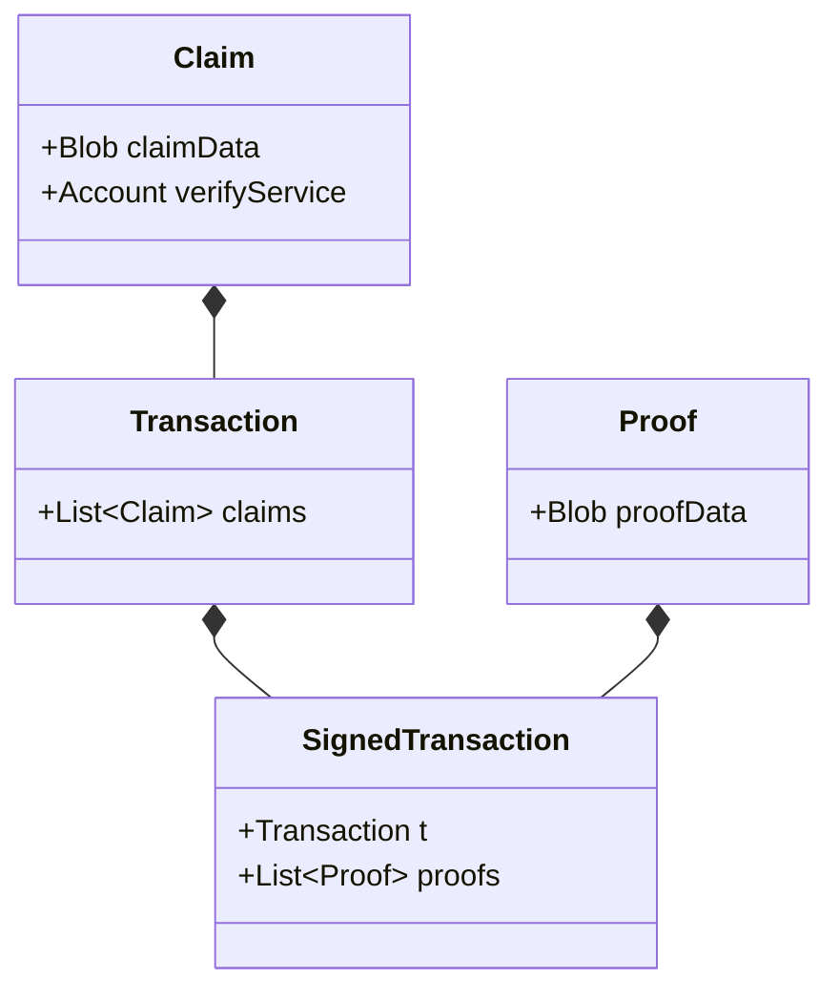
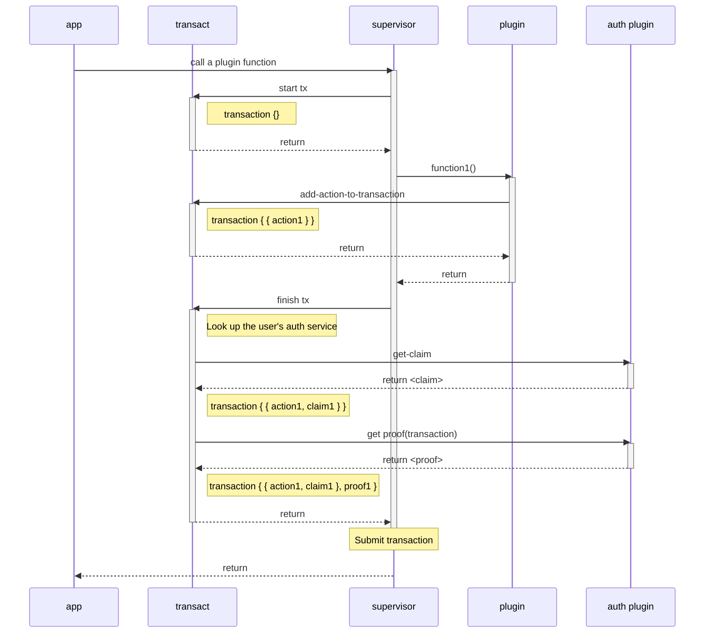

# Smart authorization

For an account to call an action defined in a service requires that the posted payload satisfies the authorization of the account.

Account authorization can use various techniques: simple signature verification, multi-signature verification, time locks, zero-knowledge proofs, and more. As technology progresses, new cryptographic techniques are discovered to improve the capabilities and efficiency of proving technology. Rather than attempt to add and maintain native support for all major authorization techniques, psibase instead describes a mechanism by which all accounts are given full programmatic control over how they should be authorized.

## Goals

- Enable accounts to have complete programmatic control over how their account can be authorized
- Allow developers to develop, deploy, and use custom cryptographic verification programs without requiring coordinated upgrades to the native node software

## Design

### How it works

#### Overview

Any account may specify how it should be authorized. As the user interacts with psibase apps and publishes transactions to modify their state on the network, code is dynamically loaded on the client-side to ensure that the published transaction contains the necessary information to authorize the account. For example, if an account specifies that it uses a simple cryptographic signature for authorization, the psibase infrastructure on the client-side will automatically pull the corresponding signature-authorization plugin from the server and allow it to modify the transaction by adding signatures before it is published to the network.

This is fully dynamic. Third-party developers can write their own authorization plugins, and accounts are free to use any authorization plugin.

#### Definitions

- **Claim** - Something that the submitter of a transaction claims to know (e.g. a public key)
- **Proof** - Conclusive evidence that the transaction submitter does actually know what she claims (e.g. a cryptographic signature)
- **Transaction** - A payload that specifies the intent of the sender to execute some code on the network
- **Auth service** - A service (configurable by each account) that specifies what claims are needed to authorize transactions from that account
- **Verify service** - A service that knows how to verify proof of a claim

#### Detailed steps

1. Every psibase account must specify an auth service
2. The auth service must enforce that transactions submitted by an account make one or more specific claims
3. A transaction gets submitted with: the claim(s) required by the auth service, a corresponding proof(s), the name of a verify service(s)
4. The auth service will verify the existence of the needed claims in the transaction and that the correct verify service was specified.
5. The claim(s) and proof(s) are sent to the associated verify service(s), which can authorize (or fail) the transaction.

## Architecture

A `SignedTransaction` is constructed on the client-side. A `SignedTransaction` is defined as follows:

> Note: A `SignedTransaction` should be renamed to something more generic, like `AuthedTransaction`, since "Signed" implies the specific claim/proof technique of using digital signatures.

The submitted `SignedTransaction` is sent to the auth service defined by an account (e.g. [AuthSig](../../default-apps/auth-sig.md)) and the corresponding verification service. These services will fail the transaction if either the claims in the transaction are incorrect, or if the proof does not prove the claim.

## Client-side transaction construction

When building psibase apps, the construction of each transaction submitted to the network is done automatically, including the aggregation of claims and generation of proofs. The following sequence diagram shows an example of a simple transaction being constructed. This entire interaction happens on the client-side.

## Auth notifiers

At any time, a plugin can notify the `transact` plugin (which is responsible for transaction construction) that it has one or more claims to be added to the transaction. If this is done, at the time the transaction is being constructed, the `transact` plugin will ask this notifier for claims and proofs in addition to the user's auth service plugin.

## Transaction privacy

The only plugin that can see the full contents of a transaction is the user's auth service plugin. For every other plugin, it only knows what actions it was itself responsible for including in the transaction. This rule includes auth notifiers. While `transact` provides the user's auth service plugin with all actions in a transaction, it will only provide an auth-notifier with a list of actions that were added by the notifier plugin itself.

## Conclusion

Smart authorization gives psibase a fully programmable account authorization system. Furthermore, regardless of any custom permissions that must be satisfied for a particular user to submit a transaction, this architecture completely abstracts authorization from the app being used. This keeps both the user and developer experience simple.
