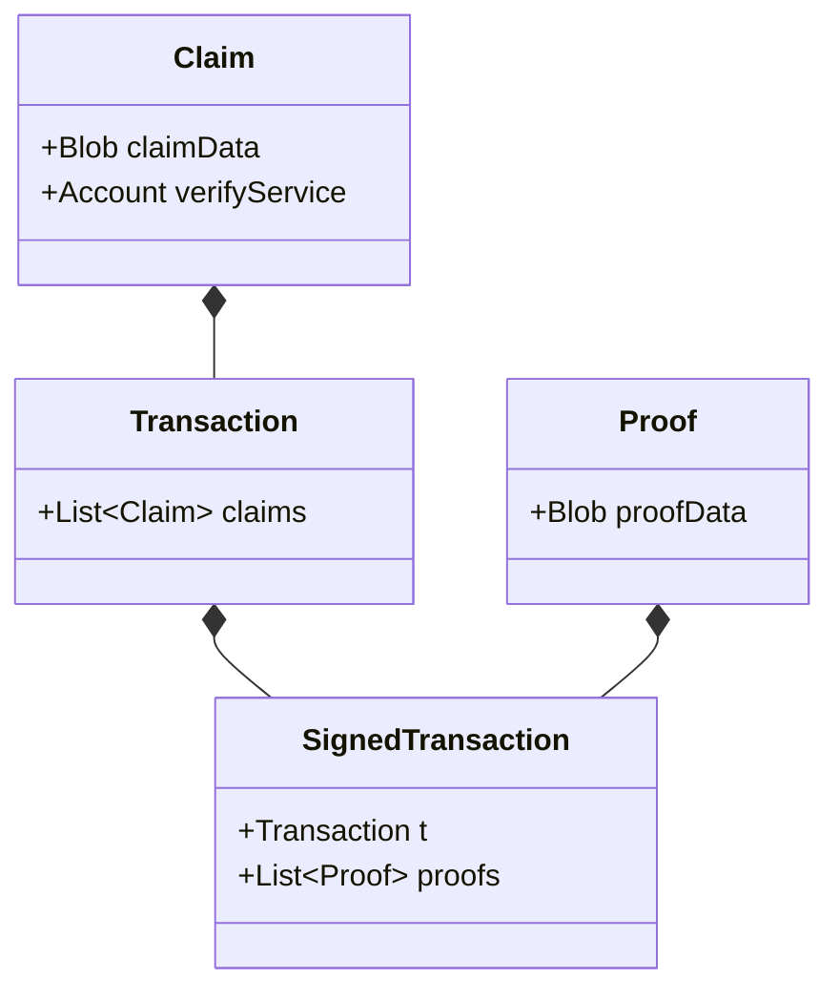
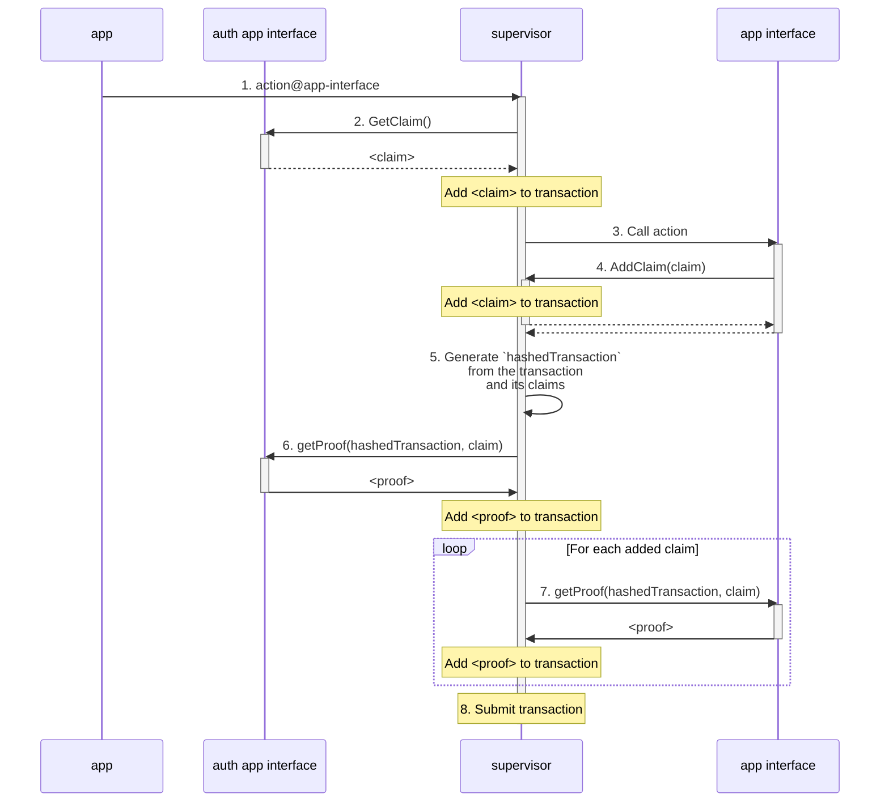

# Smart authorization

Account authorization can be done in many different ways: simple signature verification, time locks, zero-knowledge password proofs, multi-user authentication, and more. As technology progresses, new cryptographic techniques are discovered to improve the capabilities and efficiency of proving technology. Rather than attempt to add and maintain native support for all major authorization techniques, psibase instead describes a mechanism by which accounts are given full programmatic control over account authorization.

## Goals

* Enable accounts to have complete programmatic control over how their account can be authorized
* Allow developers to develop, deploy, and use custom cryptographic verification programs without requiring coordinated upgrades to the native node software

## Design overview

### Definitions

* **Claim** - Something that the submitter of a transaction claims to know (e.g. a public key)
* **Proof** - Conclusive evidence that the transaction submitter does actually know what she claims (e.g. a cryptographic signature)
* **Transaction** - A payload that specifies the intent of the sender to execute some code on the network
* **Auth service** - A service (configurable by each account) that specifies what claims are needed to authorize transactions from that account
* **Verify service** - A service that knows how to verify proof of a claim

### How it works

1. Every psibase account must specify an auth service
2. The auth service must enforce that transactions submitted by an account make one or more specific claims
3. A transaction gets submitted with: the claim(s) required by the auth service, a corresponding proof(s), the name of a verify service(s)
4. The auth service will verify the existence of the transaction claims, and that the correct verify service was specified.
5. The claim(s) and proof(s) are sent to the associated verify service(s), which can authorize (or fail) the transaction.

## Architecture

A `SignedTransaction` is constructed on the client-side. A `SignedTransaction` is defined as follows:

> Note: A `SignedTransaction` should be eventually renamed to something more generic, like `AuthedTransaction`, since "Signed" implies the specific claim/proof technique of using digital signatures.

The submitted `SignedTransaction` is sent to the AuthService defined by an account (e.g. [AuthSys](../../default-apps/auth-sys.md)) and the corresponding verification service. These services will fail the transaction if either the claims in the transaction are incorrect, or if the proof does not prove the claim.

## Supervisor

When building Psibase apps, the construction of each transaction submitted to the network is done automatically, including any claim and proof aggregation. The following sequence diagram shows the client-side interactions involved when PsibaseOS aggregates claims and proofs.

The following is an explanation of each step in the diagram to aid understanding:

1. Alice calls an action on an app interface.
2. Supervisor gives the user's configured auth app interface the opportunity to add a claim to the transaction.
3. Supervisor calls the app interface action
4. If (and only if) an app interface calls a service action, then it is allowed to add a claim to the transaction.
5. Supervisor has accumulated all actions and claims for this transaction, so it calculates the hash of the transaction object which can be used for the generation of proofs (such as digital signatures).
6. The user's configured auth app interface is asked to generate a proof for the claim it added.
7. Each app interface that added a claim is asked for a proof of the claim.
8. Supervisor has collected all claims and proofs, therefore the final transaction object is packed and submitted to the network.

## Conclusion

Smart authorization gives psibase a fully programmable account authorization system. Furthermore, regardless of any custom permissions that must be satisfied for a particular user to submit a transaction, this architecture completely abstracts authorization from the app being used. This keeps both the user and developer experience simple.
