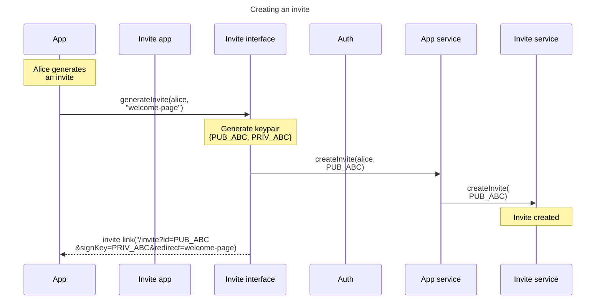
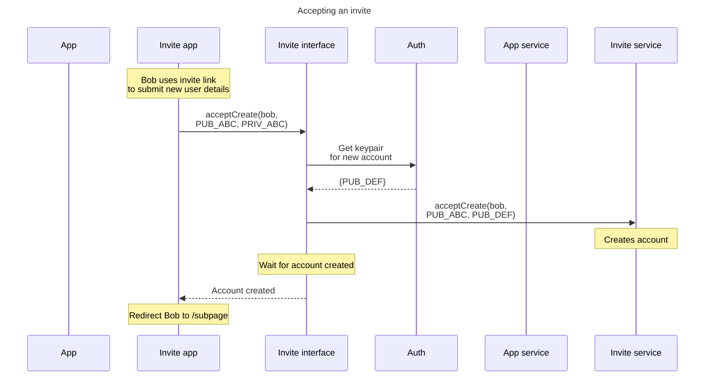

# User onboarding

## Motivation

User onboarding is one of the most important user experiences, as it is often one of the first interactions a new user has with a community. Each psibase account has associated configuration data and therefore has an associated storage cost. The challenge is that the value provided by each new user often accrues to a different entity than the one who bears the account creation cost (the infrastructure provider). This asymmetry has caused onboarding experiences to be cumbersome in other distributed app frameworks, and the friction slows the growth of the network. 

## Goals

The psibase onboarding experience is intended to be comparable to the experience of signing in using OAuth on traditional web applications. It should be simple and immersive. It should allow the entities and organizations who gain from the addition of a new user to subsidize their account creation cost.

## Invites

New users shall be onboarded through an invitation process. The default app responsible for the creation of new accounts is called [AccountSys](../default-apps/account-sys.md). Any "invite" services which are permitted to facilitate the creation of a new account must be configured in this service.

> Note: The following designs are specifically for providing new accounts to *new* users. New accounts can be created by existing users simply by allowing them to pay a small amount for additional accounts.

## User flow

### Generic onboarding flow

Generic onboarding refers to a process that allows a user to invite another user to the network as a whole, rather than to participate in a particular psibase app.

An existing user may access an invite service, and create an invite. When the invite is created, an HTTP link is generated which can be sent to a recipient. A new psibase account can be redeemed by clicking the link and following the instructions provided in the interface provided by the invite app.

### App onboarding flow

App onboarding refers to a process that allows apps to wrap the invite process into their own app and subsidize account creation costs. This provides a more immersive user-onboarding experience.

Psibase apps can expose the functionality for their users to generate an invite. When initiated, the psibase app's service creates the invite. After the invite is created, an HTTP link is generated which can be sent to a recipient. By clicking the link, the invitee may join the app to which they were invited, and may optionally create a new psibase account in the process. 

After the invitee accepts the invite (with or without constructing a new account), they are redirected back to the root page  (or to the redirect subpage if provided) of the application responsible for generating the invite. The user may then use the application with their new user account.

## How it works

### Generic onboarding details

Embedded in the query string of the HTTP link is a private key, generated at the time of the invite. A corresponding invite public key is also saved in a service database. This public key is also known as the `invite ID`.

After the invitee clicks the link, and fills out their new account details in the invite app interface, they submit a transaction that prompts its creation. However, every transaction submitted to a psibase infrastructure provider must have a sender. Therefore, in order to submit this transaction, the invite service provides the account from which the transaction is sent (since the user may not have one yet). This sender account should use a custom auth service which authorizes actions if and only if the transaction is digitally signed with a private key that corresponds to an `invite ID`.

If the new account uses a PKI authorization service, such as [auth-sys](../default-apps/auth-sys.md), it should not be configured to use the `invite ID` as its public key, since the invite creator also knows its corresponding private key.

### App onboarding details

When the app needs to generate an invite link, it can use the `generateInvite` app interface function of the invite app. 

The invite app interface submits an action on behalf of the user to the psibase app's service to initiate the creation of an invite. The app's service should then call into the invite service to create the invite. This ensures that it is the psibase app's service who pays for the invite.

The invite service should allow psibase apps to register with it to configure rate-limiting details such as the number of open invites allowed per user, and the minimum age of an account that is permitted to generate invites.

The invite link is returned to the psibase app once the invite was successfully created, and the app may present the generated invite link to the user however it wants. The invite link should include a query string that specified the invite ID, the invite signing key, and the redirect subpage string, such as: `?id=ABC123&signKey=DEF456&redirect=welcome-page`.

Once the invitee submits the transaction to accept the invite (just as is done in [generic onboarding](#generic-onboarding-details)), the invite app will automatically redirect the user back to the root page (or redirect subpage if specified) of the application responsible for generating the invite.

## App onboarding sequence diagram

The following sequence diagrams gives a rough outline of all the steps required to carry out the successful onboarding of a new user within an application willing to subsidize the invite cost.

