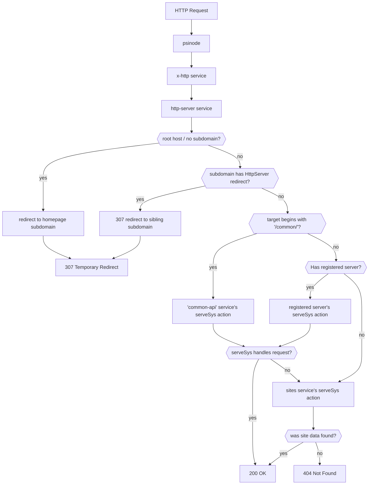

# HTTP requests

## Query Service

Each subdomain can have a query service which provides a `serveSys` action. The services run in RPC mode; this prevents them from writing to the database, but allows them to read data they normally can't.

## Sites

[SystemService::Sites] provides web hosting for static content. It allows uploading files and managing a limited set of headers. In addition, a subdomain can be configured for a single page application or can mirror content from another subdomain.

## Redirects

The root host (no subdomain) redirects to the homepage subdomain. If a subdomain owner configured [SystemService::HttpServer::setRedirect], all requests to that subdomain get a temporary redirect (HTTP 307) to the destination subdomain (path and query preserved).

## Common

The [common-api service](../../default-apps/common-api.md) handles endpoints which start with the `/common*` path across all domains. It handles RPC requests and serves files.

## XHttp

The local [x-http](../../default-apps/x-http.md) service handles dispatching of local service subdomains. Node operators can also configure it to intercept any request. Requests which start with `/native`, e.g. `/native/admin/status` have special processing in `psinode` and are not allowed on most subdomains.

## CORS

psinode accepts CORS preflight requests by default, because almost all queries are read-only—user services are not even allowed to write mutable state in queries. This can be overridden by explicitly handling `OPTIONS` requests in the few system services that need it (`push_transaction` being the most notable). CORS headers can be set by services and most of the convenience functions include them.

## Authentication

When a user logs in to an app, the client-side infrastructure signs a login request and sends it to the [login endpoint](../../default-apps/transact.md#login) to get a JWT. This token is set as a cookie on the app's domain and also sent in an `Authorization` for any HTTP requests made by plugins. HttpServer extracts the username from the token and passes it to query services.
